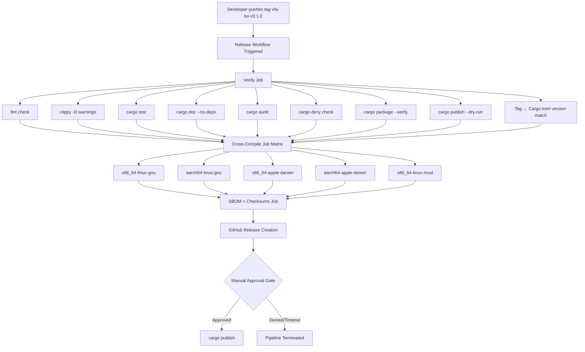
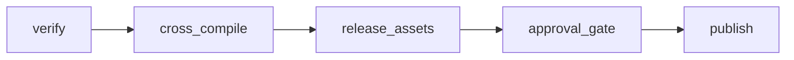

# Design Document: crates-io-publish

## Overview

This design covers the preparation and automated publication of the `vfa-tui` crate to crates.io as a binary-only distribution. The scope includes:

1. **Metadata & Licensing** — Cargo.toml completion, dual-license file creation, version reset
2. **Code Quality** — dead code cleanup, public API minimization, dependency deduplication
3. **Package Hygiene** — exclude patterns, stray directory removal
4. **Documentation** — README restructuring, CHANGELOG, SECURITY.md
5. **CI/CD** — Tag-triggered release workflow with approval gate, cross-compilation, SBOM generation, supply-chain security

The design prioritizes irreversibility awareness: crate publication cannot be undone, so every step before `cargo publish` is a gate that must pass.

## Architecture

### Release Pipeline Architecture



### Job Dependency Graph



**Design Decision: Sequential job dependency (not parallel verify+cross-compile)**

Rationale: Cross-compilation is expensive (5 matrix entries × ~3min each). Running verify first catches 95% of failures cheaply in ~2 minutes. Only if verify passes do we burn the cross-compile runner minutes.

### Workflow File Structure

Single workflow file: `.github/workflows/vfa-tui-release.yml`

Rationale: The existing CI workflow (`.github/workflows/vfa-tui-ci.yml`) handles PR checks. The release workflow is a separate concern triggered only by tags, with its own environment and secrets.

## Components and Interfaces

### Component 1: Cargo.toml Final Shape

```toml
[package]
name = "vfa-tui"
version = "0.1.0"
edition = "2021"
rust-version = "1.75"
description = "Enterprise-grade terminal UI for the Vanguard Frontier Agentic marketplace catalog"
license = "MIT OR Apache-2.0"
repository = "https://github.com/VincentChuWaiChow/vanguard-frontier-agentic"
homepage = "https://github.com/VincentChuWaiChow/vanguard-frontier-agentic/tree/master/tools/vfa-tui"
readme = "README.md"
keywords = ["tui", "catalog", "marketplace", "terminal", "security"]
categories = ["command-line-utilities", "development-tools"]
authors = ["VincentChuWaiChow <15792229+VincentChuWaiChow@users.noreply.github.com>"]
exclude = [
    "proptest-regressions/",
    "tests/",
    "~/",
    "target/",
    ".gitignore",
]

[dependencies]
ratatui = "0.30"
crossterm = "0.28"
clap = { version = "4", features = ["derive"] }
serde = { version = "1", features = ["derive"] }
serde_json = "1"
tokio = { version = "1", features = ["rt-multi-thread", "macros", "process", "sync", "time", "io-util", "fs"] }
tracing = "0.1"
tracing-subscriber = { version = "0.3", features = ["env-filter", "json", "time"] }
thiserror = "2"
anyhow = "1"
nucleo-matcher = "0.3"
uuid = { version = "1", features = ["v4"] }
rusqlite = { version = "0.32", features = ["bundled"] }
notify-debouncer-full = "0.3"
toml = "0.8"
sha2 = "0.10"
chrono = { version = "0.4", features = ["serde"] }
futures-util = "0.3"
terminal-light = "1"

[target.'cfg(unix)'.dependencies]
libc = "0.2"

[dev-dependencies]
proptest = "1"
tempfile = "3"
```

**Key Changes from Current:**
- `publish = false` → removed entirely (absence means "publishable")
- `version` → `"0.1.0"` (reset for first public release)
- `rust-version` → `"1.75"` (MSRV declaration)
- `license` → `"MIT OR Apache-2.0"` (dual-license expression)
- Added: `repository`, `homepage`, `readme`, `keywords`, `categories`, `authors`
- Added: `exclude` array
- `futures = "0.3"` → `futures-util = "0.3"` (smaller dependency footprint)
- `sha2` removed from `[dev-dependencies]` (already in `[dependencies]`)

### Component 2: lib.rs Public API Minimization

**Design Decision: Keep modules `pub` only where integration tests import them.**

The integration tests (`tests/integration/` and `tests/property/`) reference:
- `catalog::store` — for catalog loading tests
- `search` — for fuzzy search property tests
- `security` — for sanitization/redaction property tests
- `models` — for data model construction in tests
- `error` — for error type matching
- `test_fixtures` — already gated behind `#[cfg(test)]`

Modules that should become `pub(crate)`:
- `app` — internal state machine, not needed by integration tests
- `cli` — only used by main.rs directly
- `federation` — internal plumbing
- `gates` — internal plumbing
- `headless` — internal plumbing
- `logging` — internal init, not tested externally
- `paths` — utility, not tested externally
- `persistence` — internal SQLite layer
- `policy` — internal policy engine
- `subprocess` — internal process management
- `ui` — internal rendering, not tested externally
- `workspace` — internal detection logic

**New lib.rs:**

```rust
#![deny(warnings)]

// Public for integration/property tests
pub mod catalog;
pub mod error;
pub mod models;
pub mod search;
pub mod security;

// Internal modules
pub(crate) mod app;
pub(crate) mod cli;
pub(crate) mod federation;
pub(crate) mod gates;
pub(crate) mod headless;
pub(crate) mod logging;
pub(crate) mod paths;
pub(crate) mod persistence;
pub(crate) mod policy;
pub(crate) mod subprocess;
pub(crate) mod ui;
pub(crate) mod workspace;

#[cfg(test)]
pub mod test_fixtures;
```

**Caveat**: If integration tests currently import from any of the `pub(crate)` modules, those imports must be moved or the module kept `pub`. A `cargo test` pass after the change confirms correctness.

### Component 3: main.rs Cleanup

Remove the two allow attributes:
```rust
// REMOVE these lines:
// #![allow(dead_code)]
// #![allow(unused_imports)]
```

After removal, run `cargo clippy -- -D warnings`. Any genuine dead code must be either:
- Removed if truly unused
- Prefixed with `_` if intentionally reserved for future use
- Moved behind `#[cfg(test)]` if test-only

### Component 4: deny.toml Configuration

```toml
# tools/vfa-tui/deny.toml

[graph]
targets = [
    "x86_64-unknown-linux-gnu",
    "aarch64-unknown-linux-gnu",
    "x86_64-apple-darwin",
    "aarch64-apple-darwin",
    "x86_64-unknown-linux-musl",
]

[licenses]
allow = [
    "MIT",
    "Apache-2.0",
    "BSD-2-Clause",
    "BSD-3-Clause",
    "ISC",
    "Unicode-3.0",
    "Unicode-DFS-2016",
    "Zlib",
    "BSL-1.0",
    "CC0-1.0",
    "OpenSSL",
]
confidence-threshold = 0.8

[[licenses.clarify]]
name = "ring"
expression = "MIT AND ISC AND OpenSSL"
license-files = [{ path = "LICENSE", hash = 0xbd0eed23 }]

[bans]
multiple-versions = "warn"
wildcards = "allow"

[advisories]
vulnerability = "deny"
unmaintained = "warn"
yanked = "deny"
notice = "warn"

[sources]
unknown-registry = "deny"
unknown-git = "deny"
allow-git = []
```

**Design Decision: Broad allow-list for compatible licenses**

The allow-list covers the standard permissive licenses found in the Rust ecosystem. The `ring` crate (pulled transitively by `rusqlite` with `bundled`) needs explicit clarification since it has a composite license. The list is intentionally conservative — only permissive licenses compatible with MIT OR Apache-2.0.

### Component 5: Release Workflow Structure

**File**: `.github/workflows/vfa-tui-release.yml`

**Jobs:**

| Job | Runner | Purpose | Depends On |
|-----|--------|---------|-----------|
| `verify` | `ubuntu-latest` | All quality gates | — |
| `cross-compile` | matrix (3 runners) | Build release binaries | `verify` |
| `release-assets` | `ubuntu-latest` | Checksums, SBOM, GitHub Release | `cross-compile` |
| `publish` | `ubuntu-latest` | `cargo publish` | `release-assets` + Environment approval |

**Environment**: `crates-io-publish` with required reviewer protection rule.

**Secrets**:
- `CARGO_REGISTRY_TOKEN` — scoped to `vfa-tui` publish only, stored in the `crates-io-publish` environment (not repo-level)

### Component 6: Cross-Compilation Strategy

**Design Decision: Use native `cargo build` with cross-compilation toolchains (not the `cross` tool)**

Rationale:
- The existing CI already uses this pattern successfully
- `cross` adds Docker overhead and complexity
- `rusqlite` with `bundled` feature compiles SQLite from C source, which `cross` handles poorly
- macOS targets require macOS runners anyway (no cross-compile from Linux for Darwin targets)

**Matrix Configuration:**

| Target | Runner | Extra Setup |
|--------|--------|-------------|
| `x86_64-unknown-linux-gnu` | `ubuntu-latest` | None |
| `aarch64-unknown-linux-gnu` | `ubuntu-latest` | `gcc-aarch64-linux-gnu` |
| `x86_64-apple-darwin` | `macos-13` | None (Intel runner) |
| `aarch64-apple-darwin` | `macos-14` | None (ARM runner) |
| `x86_64-unknown-linux-musl` | `ubuntu-latest` | `musl-tools` |

**Binary Naming Convention:**
```
vfa-tui-{target}{ext}
```
Examples:
- `vfa-tui-x86_64-unknown-linux-gnu`
- `vfa-tui-aarch64-apple-darwin`
- `vfa-tui-x86_64-unknown-linux-musl`

No `.exe` extension (all targets are Unix). Checksum files are named:
```
vfa-tui-{target}.sha256
```

### Component 7: SBOM Generation

**Design Decision: Use `cargo-sbom` (already in use in existing CI)**

The existing CI workflow already installs `cargo-sbom` v0.10.0 and generates SPDX 2.3 JSON. This tool:
- Produces SPDX 2.3 format as required
- Reads directly from `Cargo.lock` for accurate transitive dependency enumeration
- Is Rust-native (no Docker, no external runtime)
- Is already proven in the project's CI

**Output**: One SBOM per release (not per-target, since dependencies are identical across targets):
```
vfa-tui-0.1.0.sbom.spdx.json
```

### Component 8: Approval Gate Implementation

**Design Decision: GitHub Environments with protection rules**

Configuration:
- Environment name: `crates-io-publish`
- Required reviewers: At least 1 (the crate owner)
- Wait timer: None (manual approval only)
- Branch restriction: Tags matching `vfa-tui-v*`

The `CARGO_REGISTRY_TOKEN` secret is scoped to this environment, meaning it is inaccessible to any workflow job that doesn't use `environment: crates-io-publish`.

### Component 9: License Files

**LICENSE-MIT** (in `tools/vfa-tui/`):
Standard MIT license text with:
- Copyright: `Copyright (c) 2024 VincentChuWaiChow`

**LICENSE-APACHE** (in `tools/vfa-tui/`):
Full Apache License 2.0 text. Can be a copy or symlink from the repository root if the root already uses Apache-2.0.

### Component 10: README Restructuring for crates.io

The README needs reordering for crates.io display (which renders the full README):

1. Title + one-line description
2. **Installation** — `cargo install vfa-tui` + link to pre-built binaries
3. **Limitations** — monorepo dependency, not standalone
4. **Pre-built Binaries** — link to GitHub Releases
5. Overview (condensed)
6. Usage + CLI reference
7. Supported Platforms
8. Architecture (condensed)
9. Development Guide (for contributors)
10. License — "MIT OR Apache-2.0"

Key additions:
- Explicit statement: "Distributed as a binary via `cargo install`. The library API is internal and not covered by semver guarantees."
- Remove `rtk` command references in user-facing instructions
- Add "Limitations" section

## Data Models

### Release Artifact Set

For each release `vfa-tui-v{version}`, the following artifacts are produced:

| Artifact | Format | Attached To |
|----------|--------|-------------|
| `vfa-tui-x86_64-unknown-linux-gnu` | ELF binary | GitHub Release |
| `vfa-tui-aarch64-unknown-linux-gnu` | ELF binary | GitHub Release |
| `vfa-tui-x86_64-apple-darwin` | Mach-O binary | GitHub Release |
| `vfa-tui-aarch64-apple-darwin` | Mach-O binary | GitHub Release |
| `vfa-tui-x86_64-unknown-linux-musl` | ELF static binary | GitHub Release |
| `SHA256SUMS.txt` | Text (one line per binary) | GitHub Release |
| `vfa-tui-{version}.sbom.spdx.json` | SPDX 2.3 JSON | GitHub Release |

### Workflow Environment Model

```yaml
# GitHub Environment: crates-io-publish
name: crates-io-publish
protection_rules:
  required_reviewers: 1
  wait_timer: 0
secrets:
  CARGO_REGISTRY_TOKEN: <scoped-to-vfa-tui-only>
```

### Tag → Version Contract

The release workflow enforces a strict contract:
```
Tag name:    vfa-tui-v{X.Y.Z}
Cargo.toml:  version = "{X.Y.Z}"
```

If these don't match, the verify job fails immediately.

### CHANGELOG Format (Keep a Changelog)

```markdown
# Changelog

All notable changes to this project will be documented in this file.

The format is based on [Keep a Changelog](https://keepachangelog.com/en/1.1.0/),
and this project adheres to [Semantic Versioning](https://semver.org/spec/v2.0.0.html).

## [0.1.0] - YYYY-MM-DD

### Added
- Initial public release on crates.io
- Interactive TUI for browsing VFA catalog (agents, skills, roles, providers)
- Fuzzy search across all catalog entities
- Validation gate execution with streaming output
- Export command builder with dry-run preview
- Headless reporting mode (JSON/text/summary)
- Cross-platform support (Linux x86_64/aarch64, macOS x86_64/aarch64, musl)
- Structured audit logging
- Terminal escape sanitization for security
```

### SECURITY.md Structure

```markdown
# Security Policy

## Supported Versions

| Version | Supported |
|---------|-----------|
| 0.1.x   | ✅        |

## Reporting a Vulnerability

...contact method, timeline, process...
```

## Correctness Properties

*A property is a characteristic or behavior that should hold true across all valid executions of a system — essentially, a formal statement about what the system should do. Properties serve as the bridge between human-readable specifications and machine-verifiable correctness guarantees.*

> **Note on PBT Applicability**: This feature is primarily about CI/CD pipeline construction, configuration files (TOML, YAML), and workflow automation. Most acceptance criteria are configuration/smoke checks (field has value X, file exists, command exits 0) rather than algorithmic logic with meaningful input variation. The properties below are universal invariants that can be verified as integration tests. The three candidates most amenable to property-based testing (with varying inputs) are Properties 1, 3, and 4.

### Property 1: Package Contents Invariant

*For any* file path in the output of `cargo package --list`, that path SHALL match the intentional file set (files under `src/`, `*.md` documentation files, `LICENSE-*`, `Cargo.toml`, `Cargo.lock`) AND SHALL NOT match any excluded pattern (`proptest-regressions/`, `tests/`, `~/`, `target/`).

**Validates: Requirements 9.1, 9.2, 9.3, 9.5, 20.1, 20.2, 20.3**

### Property 2: License File Inclusion

*For any* valid invocation of `cargo package --list`, the output SHALL contain both `LICENSE-MIT` and `LICENSE-APACHE` entries.

**Validates: Requirements 1.2, 1.5**

### Property 3: Public API Minimality

*For any* module declared in `src/lib.rs`, if that module is marked `pub`, there SHALL exist at least one integration test file that imports from it. Conversely, *for any* module marked `pub(crate)`, no integration test SHALL import from it.

**Validates: Requirements 4.3, 18.1**

### Property 4: SBOM Dependency Completeness

*For any* crate entry in `Cargo.lock` (direct or transitive), that crate SHALL appear in the generated SBOM with its version and license information.

**Validates: Requirements 14.3**

### Property 5: Tag-Version Consistency

*For any* Git tag matching the pattern `vfa-tui-v{X.Y.Z}`, the version field in `Cargo.toml` SHALL equal `{X.Y.Z}`. The release workflow SHALL fail if this invariant is violated.

**Validates: Requirements 10.1, 16.1**

### Property 6: Checksum Integrity

*For any* release binary attached to a GitHub Release, computing SHA-256 over the binary content SHALL produce a digest identical to the corresponding entry in `SHA256SUMS.txt`.

**Validates: Requirements 13.2, 13.4**

### Property 7: Verification Gate Ordering

*For any* release workflow execution that reaches the `cargo publish` step, ALL of the following checks SHALL have completed successfully in a prior job: format check, clippy, tests, doc generation, cargo audit, cargo deny, cargo package, and cargo publish --dry-run.

**Validates: Requirements 10.2, 10.3, 10.4, 15.1**

### Property 8: Approval Gate Enforcement

*For any* release workflow execution, `cargo publish` SHALL NOT execute unless the `crates-io-publish` environment approval has been explicitly granted. If approval is denied or times out, zero publish commands SHALL have been executed.

**Validates: Requirements 11.1, 11.3, 11.4**

## Error Handling

### Workflow Failure Modes

| Failure | Stage | Recovery |
|---------|-------|----------|
| Tag doesn't match Cargo.toml version | verify | Fix Cargo.toml or delete/re-push tag |
| Clippy warnings | verify | Fix code, re-tag |
| Test failure | verify | Fix code, re-tag |
| `cargo audit` finds vulnerability | verify | Update dependency, re-tag |
| `cargo deny` license violation | verify | Replace dependency or update allow-list |
| `cargo package` fails | verify | Fix exclude patterns or missing files |
| `cargo publish --dry-run` fails | verify | Fix metadata or excluded files |
| Cross-compilation failure | cross-compile | Fix platform-specific code, re-tag |
| SBOM generation failure | release-assets | Update cargo-sbom version or fix Cargo.lock |
| Checksum generation failure | release-assets | Retry (likely transient) |
| Approval denied | approval_gate | Re-evaluate readiness, re-tag when ready |
| `cargo publish` fails (token invalid) | publish | Rotate token in environment secrets |
| `cargo publish` fails (name taken) | publish | **Unrecoverable** — choose different name |
| `cargo publish` fails (version exists) | publish | **Unrecoverable** — bump version, re-tag |

### Error Handling Principles

1. **Fail fast**: Every verification step uses `set -e` equivalent (GitHub Actions default). First failure stops the pipeline.
2. **No partial releases**: Binary artifacts are uploaded to a draft release. The release is only published after `cargo publish` succeeds.
3. **Idempotent retries**: Re-pushing the same tag (after deletion) re-runs the entire pipeline from scratch.
4. **Token safety**: The token is only accessible in the `publish` job which runs in the `crates-io-publish` environment. Other jobs cannot access it.

## Testing Strategy

### Approach

This feature is primarily about CI/CD pipeline construction, configuration files, and workflow automation. The "code" being tested is:
- TOML configuration (Cargo.toml, deny.toml)
- YAML workflow definitions
- Shell scripts within workflow steps
- File existence and content (LICENSE-*, CHANGELOG.md, SECURITY.md)

### Test Categories

**1. Local Verification Tests (run by developers before tagging):**

| Test | Command | Validates |
|------|---------|-----------|
| Format check | `cargo fmt -- --check` | Code style |
| Clippy | `cargo clippy -- -D warnings` | Lint cleanliness |
| Unit + property tests | `cargo test` | Logic correctness |
| License check | `cargo deny check licenses` | License compliance |
| Audit | `cargo audit` | Known vulnerabilities |
| Package dry-run | `cargo publish --dry-run` | Packaging correctness |
| Package list | `cargo package --list` | Exclusion patterns |

**2. Property-Based Tests (existing proptest suite):**

The existing 17 property tests continue to validate core logic. No new property tests are needed for the publication workflow itself since it's infrastructure configuration, not algorithmic logic.

**3. Integration Tests (workflow validation):**

Since the release workflow is GitHub Actions YAML, it cannot be unit-tested locally. Validation strategy:
- **Dry-run validation**: `cargo publish --dry-run` catches 90% of packaging issues
- **Act (optional)**: The `nektos/act` tool can simulate GitHub Actions locally for workflow syntax validation
- **First release**: Tag a `0.1.0-rc.1` pre-release to test the full pipeline end-to-end before the real `0.1.0` tag

**4. MSRV Verification:**

The CI workflow includes an advisory MSRV job:
```yaml
msrv:
  runs-on: ubuntu-latest
  steps:
    - uses: dtolnay/rust-toolchain@1.75
    - run: cargo check
    - run: cargo test
```

This is non-blocking (PR merges are not gated on it) per Requirement 17.3.

### What Is NOT Tested via PBT

- Workflow YAML correctness (validated by GitHub Actions runtime)
- GitHub Environment configuration (manual setup, tested by first release)
- Token scoping (verified during initial token creation on crates.io)
- Cross-compilation success (tested by CI matrix runners)
- SBOM content accuracy (validated by `cargo-sbom` tool's own test suite)

### Pre-Release Checklist

Before pushing the `vfa-tui-v0.1.0` tag:

1. [ ] `cargo fmt -- --check` passes
2. [ ] `cargo clippy -- -D warnings` passes
3. [ ] `cargo test` passes (all unit, property, integration)
4. [ ] `cargo publish --dry-run` succeeds
5. [ ] `cargo package --list` shows no excluded files
6. [ ] `cargo deny check` passes (requires deny.toml)
7. [ ] `cargo audit` reports no vulnerabilities
8. [ ] LICENSE-MIT and LICENSE-APACHE exist and are non-empty
9. [ ] CHANGELOG.md has 0.1.0 entry
10. [ ] SECURITY.md exists with contact info
11. [ ] README.md has installation instructions (no `rtk` references)
12. [ ] GitHub Environment `crates-io-publish` is configured with reviewer
13. [ ] `CARGO_REGISTRY_TOKEN` secret is set in the environment
14. [ ] Scoped token tested with `cargo login` locally (optional)
