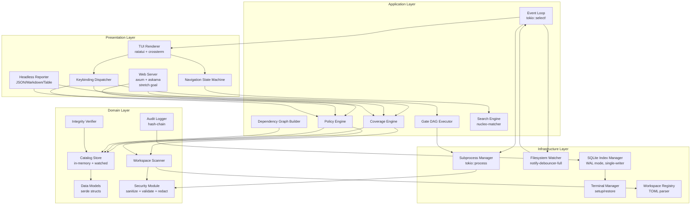
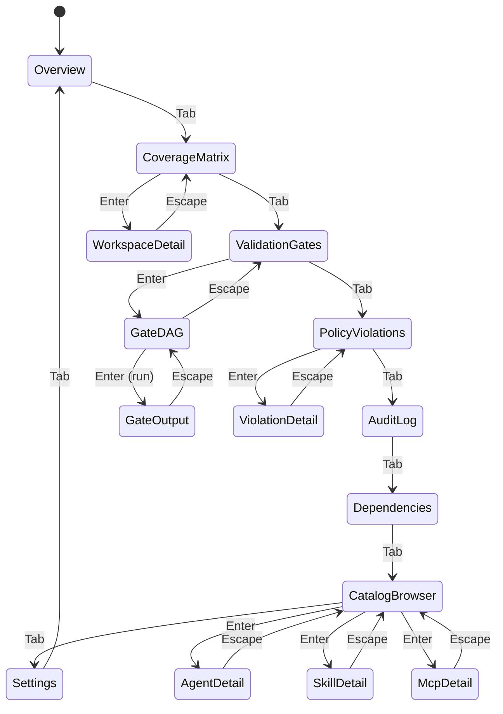

# Design Document

## Overview

The `vfa-tui` v2 is a **platform-grade Rust TUI operator console** for managing adoption of agentic assets (agents, skills, MCP references, rules) across an organization's repositories at Fortune 50 scale. It evolves the v1 catalog browser (`tools/vfa-tui/`) into a full operator console providing multi-workspace federation, catalog governance, policy enforcement, and adoption metrics.

### Design Philosophy

1. **Scan once, cache, watch for changes** — SQLite index allows sub-second startup even with 100+ workspaces; filesystem watchers provide live updates without polling.
2. **No network access** — All data comes from local filesystem scans. Deterministic behavior for CI/CD trust.
3. **Security by construction** — No shell interpolation, secret redaction, terminal escape sanitization on all rendered content (carried from v1).
4. **Graceful degradation** — If a workspace path is unavailable, skip it and show status. Never panic on recoverable errors.
5. **Deterministic policy evaluation** — Same inputs produce same compliance scores. Round half up, stable sorts.
6. **Dual output** — Every view has both a TUI rendering and a structured data equivalent (JSON/Markdown/table).
7. **Single-writer SQLite** — All writes go through a dedicated tokio task with mpsc receiver; multiple read connections for UI thread.
8. **Preserve v1 patterns** — Terminal management, security module, subprocess execution, and catalog loading patterns from v1 are retained and extended.

### Technology Stack

| Concern | Crate | Version | Rationale |
|---------|-------|---------|-----------|
| Terminal rendering | `ratatui` | 0.30 | Immediate-mode TUI framework with rich widget library |
| Terminal backend | `crossterm` | 0.28 | Cross-platform terminal abstraction (Linux, macOS, WSL) |
| CLI parsing | `clap` | 4.x (derive) | Type-safe argument handling with derive macros |
| JSON serialization | `serde` + `serde_json` | 1.x | Strict schema validation with `#[serde(deny_unknown_fields)]` |
| TOML parsing | `toml` | 0.8 | Workspace registry and policy file parsing |
| Async runtime | `tokio` | 1.x (rt-multi-thread) | Subprocess, file watching, concurrent scans |
| SQLite | `rusqlite` | 0.32 | WAL-mode persistence with `bundled` feature for static linking |
| Filesystem watching | `notify-debouncer-full` | 0.4 | Intelligent rename/modify coalescing for live reload |
| Hashing | `sha2` | 0.10 | SHA-256 for content hashing and audit chain |
| Fuzzy matching | `nucleo-matcher` | 0.3 | High-performance fuzzy matching for search |
| Structured logging | `tracing` + `tracing-subscriber` | 0.1/0.3 | Structured audit events |
| Error handling | `thiserror` + `anyhow` | 2.x/1.x | Domain errors (thiserror) + application errors (anyhow) |
| UUID generation | `uuid` | 1.x (v4) | Session ID generation |
| Web (stretch) | `axum` + `askama` | 0.8/0.12 | Server-rendered HTML with HTMX for Tier 4 |
| Property testing | `proptest` | 1.x | Property-based testing with shrinking |

## Architecture

### Layer Diagram



### Module Structure

```
tools/vfa-tui/
├── Cargo.toml
├── Cargo.lock
├── src/
│   ├── main.rs                   # Entry point, CLI parsing, mode dispatch
│   ├── lib.rs                    # Public API surface for testing
│   ├── app.rs                    # Application state, event loop orchestration
│   ├── cli.rs                    # clap derive structs (expanded for v2)
│   ├── error.rs                  # Error types (thiserror hierarchy)
│   ├── models/
│   │   ├── mod.rs
│   │   ├── agent.rs              # Agent data model (from v1)
│   │   ├── skill.rs              # Skill data model (from v1)
│   │   ├── role.rs               # Install role data model (from v1)
│   │   ├── provider.rs           # Provider enumeration (from v1)
│   │   ├── mcp_ref.rs            # MCP reference + trust matrix (from v1)
│   │   ├── rule.rs               # Rule data model (from v1)
│   │   ├── integrity.rs          # Asset integrity data model (from v1)
│   │   ├── harness.rs            # Harness enumeration (from v1)
│   │   ├── export.rs             # Export command model (from v1)
│   │   ├── gate.rs               # Validation gate + DAG (extended)
│   │   ├── workspace.rs          # NEW: workspace registry entry model
│   │   ├── coverage.rs           # NEW: coverage matrix cell model
│   │   ├── policy.rs             # NEW: policy rule data model
│   │   ├── audit.rs              # NEW: audit log entry model
│   │   └── report.rs             # NEW: headless report output model
│   ├── catalog/
│   │   ├── mod.rs
│   │   ├── loader.rs             # JSON file loading + validation (from v1)
│   │   ├── store.rs              # In-memory catalog store (extended)
│   │   └── watcher.rs            # NEW: filesystem watcher integration
│   ├── federation/
│   │   ├── mod.rs
│   │   ├── registry.rs           # NEW: workspace registry TOML parser
│   │   ├── scanner.rs            # NEW: workspace install scanner
│   │   ├── coverage.rs           # NEW: coverage matrix computation
│   │   ├── drift.rs              # NEW: drift detection engine
│   │   └── versions.rs           # NEW: version comparison engine
│   ├── policy/
│   │   ├── mod.rs
│   │   ├── engine.rs             # NEW: policy evaluation engine
│   │   ├── parser.rs             # NEW: policies.toml parser
│   │   ├── trust.rs              # NEW: trust boundary enforcement
│   │   ├── lifecycle.rs          # NEW: lifecycle gate evaluation
│   │   └── violations.rs         # NEW: violations aggregation
│   ├── persistence/
│   │   ├── mod.rs
│   │   ├── index.rs              # NEW: SQLite index manager
│   │   ├── schema.rs             # NEW: schema definitions + migrations
│   │   ├── writer.rs             # NEW: single-writer task
│   │   └── audit.rs              # NEW: audit log with hash chain
│   ├── gates/
│   │   ├── mod.rs
│   │   ├── dag.rs                # NEW: DAG construction + topological sort
│   │   └── executor.rs           # NEW: parallel gate execution
│   ├── ui/
│   │   ├── mod.rs
│   │   ├── layout.rs             # Layout computation (extended)
│   │   ├── nav.rs                # Navigation state machine (expanded tabs)
│   │   ├── theme.rs              # Color/style definitions (extended)
│   │   ├── widgets/
│   │   │   ├── mod.rs
│   │   │   ├── list_view.rs      # Scrollable list widget (from v1)
│   │   │   ├── detail.rs         # Detail panel widget (from v1)
│   │   │   ├── status_bar.rs     # Status bar (extended)
│   │   │   ├── help_bar.rs       # Keybinding help (from v1)
│   │   │   ├── output.rs         # Subprocess output panel (from v1)
│   │   │   ├── search.rs         # Search input widget (from v1)
│   │   │   ├── coverage_grid.rs  # NEW: coverage matrix grid
│   │   │   ├── dag_view.rs       # NEW: DAG visualization
│   │   │   ├── violations.rs     # NEW: violations dashboard
│   │   │   ├── audit_log.rs      # NEW: audit log viewer
│   │   │   ├── dep_graph.rs      # NEW: dependency graph ASCII tree
│   │   │   └── notification.rs   # NEW: toast notification widget
│   │   └── tabs.rs               # NEW: tab bar management
│   ├── headless/
│   │   ├── mod.rs
│   │   ├── reporter.rs           # NEW: structured output generation
│   │   └── formats.rs            # NEW: JSON/Markdown/Table formatters
│   ├── subprocess/
│   │   ├── mod.rs
│   │   ├── executor.rs           # Subprocess spawning (from v1)
│   │   ├── stream.rs             # stdout/stderr streaming (from v1)
│   │   └── signal.rs             # Signal handling (from v1)
│   ├── security/
│   │   ├── mod.rs
│   │   ├── sanitize.rs           # Terminal escape sanitization (from v1)
│   │   ├── validate.rs           # Input/path validation (from v1)
│   │   └── redact.rs             # Secret redaction (from v1)
│   ├── search/
│   │   ├── mod.rs
│   │   └── fuzzy.rs              # Fuzzy matching engine (from v1)
│   ├── workspace/
│   │   ├── mod.rs
│   │   └── detect.rs             # Workspace root detection (from v1)
│   ├── logging/
│   │   ├── mod.rs
│   │   └── audit.rs              # Structured tracing events (from v1)
│   └── web/                      # Stretch goal (Tier 4)
│       ├── mod.rs
│       ├── server.rs             # NEW: axum server setup
│       ├── routes.rs             # NEW: read-only HTTP endpoints
│       └── templates/            # NEW: askama HTML templates
│           ├── base.html
│           ├── coverage.html
│           ├── violations.html
│           └── audit.html
├── tests/
│   ├── integration/
│   │   ├── catalog_loading.rs
│   │   ├── workspace_scan.rs
│   │   ├── policy_evaluation.rs
│   │   ├── gate_execution.rs
│   │   ├── headless_reports.rs
│   │   └── sqlite_persistence.rs
│   ├── property/
│   │   ├── sanitize_props.rs     # From v1
│   │   ├── redact_props.rs       # From v1
│   │   ├── search_props.rs       # From v1
│   │   ├── validation_props.rs   # From v1
│   │   ├── coverage_props.rs     # NEW
│   │   ├── policy_props.rs       # NEW
│   │   ├── drift_props.rs        # NEW
│   │   ├── audit_props.rs        # NEW
│   │   ├── dag_props.rs          # NEW
│   │   └── toml_props.rs         # NEW
│   └── fixtures/
│       ├── catalog/              # Catalog JSON fixtures
│       ├── workspaces/           # Mock workspace directories
│       ├── policies/             # Policy TOML fixtures
│       └── registries/           # Registry TOML fixtures
└── migrations/
    ├── 001_initial_schema.sql
    ├── 002_audit_log.sql
    └── 003_gate_history.sql
```

## Components and Interfaces

### Terminal Manager (retained from v1)

Responsible for terminal setup (alternate screen, raw mode, cursor hide) and guaranteed restoration on exit.

```rust
pub struct TerminalManager {
    terminal: Terminal<CrosstermBackend<Stdout>>,
}

impl TerminalManager {
    pub fn new() -> Result<Self>;
    pub fn restore(&mut self) -> Result<()>;
    pub fn draw<F>(&mut self, f: F) -> Result<()>
    where F: FnOnce(&mut Frame);
}

impl Drop for TerminalManager {
    fn drop(&mut self) { /* restore terminal state */ }
}

/// Installed at startup — restores terminal even on panic.
fn install_panic_hook() {
    let original_hook = std::panic::take_hook();
    std::panic::set_hook(Box::new(move |panic_info| {
        let _ = crossterm::execute!(
            std::io::stdout(),
            crossterm::terminal::LeaveAlternateScreen,
            crossterm::cursor::Show,
        );
        let _ = crossterm::terminal::disable_raw_mode();
        original_hook(panic_info);
    }));
}
```

### Application State (expanded for multi-workspace)

```rust
pub struct App {
    // Core state
    pub nav: NavigationState,
    pub catalog: CatalogStore,
    pub search: SearchState,
    pub session_id: Uuid,
    pub should_quit: bool,

    // v2 additions
    pub registry: WorkspaceRegistry,
    pub coverage: CoverageMatrix,
    pub policy_state: PolicyState,
    pub gate_state: GateState,
    pub audit_viewer: AuditViewerState,
    pub dep_graph: DependencyGraph,
    pub notifications: VecDeque<Notification>,

    // Infrastructure handles
    pub db_writer: mpsc::Sender<DbCommand>,
    pub watcher_events: mpsc::Receiver<WatcherEvent>,
    pub scan_completions: mpsc::Receiver<ScanResult>,

    // Status
    pub status: StatusBar,
    pub last_refresh: HashMap<DataSource, Instant>,
    pub dirty: bool, // re-render flag
}

impl App {
    pub fn new(config: AppConfig, db_writer: mpsc::Sender<DbCommand>) -> Result<Self>;
    pub fn handle_event(&mut self, event: AppEvent) -> Result<()>;
    pub fn tick(&mut self) -> Result<()>;
    pub fn is_dirty(&self) -> bool;
    pub fn mark_clean(&mut self);
}
```

### Event Loop Architecture

The event loop uses `tokio::select!` to multiplex all event sources without blocking:

```rust
/// Unified event enum — all possible events in one discriminant.
#[derive(Debug)]
pub enum AppEvent {
    // Terminal input
    Key(KeyEvent),
    Resize(u16, u16),

    // Filesystem watcher
    CatalogChanged(PathBuf),
    RegistryChanged,
    WorkspaceChanged(PathBuf),

    // Background task completions
    ScanComplete(WorkspaceScanResult),
    GateComplete(GateResult),
    IntegrityComplete(IntegrityResult),

    // Timer
    Tick, // 250ms tick for animations and status

    // Internal messages
    Notification(Notification),
    Error(TuiError),
}

/// Main event loop — runs until should_quit is set.
pub async fn run_event_loop(
    mut app: App,
    mut terminal: TerminalManager,
    mut event_reader: EventStream, // crossterm::event::EventStream
    mut watcher_rx: mpsc::Receiver<WatcherEvent>,
    mut scan_rx: mpsc::Receiver<ScanResult>,
    mut gate_rx: mpsc::Receiver<GateResult>,
    mut tick_interval: tokio::time::Interval,
) -> Result<()> {
    loop {
        // Render only when dirty
        if app.is_dirty() {
            terminal.draw(|f| ui::render(f, &mut app))?;
            app.mark_clean();
        }

        // Multiplex all event sources
        let event = tokio::select! {
            // Terminal events (key press, resize)
            Some(Ok(evt)) = event_reader.next() => {
                match evt {
                    CrosstermEvent::Key(k) => AppEvent::Key(k),
                    CrosstermEvent::Resize(w, h) => AppEvent::Resize(w, h),
                    _ => continue,
                }
            }
            // Filesystem watcher notifications
            Some(watcher_evt) = watcher_rx.recv() => {
                match watcher_evt {
                    WatcherEvent::Catalog(path) => AppEvent::CatalogChanged(path),
                    WatcherEvent::Registry => AppEvent::RegistryChanged,
                    WatcherEvent::Workspace(path) => AppEvent::WorkspaceChanged(path),
                }
            }
            // Background scan completions
            Some(scan) = scan_rx.recv() => AppEvent::ScanComplete(scan),
            // Gate execution completions
            Some(gate) = gate_rx.recv() => AppEvent::GateComplete(gate),
            // 250ms tick
            _ = tick_interval.tick() => AppEvent::Tick,
        };

        app.handle_event(event)?;

        if app.should_quit {
            break;
        }
    }
    Ok(())
}
```

### Navigation State Machine (expanded tabs)



```rust
#[derive(Debug, Clone, PartialEq)]
pub enum Tab {
    Overview,
    CoverageMatrix,
    ValidationGates,
    PolicyViolations,
    AuditLog,
    Dependencies,
    CatalogBrowser,
    Settings,
}

#[derive(Debug, Clone, PartialEq)]
pub enum View {
    // Tab-level views
    TabView(Tab),
    // Drill-down views
    WorkspaceDetail(String),         // workspace name
    GateDAG,
    GateOutput(String),              // gate name
    ViolationDetail(usize),          // violation index
    AgentDetail(String),             // agent ID
    SkillDetail(String),             // skill ID
    McpDetail(String),               // MCP ref ID
    RoleDetail(String),              // role ID
    RuleDetail(String),              // rule ID
    IntegrityDetail(String),         // asset path
    DependencyFocus(String),         // asset ID for focus view
    // Overlays
    HelpOverlay,
    SearchOverlay,
}

pub struct NavigationState {
    pub current_tab: Tab,
    pub current_view: View,
    pub history: Vec<View>,          // back-navigation stack (max 20)
    pub list_states: HashMap<Tab, ListState>, // per-tab scroll positions
    pub search_active: bool,
    pub search_query: String,
}

impl NavigationState {
    pub fn push_view(&mut self, view: View);
    pub fn pop_view(&mut self) -> Option<View>;
    pub fn next_tab(&mut self);
    pub fn prev_tab(&mut self);
    pub fn activate_search(&mut self);
    pub fn deactivate_search(&mut self);
}
```

### Catalog Store (enhanced with filesystem watching)

```rust
pub struct CatalogStore {
    // Core data (from v1)
    pub agents: Vec<Agent>,
    pub skills: Vec<Skill>,
    pub roles: HashMap<String, Role>,
    pub mcp_refs: Vec<McpReference>,
    pub rules: Vec<Rule>,
    pub integrity: Option<AssetIntegrity>,
    pub load_errors: Vec<CatalogLoadError>,

    // v2 metadata
    pub catalog_root: PathBuf,
    pub last_loaded: HashMap<PathBuf, Instant>,
    pub content_hashes: HashMap<PathBuf, String>, // SHA-256 per file
}

impl CatalogStore {
    pub fn load(catalog_root: &Path) -> Self;
    pub fn reload_file(&mut self, path: &Path) -> Result<ReloadOutcome>;

    // Queries (from v1)
    pub fn agent_count(&self) -> usize;
    pub fn skill_count(&self) -> usize;
    pub fn agents_by_provider(&self, provider: &Provider) -> Vec<&Agent>;
    pub fn agents_for_role(&self, role_id: &str) -> Vec<&Agent>;
    pub fn skills_for_agent(&self, agent_id: &str) -> Vec<&Skill>;
    pub fn agents_with_skill(&self, skill_id: &str) -> Vec<&Agent>;
    pub fn roles_containing_agent(&self, agent_id: &str) -> Vec<&str>;

    // v2 queries
    pub fn agent_by_id(&self, id: &str) -> Option<&Agent>;
    pub fn skill_by_id(&self, id: &str) -> Option<&Skill>;
    pub fn all_asset_ids(&self) -> Vec<&str>;
    pub fn content_hash_for(&self, path: &str) -> Option<&str>;
    pub fn dependency_edges(&self) -> Vec<DependencyEdge>;
}

#[derive(Debug)]
pub enum ReloadOutcome {
    Updated(String),        // catalog name that was updated
    RetainedPrevious(String, String), // catalog name, error reason
}
```

### Workspace Scanner (NEW)

```rust
/// Scans downstream workspaces for installed assets.
pub struct WorkspaceScanner {
    concurrency: usize,  // default 8
}

/// Detection signal for confirming asset installation.
#[derive(Debug, Clone, PartialEq)]
pub enum DetectionMethod {
    FilenameMatch,
    MetadataComment,     // VFA-EXPORT: header
    ContentSignature,    // first-50-lines match
}

/// Result of scanning a single workspace.
#[derive(Debug, Clone)]
pub struct WorkspaceScanResult {
    pub workspace_path: PathBuf,
    pub workspace_name: String,
    pub installed_assets: Vec<InstalledAsset>,
    pub scan_duration: Duration,
    pub errors: Vec<ScanWarning>,
}

#[derive(Debug, Clone)]
pub struct InstalledAsset {
    pub asset_id: String,
    pub asset_type: AssetType,
    pub installed_path: PathBuf,
    pub content_hash: String,          // SHA-256
    pub version: Option<String>,       // extracted version
    pub detection_methods: Vec<DetectionMethod>, // must have ≥2
    pub harness: Harness,
}

#[derive(Debug, Clone, PartialEq)]
pub enum AssetType { Agent, Skill, Rule, McpRef }

impl WorkspaceScanner {
    pub fn new(concurrency: usize) -> Self;

    /// Scan all workspaces in parallel, returning results as they complete.
    pub async fn scan_all(
        &self,
        registry: &WorkspaceRegistry,
        catalog: &CatalogStore,
        tx: mpsc::Sender<WorkspaceScanResult>,
    ) -> Result<()>;

    /// Scan a single workspace.
    pub async fn scan_workspace(
        &self,
        entry: &WorkspaceEntry,
        catalog: &CatalogStore,
    ) -> Result<WorkspaceScanResult>;

    /// Detect installed assets in a harness directory.
    fn scan_harness_dir(
        &self,
        dir: &Path,
        harness: Harness,
        catalog: &CatalogStore,
    ) -> Vec<InstalledAsset>;

    /// Parse VFA-EXPORT metadata comment from file header.
    fn parse_export_metadata(content: &str) -> Option<ExportMetadata>;

    /// Match file content signature against known templates.
    fn match_content_signature(
        first_50_lines: &str,
        catalog: &CatalogStore,
    ) -> Option<String>; // returns asset_id
}

/// Harness-specific directory scanning patterns.
const HARNESS_DIRS: &[(&str, Harness)] = &[
    (".claude", Harness::ClaudeCode),
    (".cursor", Harness::Cursor),
    (".kiro", Harness::Kiro),
    (".codex", Harness::Codex),
    (".opencode", Harness::Other),
];
```

### Coverage Engine (NEW)

```rust
/// Builds and maintains the coverage matrix.
pub struct CoverageEngine;

#[derive(Debug, Clone, PartialEq)]
pub enum CellStatus {
    Installed,   // hash matches canonical
    Outdated,    // version behind canonical
    Drifted,     // hash mismatch regardless of version
    NotInstalled,
}

#[derive(Debug, Clone)]
pub struct CoverageCell {
    pub status: CellStatus,
    pub installed_version: Option<String>,
    pub canonical_version: String,
    pub installed_hash: Option<String>,
    pub canonical_hash: Option<String>,
}

#[derive(Debug, Clone)]
pub struct CoverageMatrix {
    pub rows: Vec<CoverageRow>,       // one per catalog asset
    pub columns: Vec<String>,          // workspace names
    pub cells: HashMap<(String, String), CoverageCell>, // (asset_id, workspace_name)
    pub workspace_scores: HashMap<String, f64>,  // coverage percentages
}

#[derive(Debug, Clone)]
pub struct CoverageRow {
    pub asset_id: String,
    pub asset_type: AssetType,
    pub asset_name: String,
    pub provider: Provider,
}

impl CoverageEngine {
    /// Build the full coverage matrix from scan results.
    pub fn build_matrix(
        catalog: &CatalogStore,
        scan_results: &[WorkspaceScanResult],
    ) -> CoverageMatrix;

    /// Compute per-workspace coverage percentage.
    /// Returns None if workspace has no applicable canonical assets.
    pub fn compute_coverage_score(
        installed_matching: usize,
        total_applicable: usize,
    ) -> Option<f64>;

    /// Compute freshness score per workspace.
    /// Formula: (assets at current version) / (total with detectable versions) × 100
    /// Returns 0.0 if no assets have detectable versions.
    pub fn compute_freshness_score(
        current_count: usize,
        total_with_versions: usize,
    ) -> f64;
}
```

### Policy Engine (NEW)

```rust
/// Evaluates declarative policy rules against workspace state.
pub struct PolicyEngine {
    pub rules: Vec<PolicyRule>,
    pub suppressions: Vec<Suppression>,
}

/// A single policy rule from policies.toml.
#[derive(Debug, Clone)]
pub struct PolicyRule {
    pub id: String,
    pub rule_type: PolicyRuleType,
    pub severity: Severity,
    pub scope: PolicyScope,
    pub description: String,
}

#[derive(Debug, Clone, PartialEq)]
pub enum PolicyRuleType {
    RequireAsset { asset_id: String },
    RequireRole { role_id: String },
    MaxStale { threshold: u32 },
    TrustBoundary { max_mutation: bool, max_egress: bool, max_credentials: bool },
    LifecycleGate { min_stage: Lifecycle },
}

#[derive(Debug, Clone, PartialEq)]
pub enum Severity { Critical, Warning, Info }

#[derive(Debug, Clone)]
pub enum PolicyScope {
    All,
    NamePattern(String),   // glob pattern
    Team(String),
}

#[derive(Debug, Clone)]
pub struct PolicyViolation {
    pub rule: PolicyRule,
    pub workspace: String,
    pub asset_id: Option<String>,
    pub first_detected: DateTime<Utc>,
    pub details: String,
    pub remediation: String,
}

#[derive(Debug, Clone)]
pub struct PolicyEvaluation {
    pub workspace: String,
    pub results: Vec<RuleResult>,
    pub compliance_score: f64,  // (passed / total_applicable) × 100
}

#[derive(Debug, Clone)]
pub struct RuleResult {
    pub rule_id: String,
    pub passed: bool,
    pub details: Option<String>,
}

impl PolicyEngine {
    pub fn load(path: &Path) -> Result<Self>;
    pub fn validate_rules(&self, catalog: &CatalogStore) -> Vec<PolicyValidationError>;

    /// Evaluate all policies against a workspace — deterministic.
    pub fn evaluate(
        &self,
        workspace: &str,
        workspace_entry: &WorkspaceEntry,
        scan_result: &WorkspaceScanResult,
        catalog: &CatalogStore,
    ) -> PolicyEvaluation;

    /// Check if a rule applies to a workspace based on scope.
    pub fn rule_applies(&self, rule: &PolicyRule, workspace: &WorkspaceEntry) -> bool;

    /// Check if a violation is suppressed.
    pub fn is_suppressed(&self, violation: &PolicyViolation) -> bool;

    /// Compute compliance score: (passed / applicable) × 100, round half up.
    pub fn compliance_score(passed: usize, total: usize) -> f64;
}
```

### Policy DSL Format (policies.toml)

```toml
# ~/.config/vfa/policies.toml

[metadata]
version = "1.0"
description = "Organization-wide agentic asset policies"

# Require specific assets in all workspaces
[[rule]]
id = "require-security-scanner"
type = "require_asset"
asset_id = "aws-iam-access-analyzer-live-guard"
severity = "critical"
scope = "all"
description = "All workspaces must have IAM access analyzer installed"

# Require all agents from a role
[[rule]]
id = "require-security-role"
type = "require_role"
role_id = "cloud-security-engineer"
severity = "warning"
scope = { team = "platform-security" }
description = "Security team repos must have full security role"

# Maximum stale assets per workspace
[[rule]]
id = "max-stale-assets"
type = "max_stale"
threshold = 5
severity = "warning"
scope = "all"
description = "No workspace should have more than 5 stale assets"

# Trust boundary enforcement
[[rule]]
id = "no-mutation-mcp"
type = "trust_boundary"
max_mutation = false
max_egress = true
max_credentials = true
severity = "critical"
scope = { name_pattern = "production-*" }
description = "Production workspaces must not use mutation-capable MCP servers"

# Lifecycle gate for production
[[rule]]
id = "prod-lifecycle-gate"
type = "lifecycle_gate"
min_stage = "stable"
severity = "critical"
scope = { name_pattern = "production-*" }
description = "Production workspaces must only use stable or deprecated assets"

# Suppressions
[[suppression]]
rule_id = "no-mutation-mcp"
workspace = "staging-infra"
reason = "Approved exception for staging mutation testing"
approver = "security-lead@company.com"
expires = "2025-06-01"
```

### Audit Logger (NEW — hash-chain)

```rust
/// Append-only audit log with SHA-256 hash chain for tamper detection.
pub struct AuditLogger {
    writer_tx: mpsc::Sender<DbCommand>,
    last_hash: String, // hash of the previous entry
}

#[derive(Debug, Clone)]
pub struct AuditEntry {
    pub id: i64,                    // auto-increment
    pub timestamp: String,          // ISO 8601 with millisecond precision
    pub event_type: AuditEventType,
    pub subject: String,            // asset or workspace identifier
    pub details: serde_json::Value, // structured detail blob
    pub operator: String,           // "system", "headless", or user
    pub entry_hash: String,         // SHA-256(prev_hash + timestamp + event_type + subject + details)
    pub prev_hash: String,          // hash of previous entry (for chain verification)
}

#[derive(Debug, Clone, PartialEq, serde::Serialize, serde::Deserialize)]
#[serde(rename_all = "snake_case")]
pub enum AuditEventType {
    PolicyEvaluation,
    Promotion,
    InstallationDetected,
    DriftDetected,
    ViolationResolved,
    OperatorAction,
    GateExecution,
    ConfigChange,
}

impl AuditLogger {
    pub fn new(writer_tx: mpsc::Sender<DbCommand>, last_hash: String) -> Self;

    /// Append an entry — computes hash chain link automatically.
    pub async fn log(&mut self, event_type: AuditEventType, subject: &str, details: serde_json::Value, operator: &str) -> Result<()>;

    /// Verify the hash chain integrity from entry N to entry M.
    pub fn verify_chain(entries: &[AuditEntry]) -> Result<(), ChainIntegrityError>;

    /// Compute the hash for a new entry.
    fn compute_hash(prev_hash: &str, timestamp: &str, event_type: &AuditEventType, subject: &str, details: &serde_json::Value) -> String;
}

#[derive(Debug, thiserror::Error)]
pub enum ChainIntegrityError {
    #[error("hash chain broken at entry {id}: expected {expected}, got {actual}")]
    BrokenChain { id: i64, expected: String, actual: String },
}
```

### Validation Gate DAG Executor (NEW)

```rust
/// Constructs and executes validation gates as a DAG.
pub struct GateDagExecutor {
    concurrency_limit: usize, // default 4
}

#[derive(Debug, Clone)]
pub struct GateDefinition {
    pub name: String,
    pub command: String,
    pub args: Vec<String>,
    pub dependencies: Vec<String>,  // names of prerequisite gates
    pub timeout: Duration,
    pub description: String,
}

#[derive(Debug, Clone)]
pub struct GateDAG {
    pub gates: Vec<GateDefinition>,
    pub adjacency: HashMap<String, Vec<String>>, // gate → dependents
    pub execution_order: Vec<Vec<String>>,       // topological layers for parallel exec
}

#[derive(Debug, Clone)]
pub struct GateResult {
    pub name: String,
    pub status: GateStatus,
    pub exit_code: Option<i32>,
    pub duration: Duration,
    pub timestamp: String,
    pub output: String,
    pub skip_reason: Option<String>,
}

#[derive(Debug, Clone, PartialEq)]
pub enum GateStatus {
    Pending,
    Running,
    Passed,
    Failed,
    Skipped,
    TimedOut,
}

impl GateDagExecutor {
    pub fn new(concurrency_limit: usize) -> Self;

    /// Parse gates from gates.toml or infer from package.json validate:* scripts.
    pub fn parse_gates(gates_toml: Option<&Path>, package_json: &Path) -> Result<GateDAG>;

    /// Construct execution layers via topological sort.
    pub fn build_execution_layers(dag: &GateDAG) -> Result<Vec<Vec<String>>, CycleError>;

    /// Execute all gates respecting dependencies and concurrency.
    pub async fn execute_all(
        &self,
        dag: &GateDAG,
        working_dir: &Path,
        result_tx: mpsc::Sender<GateResult>,
    ) -> Result<Vec<GateResult>>;

    /// Execute a single gate and its unsatisfied prerequisites.
    pub async fn execute_single(
        &self,
        gate_name: &str,
        dag: &GateDAG,
        cached_results: &HashMap<String, (GateResult, String)>, // (result, content_hash)
        working_dir: &Path,
    ) -> Result<Vec<GateResult>>;

    /// Check if cached result is still valid (same content hash).
    pub fn is_cache_valid(
        cached_hash: &str,
        current_hash: &str,
    ) -> bool;
}

#[derive(Debug, thiserror::Error)]
#[error("cycle detected in gate DAG involving: {gates:?}")]
pub struct CycleError { pub gates: Vec<String> }
```

### SQLite Index Manager (NEW)

```rust
/// Manages the SQLite persistence layer with WAL mode and single-writer pattern.
pub struct IndexManager {
    read_pool: Vec<Connection>,    // multiple readers for UI/background
    writer_tx: mpsc::Sender<DbCommand>,
    schema_version: u32,
}

/// Commands sent to the single-writer task.
#[derive(Debug)]
pub enum DbCommand {
    // Scan results
    UpsertScanResult(WorkspaceScanResult),
    InvalidateWorkspace(String),

    // Gate history
    RecordGateResult(GateResult),
    GetCachedGateResult { gate_name: String, reply: oneshot::Sender<Option<(GateResult, String)>> },

    // Audit log
    AppendAuditEntry(AuditEntry),
    ExportAuditLog { format: ExportFormat, reply: oneshot::Sender<Result<String>> },

    // Content hashes
    UpdateContentHash { path: String, hash: String },
    GetContentHash { path: String, reply: oneshot::Sender<Option<String>> },

    // Schema
    Migrate,
    RebuildIndex,

    // Lifecycle
    Shutdown,
}

impl IndexManager {
    /// Open or create the SQLite index with WAL mode.
    pub fn open(path: &Path) -> Result<Self>;

    /// Open in-memory fallback when file is inaccessible.
    pub fn open_in_memory() -> Result<Self>;

    /// Spawn the single-writer background task.
    pub fn spawn_writer(path: &Path) -> (mpsc::Sender<DbCommand>, JoinHandle<()>);

    /// Get a read connection for querying.
    pub fn read_connection(&self) -> &Connection;

    /// Run schema migrations.
    pub fn migrate(conn: &Connection) -> Result<u32>; // returns new version

    /// Check if a workspace scan is stale.
    pub fn is_scan_stale(conn: &Connection, workspace_path: &str) -> Result<bool>;

    /// Load cached scan results for fast startup.
    pub fn load_cached_scans(conn: &Connection) -> Result<Vec<WorkspaceScanResult>>;
}
```

### SQLite Schema

```sql
-- migrations/001_initial_schema.sql
PRAGMA journal_mode = WAL;
PRAGMA busy_timeout = 5000;
PRAGMA foreign_keys = ON;

CREATE TABLE IF NOT EXISTS schema_meta (
    key TEXT PRIMARY KEY,
    value TEXT NOT NULL
);
INSERT OR REPLACE INTO schema_meta (key, value) VALUES ('schema_version', '3');
INSERT OR REPLACE INTO schema_meta (key, value) VALUES ('console_version', '1.0.0');

-- Workspace scan cache
CREATE TABLE IF NOT EXISTS workspace_scans (
    workspace_path TEXT PRIMARY KEY,
    workspace_name TEXT NOT NULL,
    last_scan_ts TEXT NOT NULL,  -- ISO 8601
    scan_duration_ms INTEGER NOT NULL,
    asset_count INTEGER NOT NULL,
    fs_mtime_at_scan INTEGER NOT NULL  -- filesystem mtime when scanned
);

-- Installed asset cache
CREATE TABLE IF NOT EXISTS installed_assets (
    id INTEGER PRIMARY KEY AUTOINCREMENT,
    workspace_path TEXT NOT NULL REFERENCES workspace_scans(workspace_path) ON DELETE CASCADE,
    asset_id TEXT NOT NULL,
    asset_type TEXT NOT NULL,  -- 'agent', 'skill', 'rule', 'mcp_ref'
    installed_path TEXT NOT NULL,
    content_hash TEXT NOT NULL,  -- SHA-256
    version TEXT,               -- nullable if undetectable
    detection_method TEXT NOT NULL, -- comma-separated methods
    harness TEXT NOT NULL,
    scan_ts TEXT NOT NULL,
    UNIQUE(workspace_path, asset_id, harness)
);

CREATE INDEX idx_installed_assets_workspace ON installed_assets(workspace_path);
CREATE INDEX idx_installed_assets_asset_id ON installed_assets(asset_id);

-- Content hash cache (for catalog files)
CREATE TABLE IF NOT EXISTS content_hashes (
    path TEXT PRIMARY KEY,
    hash TEXT NOT NULL,
    last_checked TEXT NOT NULL
);

-- migrations/002_audit_log.sql
CREATE TABLE IF NOT EXISTS audit_log (
    id INTEGER PRIMARY KEY AUTOINCREMENT,
    timestamp TEXT NOT NULL,         -- ISO 8601 with milliseconds
    event_type TEXT NOT NULL,
    subject TEXT NOT NULL,
    details TEXT NOT NULL,           -- JSON blob
    operator TEXT NOT NULL,
    entry_hash TEXT NOT NULL,        -- SHA-256 chain link
    prev_hash TEXT NOT NULL          -- previous entry's hash
);

CREATE INDEX idx_audit_log_timestamp ON audit_log(timestamp);
CREATE INDEX idx_audit_log_event_type ON audit_log(event_type);
CREATE INDEX idx_audit_log_subject ON audit_log(subject);

-- Enforce append-only semantics via triggers
CREATE TRIGGER IF NOT EXISTS audit_log_no_update
    BEFORE UPDATE ON audit_log
BEGIN
    SELECT RAISE(ABORT, 'audit_log is append-only: UPDATE not permitted');
END;

CREATE TRIGGER IF NOT EXISTS audit_log_no_delete
    BEFORE DELETE ON audit_log
BEGIN
    SELECT RAISE(ABORT, 'audit_log is append-only: DELETE not permitted');
END;

-- migrations/003_gate_history.sql
CREATE TABLE IF NOT EXISTS gate_history (
    id INTEGER PRIMARY KEY AUTOINCREMENT,
    gate_name TEXT NOT NULL,
    status TEXT NOT NULL,
    exit_code INTEGER,
    duration_ms INTEGER NOT NULL,
    timestamp TEXT NOT NULL,
    catalog_hash TEXT NOT NULL,   -- hash of catalog state at execution time
    output_excerpt TEXT           -- first 1000 chars of output
);

CREATE INDEX idx_gate_history_name ON gate_history(gate_name);
CREATE INDEX idx_gate_history_timestamp ON gate_history(timestamp);

-- Drift history tracking
CREATE TABLE IF NOT EXISTS drift_history (
    id INTEGER PRIMARY KEY AUTOINCREMENT,
    workspace_path TEXT NOT NULL,
    asset_id TEXT NOT NULL,
    drift_type TEXT NOT NULL,    -- 'content' or 'version'
    first_detected TEXT NOT NULL,
    resolved_at TEXT,            -- NULL if still drifted
    expected_hash TEXT NOT NULL,
    actual_hash TEXT NOT NULL
);

CREATE INDEX idx_drift_workspace ON drift_history(workspace_path);
CREATE INDEX idx_drift_unresolved ON drift_history(resolved_at) WHERE resolved_at IS NULL;
```

### Headless Reporter (NEW)

```rust
/// Generates structured output for CI/CD pipeline consumption.
pub struct HeadlessReporter {
    format: OutputFormat,
    quiet: bool,
}

#[derive(Debug, Clone, PartialEq)]
pub enum ReportType {
    Coverage, Violations, Drift, Stale, Gates,
    Integrity, Versions, Dependencies, Lifecycle, Summary, All,
}

#[derive(Debug, Clone, PartialEq)]
pub enum OutputFormat { Json, Markdown, Table }

#[derive(Debug, serde::Serialize)]
pub struct HeadlessOutput {
    pub report_type: String,
    pub timestamp: String,
    pub console_version: String,
    pub exit_code: i32,
    #[serde(flatten)]
    pub data: serde_json::Value,
}

impl HeadlessReporter {
    pub fn new(format: OutputFormat, quiet: bool) -> Self;

    /// Run the report pipeline: scan → evaluate → format → output.
    pub async fn run(
        &self,
        report_types: &[ReportType],
        config: &AppConfig,
    ) -> Result<i32>; // returns exit code

    /// Format a report section.
    pub fn format_section(&self, report_type: &ReportType, data: &serde_json::Value) -> String;

    /// Compute the appropriate exit code based on results.
    pub fn compute_exit_code(results: &HeadlessResults) -> i32;
}

/// Exit code determination:
/// 0 = success, no violations
/// 1 = compliance failures (violations, drift, stale, gate failures)
/// 2 = operational error (bad config, missing registry)
/// 3 = partial catalog failure (catalog dir exists but files corrupted)
fn determine_exit_code(
    has_violations: bool,
    has_critical_violations: bool,
    has_content_drift: bool,
    has_stale_over_threshold: bool,
    has_gate_failures: bool,
    has_operational_error: bool,
    has_partial_catalog_failure: bool,
) -> i32 {
    if has_partial_catalog_failure { 3 }
    else if has_operational_error { 2 }
    else if has_critical_violations || has_content_drift || has_stale_over_threshold || has_gate_failures { 1 }
    else { 0 }
}
```

### Security Module (enhanced from v1)

```rust
pub mod sanitize {
    /// Replace control bytes (0x00-0x08, 0x0B-0x0C, 0x0E-0x1F, 0x7F, U+0080-U+009F)
    /// with U+FFFD. Preserve 0x09 (tab) and 0x0A (newline).
    pub fn sanitize_catalog_string(input: &str) -> String;

    /// Pass SGR sequences, strip all other ANSI escapes (OSC, DCS, SOS, PM, APC) + C1.
    pub fn sanitize_subprocess_output(input: &str) -> String;

    /// Validate that a path contains no control characters or non-UTF-8.
    pub fn validate_path_chars(path: &str) -> Result<(), PathSanitizationError>;
}

pub mod validate {
    /// Reject shell metacharacters in subprocess arguments.
    pub fn validate_argument(arg: &str) -> Result<(), ValidationError>;

    /// Resolve and validate path (no traversal, within allowed roots).
    pub fn validate_path(path: &Path, allowed_roots: &[&Path]) -> Result<PathBuf, ValidationError>;

    /// Validate workspace registry paths — reject null bytes, non-UTF-8.
    pub fn validate_registry_path(path: &str) -> Result<PathBuf, ValidationError>;
}

pub mod redact {
    /// Redact secrets from display/log output.
    pub fn redact_secrets(input: &str) -> String;

    /// Check if an env var name matches secret patterns (case-insensitive).
    pub fn is_secret_env_var(name: &str) -> bool;

    /// Build sanitized environment for child processes.
    pub fn sanitized_child_env() -> Vec<(OsString, OsString)>;
}
```

### Workspace Registry (NEW)

```rust
/// Parses and manages the workspace registry TOML file.
pub struct WorkspaceRegistry {
    pub entries: Vec<WorkspaceEntry>,
    pub path: PathBuf,
    pub last_loaded: Instant,
}

#[derive(Debug, Clone, serde::Deserialize, serde::Serialize)]
pub struct WorkspaceEntry {
    pub path: String,                       // supports $HOME expansion
    pub name: Option<String>,               // default: directory basename
    pub team: Option<String>,
    pub tags: Option<Vec<String>>,
    pub policy_overrides: Option<toml::Value>,
}

#[derive(Debug, Clone)]
pub struct ResolvedWorkspace {
    pub canonical_path: PathBuf,
    pub name: String,
    pub team: Option<String>,
    pub tags: Vec<String>,
    pub status: WorkspaceStatus,
}

#[derive(Debug, Clone, PartialEq)]
pub enum WorkspaceStatus {
    Available,
    Unavailable(String), // reason
    Scanning,
}

impl WorkspaceRegistry {
    /// Load and validate the registry file.
    pub fn load(path: &Path) -> Result<Self>;

    /// Resolve all paths (env var expansion, canonicalization).
    pub fn resolve(&self) -> Result<Vec<ResolvedWorkspace>>;

    /// Expand environment variables in path (safe, no shell execution).
    pub fn expand_env(path: &str) -> Result<String>;

    /// Detect duplicate paths after expansion.
    pub fn find_duplicates(&self) -> Vec<(usize, usize, String)>;

    /// Validate all entries, returning errors for invalid ones.
    pub fn validate(&self) -> Vec<RegistryValidationError>;

    /// Filter workspaces by glob pattern.
    pub fn filter(&self, pattern: &str) -> Vec<&WorkspaceEntry>;

    /// Reload from file (called when watcher detects change).
    pub fn reload(&mut self) -> Result<ReloadOutcome>;
}
```

### Workspace Registry TOML Format

```toml
# ~/.config/vfa/workspaces.toml

[[workspace]]
path = "$HOME/repos/payment-service"
name = "payment-service"
team = "payments"
tags = ["production", "pci"]

[[workspace]]
path = "$HOME/repos/auth-gateway"
name = "auth-gateway"
team = "platform-security"
tags = ["production", "critical"]

[workspace.policy_overrides]
max_stale = 3  # stricter than global

[[workspace]]
path = "$HOME/repos/internal-tools"
name = "internal-tools"
team = "devex"
tags = ["internal"]
```

### Dependency Graph Builder (NEW)

```rust
/// Builds and queries the asset dependency graph.
pub struct DependencyGraph {
    pub nodes: HashMap<String, DependencyNode>,
    pub edges: Vec<DependencyEdge>,
}

#[derive(Debug, Clone)]
pub struct DependencyNode {
    pub id: String,
    pub asset_type: AssetType,
    pub name: String,
}

#[derive(Debug, Clone)]
pub struct DependencyEdge {
    pub from: String,
    pub to: String,
    pub edge_type: EdgeType,
}

#[derive(Debug, Clone, PartialEq, serde::Serialize)]
#[serde(rename_all = "kebab-case")]
pub enum EdgeType {
    DependsOn,   // agent → skill (companion_skills)
    Contains,    // role → agent
    References,  // agent → mcp_ref
    Configures,  // agent → rule (harness config)
}

impl DependencyGraph {
    /// Build from catalog data.
    pub fn build(catalog: &CatalogStore) -> Self;

    /// Get all upstream dependencies of an asset.
    pub fn upstream(&self, asset_id: &str) -> Vec<&DependencyEdge>;

    /// Get all downstream dependents of an asset.
    pub fn downstream(&self, asset_id: &str) -> Vec<&DependencyEdge>;

    /// "What breaks if I remove X?" — transitive downstream closure.
    pub fn blast_radius(&self, asset_id: &str) -> Vec<&str>;

    /// Detect circular dependencies (should not exist in valid catalog).
    pub fn find_cycles(&self) -> Vec<Vec<String>>;

    /// Render as ASCII tree for TUI.
    pub fn render_ascii_tree(&self, focus_id: &str, max_depth: usize) -> String;

    /// Export as JSON adjacency list.
    pub fn to_adjacency_json(&self) -> serde_json::Value;
}
```

### CLI Interface (expanded)

```rust
use clap::Parser;

#[derive(Parser, Debug)]
#[command(name = "vfa-tui", version, about = "Platform operator console for agentic asset governance")]
pub struct Cli {
    /// Workspace registry path
    #[arg(long, default_value = "~/.config/vfa/workspaces.toml")]
    pub registry: String,

    /// Policy file path
    #[arg(long, default_value = "~/.config/vfa/policies.toml")]
    pub policies: String,

    /// SQLite index path
    #[arg(long, default_value = "~/.local/share/vfa/index.db")]
    pub index_path: String,

    /// Log file path (default: stderr in TUI, none in headless)
    #[arg(long)]
    pub log_file: Option<String>,

    /// Log level
    #[arg(long, default_value = "info")]
    pub log_level: String,

    /// Disable color output
    #[arg(long)]
    pub no_color: bool,

    /// Headless report mode
    #[arg(long, value_delimiter = ',')]
    pub report: Option<Vec<ReportType>>,

    /// Output format for headless mode
    #[arg(long, default_value = "json")]
    pub format: OutputFormat,

    /// Filter workspaces by glob pattern
    #[arg(long)]
    pub workspace_filter: Option<String>,

    /// Force full index rebuild
    #[arg(long)]
    pub rebuild_index: bool,

    /// Suppress progress output in headless mode
    #[arg(long)]
    pub quiet: bool,

    /// Validate config files without running
    #[arg(long)]
    pub validate_config: bool,

    /// Export audit log
    #[arg(long)]
    pub export_audit: Option<ExportAuditArgs>,

    /// Start web server (stretch goal)
    #[arg(long)]
    pub web: bool,

    /// Web server bind address
    #[arg(long, default_value = "127.0.0.1:8080")]
    pub web_bind: String,
}

/// Exit codes (documented in --help):
/// 0 = Success, no violations
/// 1 = Compliance failures detected (violations, drift, stale, gate failures)
/// 2 = Operational error (invalid config, missing registry, inaccessible resources)
/// 3 = Partial catalog failure (catalog exists but files corrupted)
```

## Data Models

### Workspace Registry Entry

```rust
#[derive(Debug, Clone, serde::Deserialize, serde::Serialize)]
pub struct RegistryConfig {
    pub workspace: Vec<WorkspaceEntry>,

    #[serde(default)]
    pub policy: Option<GlobalPolicyConfig>,
}

#[derive(Debug, Clone, serde::Deserialize, serde::Serialize)]
pub struct GlobalPolicyConfig {
    pub stale_threshold: Option<u32>,       // default: 2 minor versions
    pub stale_asset_limit: Option<u32>,     // default: 5
    pub scan_concurrency: Option<usize>,    // default: 8
    pub gate_concurrency: Option<usize>,    // default: 4
}
```

### Coverage Report Data

```rust
#[derive(Debug, Clone, serde::Serialize)]
pub struct CoverageReport {
    pub workspaces: Vec<WorkspaceCoverage>,
    pub aggregate_score: f64,
    pub total_assets: usize,
    pub total_workspaces: usize,
}

#[derive(Debug, Clone, serde::Serialize)]
pub struct WorkspaceCoverage {
    pub name: String,
    pub path: String,
    pub coverage_score: Option<f64>,   // None = N/A
    pub freshness_score: f64,
    pub installed_count: usize,
    pub outdated_count: usize,
    pub drifted_count: usize,
    pub stale_count: usize,
    pub assets: Vec<AssetCoverageEntry>,
}

#[derive(Debug, Clone, serde::Serialize)]
pub struct AssetCoverageEntry {
    pub asset_id: String,
    pub asset_name: String,
    pub status: CellStatus,
    pub installed_version: Option<String>,
    pub canonical_version: String,
    pub content_hash_match: bool,
}
```

### Gate DAG Configuration (gates.toml)

```rust
#[derive(Debug, Clone, serde::Deserialize)]
pub struct GatesConfig {
    pub gate: Vec<GateTomlEntry>,
}

#[derive(Debug, Clone, serde::Deserialize)]
pub struct GateTomlEntry {
    pub name: String,
    pub command: String,
    pub args: Option<Vec<String>>,
    pub depends_on: Option<Vec<String>>,
    pub timeout_secs: Option<u64>,
    pub description: Option<String>,
}
```

### Notification Model

```rust
#[derive(Debug, Clone)]
pub struct Notification {
    pub message: String,
    pub severity: NotificationSeverity,
    pub created_at: Instant,
    pub ttl: Duration,  // auto-dismiss after this duration
}

#[derive(Debug, Clone, PartialEq)]
pub enum NotificationSeverity {
    Info,
    Warning,
    Error,
    Success,
}
```

### Existing Models (retained from v1)

All models from v1 are retained unchanged:
- `Agent`, `AgentType`, `ExecutionTier`, `Lifecycle`
- `Skill`, `SkillType`
- `Role`, `RoleCatalog`
- `McpReference`, `TrustMatrix`, `SignedRelease`, `PinStrategy`
- `Rule`, `RuleType`
- `AssetIntegrity`, `IntegrityScope`, `IntegrityTree`, `IntegrityFile`
- `Provider`, `Harness`, `SourceType`
- `ExportCommand`, `ExportSelection`
- `ValidationGate` (extended with DAG fields)


## Correctness Properties

*A property is a characteristic or behavior that should hold true across all valid executions of a system — essentially, a formal statement about what the system should do. Properties serve as the bridge between human-readable specifications and machine-verifiable correctness guarantees.*

### Property 1: Invalid input produces error without panic

*For any* byte sequence that is not valid JSON, feeding it to the catalog loader or reload function SHALL produce an `Err` result, retain the previous valid state unchanged, and SHALL NOT cause a panic or undefined behavior.

**Validates: Requirements 1.3, 25.6**

### Property 2: Fuzzy search returns only matching items

*For any* list of catalog items and *for any* non-empty query string, every item in the filtered result set SHALL fuzzy-match the query against at least one searchable field (id, name, provider, summary), and no non-matching item SHALL appear in the result set.

**Validates: Requirements 16.2, 32.2**

### Property 3: Combined filter returns correct intersection

*For any* list of agents, *for any* combination of filters (provider, harness, lifecycle stage, execution tier, search query), the filtered result set SHALL equal the intersection of items matching each active filter. The result set SHALL be a subset of the original list.

**Validates: Requirements 32.3**

### Property 4: Detail formatter includes all required fields

*For any* valid catalog item struct (Agent, Skill, McpReference, Rule), the detail rendering function SHALL produce output containing all required display fields. Optional fields with `None` values SHALL render as "N/A".

**Validates: Requirements 32.4**

### Property 5: Reverse-lookup and cross-references

*For any* asset ID, the reverse-lookup functions SHALL return exactly the correct set of related items: `agents_with_skill(skill_id)` returns agents whose `companion_skills` contains the skill, `roles_containing_agent(agent_id)` returns roles whose agent list contains the agent, and `blast_radius(asset_id)` returns the transitive closure of all downstream dependents.

**Validates: Requirements 5.2, 5.3, 32.5**

### Property 6: Argument validation rejects shell metacharacters

*For any* string containing shell metacharacters (`;`, `|`, `&`, `$`, `` ` ``, `\`, `<`, `>`, `(`, `)`, `{`, `}`, `!`, `#`, `*`, `?`, `[`, `]`, newline, carriage return, null byte), `validate_argument` SHALL return `Err`. *For any* string composed entirely of safe characters, it SHALL return `Ok`.

**Validates: Requirements 20.3**

### Property 7: Path validation rejects traversal and unsafe characters

*For any* path string, if the resolved canonical path references a location outside allowed root directories, contains null bytes, non-UTF-8 sequences, or control characters, validation SHALL return `Err`. *For any* path resolving within allowed roots with valid characters, validation SHALL return `Ok` with the canonical path.

**Validates: Requirements 20.2, 20.5, 22.3**

### Property 8: Secret detection and redaction

*For any* environment variable name matching secret patterns (case-insensitive: contains `_SECRET`, `_KEY`, `_TOKEN`, `_PASSWORD`, `_CREDENTIAL`, or exact matches like `AWS_SECRET_ACCESS_KEY`, `GITHUB_TOKEN`), `is_secret_env_var` SHALL return true. *For any* string containing secret-shaped values (base64 >40 chars, JWTs, private key blocks, prefixes `ghp_`, `github_pat_`, `npm_`, `sk-`, `xoxb-`, `xoxp-`, `AKIA`), `redact_secrets` SHALL replace each with a fixed placeholder while preserving all non-secret surrounding content unchanged.

**Validates: Requirements 21.1, 21.2, 21.3, 21.5**

### Property 9: Terminal escape sanitization

*For any* string, `sanitize_catalog_string` SHALL replace control bytes (0x00-0x08, 0x0B-0x0C, 0x0E-0x1F, 0x7F, U+0080-U+009F) with U+FFFD while preserving tab (0x09) and newline (0x0A). `sanitize_subprocess_output` SHALL preserve SGR sequences (CSI + numeric params + 'm') and strip all other escape sequences and C1 controls.

**Validates: Requirements 22.1, 22.2**

### Property 10: DAG topological sort produces valid execution order

*For any* valid directed acyclic graph of gate definitions, the topological sort SHALL produce an ordering where no gate appears before any of its prerequisites. *For any* graph containing a cycle, the sort SHALL return a `CycleError` identifying the involved gates.

**Validates: Requirements 2.1, 5.6**

### Property 11: DAG prerequisite failure cascades correctly

*For any* gate DAG where gate X fails, all gates that transitively depend on X SHALL be marked as "skipped (dependency failed)" and SHALL NOT be executed. Gates that do not depend on X SHALL execute normally.

**Validates: Requirements 2.4**

### Property 12: Coverage matrix cell classification

*For any* catalog asset with a known canonical hash and version, and *for any* installed copy with a computed hash and extracted version: if hash matches canonical → "installed"; if version differs but hash matches a known version → "outdated"; if hash differs regardless of version → "drifted"; if not present → "not installed".

**Validates: Requirements 3.1, 3.3, 3.4, 10.1**

### Property 13: Percentage score computation

*For any* non-negative integers (numerator, denominator) where denominator > 0, the score function SHALL return `(numerator / denominator) × 100` rounded to one decimal place using round-half-up. When denominator = 0, coverage score SHALL return None (N/A) and freshness score SHALL return 0.0.

**Validates: Requirements 3.5, 8.3, 15.3, 27.5**

### Property 14: SHA-256 integrity verification

*For any* file content, computing SHA-256 and comparing against a recorded hash SHALL return "pass" if and only if the hashes are equal, "fail" if they differ, and "missing" if the file does not exist on disk.

**Validates: Requirements 4.1, 4.2, 4.6**

### Property 15: Dependency graph construction and traversal

*For any* catalog where agents reference skills via `companion_skills` and roles contain agent lists, the dependency graph SHALL contain exactly one edge per declared relationship. The upstream traversal from any node SHALL return all ancestors (transitive dependencies), and the downstream traversal SHALL return all descendants (transitive dependents).

**Validates: Requirements 5.1, 5.2, 5.3**

### Property 16: TOML configuration round-trip

*For any* valid workspace registry or policy configuration, parsing the TOML then serializing the parsed structure back to TOML then parsing again SHALL produce a data structure equivalent to the first parse result.

**Validates: Requirements 31.3**

### Property 17: Registry validation

*For any* workspace registry TOML entry missing the required `path` field, validation SHALL reject it. *For any* set of registry entries where two or more have paths that resolve to the same canonical location, duplicate detection SHALL identify all conflicting entries.

**Validates: Requirements 6.4, 30.5**

### Property 18: Multi-strategy detection confirmation

*For any* candidate file in a workspace scan, it SHALL be classified as "confirmed installed" if and only if at least two detection methods (filename/layout, metadata-comment, content-signature) independently identify it as a match. Candidates with fewer than two confirming methods SHALL NOT appear in scan results.

**Validates: Requirements 7.2**

### Property 19: VFA-EXPORT metadata parsing

*For any* file content containing a valid `# VFA-EXPORT: {"id": "...", "version": "...", "installed_at": "..."}` header line, the parser SHALL extract the asset ID, version, and installation timestamp. *For any* file without a valid VFA-EXPORT header, the parser SHALL return None.

**Validates: Requirements 7.7**

### Property 20: Semantic version comparison

*For any* two version strings parseable as semantic versions (major.minor.patch), comparison SHALL use numeric ordering (major first, then minor, then patch). *For any* non-semver version strings, comparison SHALL use lexicographic ordering with a warning logged. The staleness threshold SHALL flag an asset as "stale" when `canonical.minor - installed.minor > threshold`.

**Validates: Requirements 8.1, 8.6, 9.1**

### Property 21: Drift classification

*For any* installed asset where the content hash differs from canonical: if the installed version also differs from canonical version, it SHALL be classified as "version drift"; if the version is the same but hash differs, it SHALL be classified as "content drift".

**Validates: Requirements 10.3, 10.4**

### Property 22: Policy evaluation determinism

*For any* workspace state, catalog state, and policy rule set, evaluating policies SHALL produce an identical pass/fail verdict on every invocation with the same inputs. Two evaluations of the same (workspace, policy) pair SHALL produce byte-identical result structures.

**Validates: Requirements 11.3, 27.1**

### Property 23: Policy scope matching

*For any* policy rule with scope "all", it SHALL apply to every workspace. For scope `name_pattern(glob)`, it SHALL apply only to workspaces whose name matches the glob. For scope `team(name)`, it SHALL apply only to workspaces with matching team field.

**Validates: Requirements 11.6**

### Property 24: Trust boundary and lifecycle evaluation

*For any* trust boundary policy rule and *for any* installed MCP reference, the evaluation SHALL flag a violation if and only if the reference's trust matrix value exceeds the policy's threshold (e.g., `mutation_capable == true` when policy sets `max_mutation = false`). *For any* lifecycle gate policy and *for any* installed asset, the evaluation SHALL flag a violation if and only if the asset's lifecycle stage is below the policy's minimum.

**Validates: Requirements 12.2, 13.2**

### Property 25: Audit log hash chain integrity

*For any* sequence of N audit entries, each entry's `entry_hash` SHALL equal SHA-256(prev_hash + timestamp + event_type + subject + details), where `prev_hash` is the previous entry's `entry_hash`. Verifying an unmodified chain SHALL succeed. Modifying any single entry's fields SHALL cause verification to fail from that entry onward.

**Validates: Requirements 14.8**

### Property 26: Exit code determination

*For any* combination of result flags (violations, content drift, stale threshold exceeded, gate failures, operational errors, partial catalog failures), the exit code SHALL be the highest applicable: 3 (partial catalog failure) > 2 (operational error) > 1 (compliance failures) > 0 (success). TUI mode SHALL always exit 0 on normal quit.

**Validates: Requirements 17.4, 18.1, 18.2, 18.3, 18.4, 18.6, 18.7**

### Property 27: Stable case-insensitive sort

*For any* list of items with string IDs, the sort function SHALL produce output where for all adjacent pairs (a, b), `a.id.to_lowercase() <= b.id.to_lowercase()`. For items with equal lowercase IDs, their relative input order SHALL be preserved (stability).

**Validates: Requirements 27.2**

### Property 28: Violations grouping and ranking

*For any* set of policy violations, the violations dashboard SHALL group them by severity (critical first, then warning, then info) and within each severity by workspace name. Workspaces SHALL be ranked by compliance score in ascending order (worst first).

**Validates: Requirements 15.1, 15.4**

### Property 29: Environment variable expansion (safe)

*For any* path containing `$VARNAME` references where VARNAME is a known environment variable, expansion SHALL replace the reference with the variable's value without invoking a shell. Unknown variables SHALL be left unexpanded (literal `$VARNAME` preserved). No path expansion SHALL execute shell commands or interpret shell syntax beyond simple `$VAR` substitution.

**Validates: Requirements 30.2**

### Property 30: Event coalescing

*For any* sequence of filesystem watcher events where multiple events target the same file within a batch window, the coalescing logic SHALL reduce them to a single effective event per file. The final application state after processing the coalesced batch SHALL be identical to processing only the last event per file.

**Validates: Requirements 34.5, 1.6**

### Property 31: Workspace filter glob matching

*For any* glob pattern and *for any* set of workspace names/paths, the filter SHALL return exactly the workspaces whose name OR path matches the glob pattern, and no others.

**Validates: Requirements 6.7**

### Property 32: Status text indicators

*For any* status value (pass, fail, warn, drift, stale, etc.) rendered in any output mode, the output SHALL include a semantic text indicator prefix ([PASS], [FAIL], [WARN], [DRIFT], [STALE]) regardless of whether color is enabled or disabled.

**Validates: Requirements 29.2**

### Property 33: Tab cycling

*For any* current tab position, pressing Tab SHALL advance to the next tab in order (wrapping from last to first), and Shift-Tab SHALL move to the previous tab (wrapping from first to last). After N tabs where N = total tab count, the current tab SHALL equal the starting tab.

**Validates: Requirements 16.3**

## Error Handling

### Error Type Hierarchy

```rust
use thiserror::Error;

/// Domain-specific errors with structured context.
#[derive(Debug, Error)]
pub enum TuiError {
    // === Catalog Errors ===
    #[error("catalog directory not found: {path}")]
    CatalogDirNotFound { path: String },

    #[error("catalog file not found: {path}")]
    CatalogFileNotFound { path: String },

    #[error("catalog parse error in {path} at byte {offset}: {detail}")]
    CatalogParse { path: String, offset: usize, detail: String },

    #[error("catalog entry skipped in {path}: control byte at offset {offset} in field '{field}'")]
    TaintedEntry { path: String, offset: usize, field: String },

    // === Workspace/Registry Errors ===
    #[error("workspace registry not found: {path}")]
    RegistryNotFound { path: String },

    #[error("registry parse error at line {line}: {detail}")]
    RegistryParse { line: usize, detail: String },

    #[error("workspace unavailable: {path}: {reason}")]
    WorkspaceUnavailable { path: String, reason: String },

    #[error("duplicate workspace path: {path} (entries {a} and {b})")]
    DuplicateWorkspace { path: String, a: usize, b: usize },

    // === Policy Errors ===
    #[error("policy parse error at line {line}: {detail}")]
    PolicyParse { line: usize, detail: String },

    #[error("policy references nonexistent asset: {asset_id} in rule {rule_id}")]
    PolicyInvalidRef { rule_id: String, asset_id: String },

    #[error("policy references nonexistent role: {role_id} in rule {rule_id}")]
    PolicyInvalidRole { rule_id: String, role_id: String },

    // === Gate Errors ===
    #[error("cycle detected in gate DAG involving: {gates:?}")]
    GateCycle { gates: Vec<String> },

    #[error("gate '{name}' references unknown dependency: {dep}")]
    GateUnknownDep { name: String, dep: String },

    #[error("gate '{name}' timed out after {timeout_secs}s")]
    GateTimeout { name: String, timeout_secs: u64 },

    // === Security Errors ===
    #[error("validation rejected: {value} violates {rule}")]
    ValidationRejected { value: String, rule: String },

    #[error("path traversal rejected: {path}")]
    PathTraversal { path: String },

    #[error("path contains invalid characters: {path}")]
    InvalidPathChars { path: String },

    // === Persistence Errors ===
    #[error("SQLite error: {detail}")]
    SqliteError { detail: String },

    #[error("schema migration failed from v{from} to v{to}: {reason}")]
    MigrationFailed { from: u32, to: u32, reason: String },

    #[error("audit log hash chain broken at entry {id}")]
    AuditChainBroken { id: i64 },

    // === Subprocess Errors ===
    #[error("subprocess failed: {command} exited with code {code}")]
    SubprocessFailed { command: String, code: i32 },

    #[error("subprocess timed out after {timeout_secs}s: {command}")]
    SubprocessTimeout { command: String, timeout_secs: u64 },

    // === Terminal/UI Errors ===
    #[error("terminal capability missing: {capability}")]
    TerminalCapability { capability: String },

    // === Configuration Errors ===
    #[error("invalid CLI arguments: {detail}")]
    InvalidArgs { detail: String },

    #[error("conflicting format flags specified")]
    ConflictingFormats,
}
```

### Error Handling Strategy

| Error Category | Strategy | User Experience | Exit Code |
|---|---|---|---|
| Catalog directory missing | Fatal in both modes | Error message, suggest path | 2 |
| Catalog file corrupted | Continue with partial data | Warning + affected views unavailable | 3 (headless) |
| Catalog file invalid JSON | Retain previous valid state | Toast notification with error | 0 (TUI) |
| Registry not found | Offer to create (TUI) / fatal (headless) | Setup prompt or error | 2 (headless) |
| Registry parse error | Retain previous valid state | Error with line number | 2 (headless) |
| Workspace unavailable | Skip, mark offline | Warning in status bar | 0 |
| Policy file missing | Operate without enforcement | "No policies configured" notice | 0 |
| Policy parse error | Skip malformed rules, apply valid | Error with line number + continue | 0 |
| Gate cycle detected | Report error, skip DAG execution | Error message listing cycle | 2 |
| Gate timeout | Kill process, mark failed | Timeout in output panel | 1 (headless) |
| Gate prerequisite failed | Skip dependents | "Skipped (dependency failed)" | 1 (headless) |
| SQLite corrupted | Create new, in-memory fallback | Warning, data won't persist | 0 |
| SQLite write failure | Retry every 60s, in-memory between | Warning in status bar | 0 |
| Path traversal attempt | Reject input | Error identifying rejected path | 0 |
| Secret in input | Redact before display/store | Placeholder shown | 0 |
| Filesystem watcher failure | Log, retry every 30s | Warning in status bar | 0 |
| Terminal resize | Re-render immediately | Seamless layout change | 0 |

### Panic Prevention

- All public API functions return `Result<T, TuiError>` or `Result<T, anyhow::Error>`
- No `.unwrap()` or `.expect()` on fallible operations in production code (clippy lint enforced)
- `#[cfg(test)]` blocks may use `.unwrap()` for test assertions
- Panic hook installed at startup restores terminal state
- `Drop` on `TerminalManager` catches panics during restoration
- All SQLite operations wrapped in error handling — never panic on DB failure
- Filesystem watcher callbacks dispatch via mpsc (never panic in callback context)

## Testing Strategy

### Testing Pyramid

```
┌──────────────────────────────────────────────────┐
│   Integration Tests (few, slow)                  │  SQLite, subprocess, watcher, headless
├──────────────────────────────────────────────────┤
│   Property Tests (core logic, 256+ iterations)   │  33 properties covering all pure logic
├──────────────────────────────────────────────────┤
│   Unit Tests (specific examples, edge cases)     │  CLI parsing, state transitions, formats
└──────────────────────────────────────────────────┘
```

### Property-Based Testing

**Library:** `proptest` 1.x (Rust's mature property-based testing crate with shrinking)

**Configuration:**
- Minimum 256 cases per property (configurable via `PROPTEST_CASES` env var)
- Shrinking enabled for minimal failing examples
- Each property test tagged with: `// Feature: rust-tui-v2, Property N: <title>`

**Property test targets:**

| Property | Module Under Test | Generator Strategy |
|----------|-------------------|-------------------|
| 1: Invalid input | `catalog::loader` | Arbitrary byte vectors (non-JSON) |
| 2: Fuzzy search | `search::fuzzy` | Random strings + random item lists |
| 3: Combined filter | `catalog::store` | Random agents + random filter combos |
| 4: Detail formatter | `ui::widgets::detail` | Arbitrary catalog structs |
| 5: Reverse-lookup | `catalog::store`, `federation::coverage` | Random agents/skills/roles with refs |
| 6: Argument validation | `security::validate` | Strings with/without metacharacters |
| 7: Path validation | `security::validate` | Path strings with traversal/null bytes |
| 8: Secret detection | `security::redact` | Random env var names + strings with patterns |
| 9: Escape sanitization | `security::sanitize` | Strings with control bytes and ANSI escapes |
| 10: DAG topological sort | `gates::dag` | Random acyclic graphs + graphs with cycles |
| 11: DAG skip cascade | `gates::executor` | Random DAGs with failed nodes |
| 12: Coverage cell classification | `federation::coverage` | Random (hash, version) tuples vs canonical |
| 13: Score computation | `federation::coverage`, `policy::engine` | Random (numerator, denominator) pairs |
| 14: Integrity verification | `catalog::store` | Random file contents + hashes |
| 15: Dependency graph | `federation::coverage` (dep_graph) | Random catalogs with known edges |
| 16: TOML round-trip | `federation::registry`, `policy::parser` | Arbitrary valid TOML configs |
| 17: Registry validation | `federation::registry` | Entries with/without required fields + dups |
| 18: Detection threshold | `federation::scanner` | Files with 0-3 detection signals |
| 19: VFA-EXPORT parsing | `federation::scanner` | Random metadata serialized as header |
| 20: Version comparison | `federation::versions` | Random semver + non-semver pairs |
| 21: Drift classification | `federation::drift` | Random (version, hash) states |
| 22: Policy determinism | `policy::engine` | Random workspace states + policies (run twice) |
| 23: Policy scope matching | `policy::engine` | Random scopes + workspace entries |
| 24: Trust/lifecycle eval | `policy::trust`, `policy::lifecycle` | Random trust values vs boundaries |
| 25: Audit hash chain | `persistence::audit` | Random audit entry sequences |
| 26: Exit code determination | `headless::reporter` | All combinations of failure flags |
| 27: Stable sort | `catalog::store` | Random ID lists with mixed case |
| 28: Violations grouping | `policy::violations` | Random violations with severities |
| 29: Env var expansion | `federation::registry` | Paths with $VAR references |
| 30: Event coalescing | `app` | Random event sequences with duplicates |
| 31: Workspace filter | `federation::registry` | Random names + glob patterns |
| 32: Status text indicators | `headless::formats` | All status enum values |
| 33: Tab cycling | `ui::nav` | Random starting tab + N Tab/Shift-Tab presses |

### Unit Tests (Example-Based)

- CLI flag parsing (all valid combinations, conflicting flags → exit 2)
- Navigation state machine transitions (each edge in expanded state diagram)
- Keybinding dispatch (each key → correct action, per-tab context)
- Gate TOML parsing (valid gates.toml fixtures)
- Policy TOML parsing (each rule type with valid/invalid examples)
- Exit code edge cases (simultaneous conditions)
- Notification lifecycle (create, display, auto-dismiss after TTL)
- Coverage grid rendering (known data → expected ASCII output)
- Headless JSON schema compliance (each report type)
- SQLite migration path (v1→v2→v3 sequential upgrade)

### Integration Tests

- Full catalog loading from fixture files (all 6 catalog JSONs)
- Workspace scan with mock workspace directories (each harness type)
- Policy evaluation end-to-end (load policies → scan → evaluate → produce violations)
- Gate execution with mock scripts (pass, fail, timeout, dependency skip)
- SQLite persistence cycle (write → restart → read → verify data preserved)
- Headless report pipeline (scan → evaluate → format → verify output structure)
- Filesystem watcher integration (modify file → verify reload within timeout)
- Registry file change detection and reload
- Audit log append-only enforcement (attempt UPDATE → verify rejection)
- Cross-platform path handling (symlinks, case sensitivity)

### CI Pipeline

```yaml
steps:
  - cargo fmt -- --check
  - cargo clippy -- -D warnings -D clippy::unwrap_used
  - cargo test                    # unit + property (256 cases) + integration
  - cargo test -- --ignored       # slow/expensive tests (benchmarks, 1000-case proptest)
  - cargo build --release         # verify release build with #![deny(warnings)]
  - cargo build --target x86_64-unknown-linux-musl  # verify static linking
```

### Test Fixtures

Located at `tools/vfa-tui/tests/fixtures/`:
- `catalog/agents.json` — minimal valid catalog (10 agents across 4 providers)
- `catalog/skills.json` — 5 skills with companion references
- `catalog/install-roles.json` — 4 roles with agent lists
- `catalog/mcp-trust-matrix.json` — 3 MCP refs with trust classifications
- `catalog/rules.json` — 3 rules
- `catalog/asset-integrity.json` — integrity manifest for fixture files
- `workspaces/good-workspace/` — mock workspace with all harness dirs populated
- `workspaces/partial-workspace/` — workspace missing some harness dirs
- `workspaces/drifted-workspace/` — workspace with modified asset content
- `policies/full-policies.toml` — all rule types represented
- `policies/invalid-policies.toml` — syntax errors for error path testing
- `registries/valid-registry.toml` — 5 workspace entries
- `registries/duplicate-registry.toml` — entries with conflicting paths
- `gates/gates.toml` — DAG with parallel and sequential gates
- `gates/package.json` — with `validate:*` scripts for inference

### Coverage Targets

- Line coverage: ≥80% for `src/` (excluding `main.rs` terminal setup)
- Branch coverage: ≥75% for security module (`security/`), policy module (`policy/`), persistence module (`persistence/`)
- All 33 correctness properties passing with 256+ iterations each
- Zero `clippy::unwrap_used` violations in non-test code
