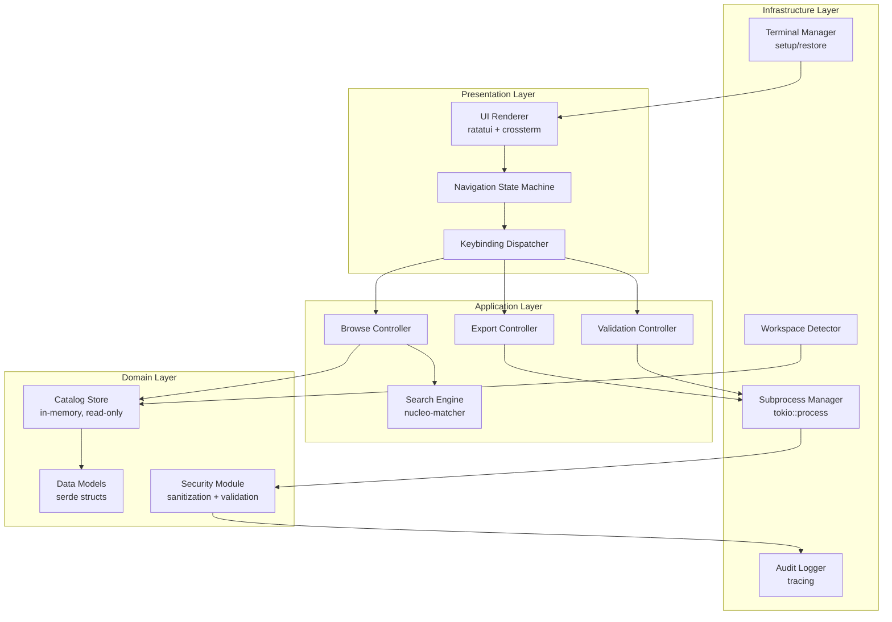
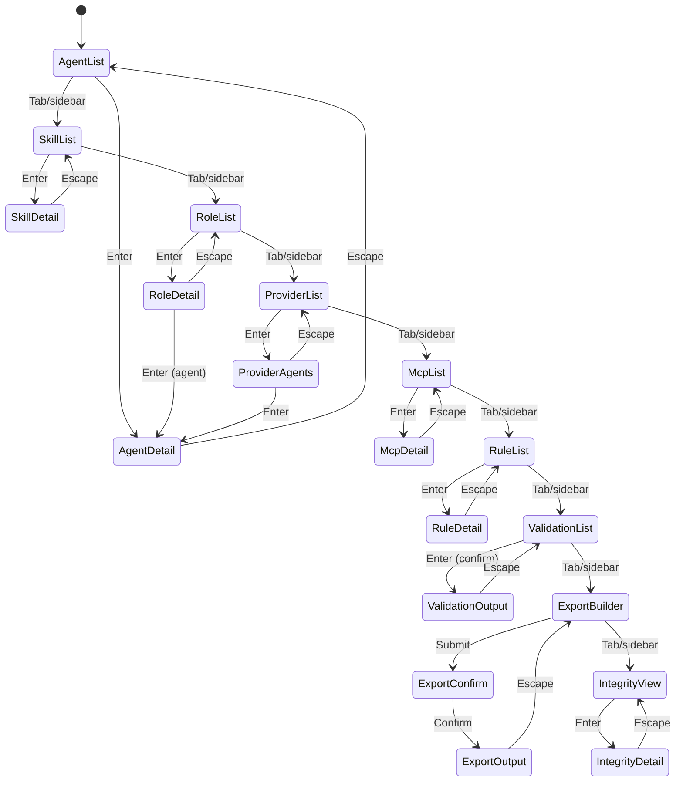

# Design Document

## Overview

The `vfa-tui` is an enterprise-grade terminal user interface written in Rust that provides interactive catalog browsing, validation gate execution, and export command building for the vanguard-frontier-agentic marketplace. It lives at `tools/vfa-tui/` as a separate Cargo workspace within the repository.

### Design Philosophy

1. **No business logic duplication** — The TUI wraps existing Node.js/Python scripts via subprocess; it never re-implements validation or export logic.
2. **Read-first, confirm-before-write** — Catalog access is read-only JSON parsing. Write operations (export) require explicit operator confirmation with dry-run as default.
3. **Security by construction** — No shell interpolation, no network access, no credential exposure, terminal escape sanitization on all rendered content.
4. **Deterministic rendering** — Same inputs produce same outputs. No caches, no config files, no history persistence.
5. **Graceful degradation** — Partial catalog loading on file errors; the TUI never panics on recoverable errors.

### Technology Stack

| Concern | Crate | Version | Rationale |
|---------|-------|---------|-----------|
| Terminal rendering | `ratatui` | 0.30 | Immediate-mode TUI framework with rich widget library |
| Terminal backend | `crossterm` | 0.28 | Cross-platform terminal abstraction (Linux, macOS, WSL) |
| CLI parsing | `clap` | 4.x (derive) | Type-safe argument handling with derive macros |
| JSON deserialization | `serde` + `serde_json` | 1.x | Strict schema validation with `#[serde(deny_unknown_fields)]` |
| Async runtime | `tokio` | 1.x (rt-multi-thread) | Subprocess management without blocking UI thread |
| Structured logging | `tracing` + `tracing-subscriber` | 0.1/0.3 | Structured audit events with configurable output |
| Error handling | `thiserror` + `anyhow` | 1.x/1.x | Domain errors (thiserror) + application errors (anyhow) |
| Fuzzy matching | `nucleo-matcher` | 0.3 | High-performance fuzzy matching for search |
| UUID generation | `uuid` | 1.x (v4) | Session ID generation |

## Architecture

### Layer Diagram



### Module Structure

```
tools/vfa-tui/
├── Cargo.toml
├── Cargo.lock
├── src/
│   ├── main.rs              # Entry point, CLI parsing, terminal setup
│   ├── app.rs               # Application state, event loop
│   ├── cli.rs               # clap derive structs
│   ├── models/
│   │   ├── mod.rs
│   │   ├── agent.rs         # Agent data model
│   │   ├── skill.rs         # Skill data model
│   │   ├── role.rs          # Install role data model
│   │   ├── provider.rs      # Provider enumeration
│   │   ├── mcp_ref.rs       # MCP reference data model
│   │   ├── rule.rs          # Rule data model
│   │   ├── integrity.rs     # Asset integrity data model
│   │   └── harness.rs       # Harness enumeration
│   ├── catalog/
│   │   ├── mod.rs
│   │   ├── loader.rs        # JSON file loading + validation
│   │   └── store.rs         # In-memory catalog store
│   ├── ui/
│   │   ├── mod.rs
│   │   ├── layout.rs        # Layout computation
│   │   ├── widgets/
│   │   │   ├── mod.rs
│   │   │   ├── list_view.rs # Scrollable list widget
│   │   │   ├── detail.rs    # Detail panel widget
│   │   │   ├── status_bar.rs# Status bar widget
│   │   │   ├── help_bar.rs  # Keybinding help bar
│   │   │   ├── output.rs    # Subprocess output panel
│   │   │   └── search.rs    # Search input widget
│   │   ├── nav.rs           # Navigation state machine
│   │   └── theme.rs         # Color/style definitions
│   ├── subprocess/
│   │   ├── mod.rs
│   │   ├── executor.rs      # tokio subprocess spawning
│   │   ├── stream.rs        # stdout/stderr line streaming
│   │   └── signal.rs        # SIGTERM/SIGKILL handling
│   ├── security/
│   │   ├── mod.rs
│   │   ├── sanitize.rs      # Terminal escape sanitization
│   │   ├── validate.rs      # Input/path validation
│   │   └── redact.rs        # Secret redaction
│   ├── search/
│   │   ├── mod.rs
│   │   └── fuzzy.rs         # Fuzzy matching engine
│   ├── workspace/
│   │   ├── mod.rs
│   │   └── detect.rs        # Workspace root detection
│   ├── logging/
│   │   ├── mod.rs
│   │   └── audit.rs         # Structured audit events
│   └── error.rs             # Error types (thiserror)
└── tests/
    ├── integration/
    │   ├── catalog_loading.rs
    │   ├── search.rs
    │   └── subprocess.rs
    └── property/
        ├── sanitize_props.rs
        ├── redact_props.rs
        ├── search_props.rs
        └── validation_props.rs
```

## Components and Interfaces

### Terminal Manager

Responsible for terminal setup (alternate screen, raw mode, cursor hide) and guaranteed restoration on exit (normal, error, or signal).

```rust
pub struct TerminalManager {
    terminal: Terminal<CrosstermBackend<Stdout>>,
}

impl TerminalManager {
    pub fn new() -> Result<Self>;
    pub fn restore(&mut self) -> Result<()>;
    pub fn draw<F>(&mut self, f: F) -> Result<()>
    where F: FnOnce(&mut Frame);
}

impl Drop for TerminalManager {
    fn drop(&mut self) { /* restore terminal state */ }
}
```

### Application State

Central state struct driving the event loop:

```rust
pub struct App {
    pub nav: NavigationState,
    pub catalog: CatalogStore,
    pub search: SearchState,
    pub subprocess: Option<SubprocessHandle>,
    pub status: StatusBar,
    pub session_id: Uuid,
    pub should_quit: bool,
}

impl App {
    pub fn new(catalog: CatalogStore, session_id: Uuid) -> Self;
    pub fn handle_event(&mut self, event: AppEvent) -> Result<()>;
    pub fn tick(&mut self) -> Result<()>;
}
```

### Navigation State Machine



```rust
#[derive(Debug, Clone, PartialEq)]
pub enum View {
    AgentList,
    AgentDetail(String),       // agent ID
    SkillList,
    SkillDetail(String),       // skill ID
    RoleList,
    RoleDetail(String),        // role ID
    ProviderList,
    ProviderAgents(String),    // provider name
    McpList,
    McpDetail(String),         // MCP ref ID
    RuleList,
    RuleDetail(String),        // rule ID
    ValidationList,
    ValidationOutput(String),  // gate script name
    ExportBuilder,
    ExportConfirm(ExportCommand),
    ExportOutput,
    IntegrityView,
    IntegrityDetail(String),   // asset path
}

pub struct NavigationState {
    pub current_view: View,
    pub history: Vec<View>,    // back-navigation stack
    pub sidebar_index: usize,
    pub list_state: ListState, // ratatui list selection state
}
```

### Catalog Store

```rust
pub struct CatalogStore {
    pub agents: Vec<Agent>,
    pub skills: Vec<Skill>,
    pub roles: Vec<Role>,
    pub mcp_refs: Vec<McpReference>,
    pub rules: Vec<Rule>,
    pub integrity: Option<AssetIntegrity>,
    pub load_errors: Vec<CatalogLoadError>,
}

impl CatalogStore {
    pub fn load(workspace_root: &Path) -> Self;
    pub fn agent_count(&self) -> usize;
    pub fn skill_count(&self) -> usize;
    pub fn provider_count(&self) -> usize;
    pub fn agents_by_provider(&self, provider: &str) -> Vec<&Agent>;
    pub fn agents_for_role(&self, role_id: &str) -> Vec<&Agent>;
    pub fn skills_for_agent(&self, agent_id: &str) -> Vec<&Skill>;
    pub fn agents_with_skill(&self, skill_id: &str) -> Vec<&Agent>;
}
```

### Subprocess Executor

```rust
pub struct SubprocessExecutor;

impl SubprocessExecutor {
    pub async fn spawn(
        command: &str,
        args: &[String],
        working_dir: &Path,
        timeout: Duration,
    ) -> Result<SubprocessHandle>;
}

pub struct SubprocessHandle {
    child: tokio::process::Child,
    stdout_rx: mpsc::UnboundedReceiver<OutputLine>,
    stderr_rx: mpsc::UnboundedReceiver<OutputLine>,
    start_time: Instant,
    timeout: Duration,
}

impl SubprocessHandle {
    pub async fn cancel(&mut self) -> Result<ExitStatus>;
    pub fn try_recv_stdout(&mut self) -> Option<OutputLine>;
    pub fn try_recv_stderr(&mut self) -> Option<OutputLine>;
    pub fn is_running(&self) -> bool;
    pub fn exit_code(&self) -> Option<i32>;
}

#[derive(Debug)]
pub struct OutputLine {
    pub content: String,
    pub timestamp: Instant,
    pub stream: OutputStream,
}

#[derive(Debug, Clone, Copy)]
pub enum OutputStream { Stdout, Stderr }
```

### Security Module

```rust
pub mod sanitize {
    /// Replace control bytes (0x00-0x1F except \n and \t, and 0x7F)
    /// with U+FFFD in catalog data.
    pub fn sanitize_catalog_string(input: &str) -> String;

    /// For subprocess output: pass SGR sequences, strip all other escapes.
    pub fn sanitize_subprocess_output(input: &str) -> String;
}

pub mod validate {
    /// Reject shell metacharacters in subprocess arguments.
    pub fn validate_argument(arg: &str) -> Result<(), ValidationError>;

    /// Resolve and validate path (no traversal, within workspace).
    pub fn validate_path(path: &Path, workspace_root: &Path) -> Result<PathBuf, ValidationError>;
}

pub mod redact {
    /// Redact secrets from display/log output.
    pub fn redact_secrets(input: &str) -> String;

    /// Check if an env var name matches secret patterns.
    pub fn is_secret_env_var(name: &str) -> bool;

    /// Build the sanitized environment passed to child processes by excluding
    /// secret-pattern variables while preserving non-secret essentials.
    pub fn sanitized_child_env() -> Vec<(std::ffi::OsString, std::ffi::OsString)>;
}
```

## Data Models

### Agent

```rust
use serde::Deserialize;
use std::collections::HashMap;

#[derive(Debug, Clone, Deserialize)]
#[serde(deny_unknown_fields)]
pub struct Agent {
    pub id: String,
    pub name: String,
    pub version: String,
    #[serde(rename = "type")]
    pub entity_type: AgentType,
    pub provider: Provider,
    pub harnesses: Vec<Harness>,
    pub summary: String,
    pub source_type: SourceType,
    pub official_docs: Vec<String>,
    pub security_notes: String,
    pub last_verified: String,
    pub path: String,
    #[serde(default)]
    pub companion_skills: Vec<String>,
    pub execution_tier: Option<ExecutionTier>,
    pub lifecycle: Option<Lifecycle>,
    #[serde(default)]
    pub harness_variants: HashMap<String, String>,
    pub author: Option<String>,
}

#[derive(Debug, Clone, Deserialize, PartialEq)]
pub enum AgentType {
    #[serde(rename = "agent")]
    Agent,
}

#[derive(Debug, Clone, Deserialize, PartialEq)]
#[serde(rename_all = "kebab-case")]
pub enum ExecutionTier {
    StaticReview,
    ReadOnlyRuntime,
    MutatingRuntime,
}

#[derive(Debug, Clone, Deserialize, PartialEq)]
#[serde(rename_all = "kebab-case")]
pub enum Lifecycle {
    Experimental,
    Beta,
    Stable,
    Deprecated,
}
```

### Skill

```rust
#[derive(Debug, Clone, Deserialize)]
#[serde(deny_unknown_fields)]
pub struct Skill {
    pub id: String,
    pub name: String,
    pub version: String,
    #[serde(rename = "type")]
    pub entity_type: SkillType,
    pub provider: Provider,
    pub harnesses: Vec<Harness>,
    pub summary: String,
    pub source_type: SourceType,
    pub official_docs: Vec<String>,
    pub security_notes: String,
    pub last_verified: String,
    pub path: String,
    pub author: Option<String>,
}

#[derive(Debug, Clone, Deserialize, PartialEq)]
pub enum SkillType {
    #[serde(rename = "skill")]
    Skill,
}
```

### Role

```rust
#[derive(Debug, Clone, Deserialize)]
pub struct RoleCatalog {
    pub version: String,
    pub description: String,
    pub roles: HashMap<String, Role>,
}

#[derive(Debug, Clone, Deserialize)]
pub struct Role {
    pub label: String,
    pub description: String,
    pub agents: Vec<String>,
    #[serde(default)]
    pub skills: Vec<String>,
}
```

### MCP Reference

```rust
#[derive(Debug, Clone, Deserialize)]
#[serde(deny_unknown_fields)]
pub struct McpReference {
    pub id: String,
    pub name: String,
    #[serde(rename = "type")]
    pub entity_type: McpType,
    pub provider: Provider,
    pub harnesses: Vec<Harness>,
    pub summary: String,
    pub source_type: SourceType,
    pub official_docs: Vec<String>,
    pub security_notes: String,
    pub last_verified: String,
    pub path: String,
    pub official_project_url: String,
    pub vendor: String,
    pub auth_model: String,
    pub install_example: String,
    pub unofficial_warning: String,
    pub trust_matrix: Option<TrustMatrix>,
}

#[derive(Debug, Clone, Deserialize)]
pub struct TrustMatrix {
    pub mutation_capable: bool,
    pub requires_egress: bool,
    pub requires_credentials: bool,
    pub signed_release: SignedRelease,
    pub pin_strategy: PinStrategy,
}

#[derive(Debug, Clone, Deserialize, PartialEq)]
#[serde(rename_all = "kebab-case")]
pub enum SignedRelease { Cosign, GhAttestation, Unsigned, Unknown }

#[derive(Debug, Clone, Deserialize, PartialEq)]
#[serde(rename_all = "kebab-case")]
pub enum PinStrategy { Digest, Tag, Version, None }

#[derive(Debug, Clone, Deserialize, PartialEq)]
pub enum McpType {
    #[serde(rename = "mcp-reference")]
    McpReference,
}
```

### Rule

```rust
#[derive(Debug, Clone, Deserialize)]
#[serde(deny_unknown_fields)]
pub struct Rule {
    pub id: String,
    pub name: String,
    #[serde(rename = "type")]
    pub entity_type: RuleType,
    pub provider: Provider,
    pub harnesses: Vec<Harness>,
    pub summary: String,
    pub source_type: SourceType,
    pub official_docs: Vec<String>,
    pub security_notes: String,
    pub last_verified: String,
    pub path: String,
}

#[derive(Debug, Clone, Deserialize, PartialEq)]
pub enum RuleType {
    #[serde(rename = "rule")]
    Rule,
}
```

### Asset Integrity

```rust
#[derive(Debug, Clone, Deserialize)]
pub struct AssetIntegrity {
    pub manifest_version: u32,
    pub algorithm: String,
    pub scope: IntegrityScope,
    pub trees: Vec<IntegrityTree>,
    pub root_files: Vec<IntegrityFile>,
}

#[derive(Debug, Clone, Deserialize)]
pub struct IntegrityScope {
    pub trees: Vec<String>,
    pub root_files: Vec<String>,
}

#[derive(Debug, Clone, Deserialize)]
pub struct IntegrityTree {
    pub tree: String,
    pub aggregate_sha256: String,
    pub files: Vec<IntegrityFile>,
}

#[derive(Debug, Clone, Deserialize)]
pub struct IntegrityFile {
    pub path: String,
    pub sha256: String,
    pub bytes: u64,
}
```

### Shared Enumerations

```rust
#[derive(Debug, Clone, Deserialize, PartialEq, Eq, Hash)]
#[serde(rename_all = "kebab-case")]
pub enum Provider {
    Aws, Azure, Oracle, Oci, Gcp, Alibaba, Huawei,
    Ovhcloud, Ionos, Scaleway, Hetzner, Contabo,
    Kubernetes, Terraform, MultiCloud, Generic,
    Dotnet, Hr, Legal, Salesforce,
}

#[derive(Debug, Clone, Deserialize, PartialEq, Eq, Hash)]
#[serde(rename_all = "kebab-case")]
pub enum Harness {
    Codex, Copilot, ClaudeCode, Cursor, Gemini, Kiro, Other,
}

#[derive(Debug, Clone, Deserialize, PartialEq)]
#[serde(rename_all = "kebab-case")]
pub enum SourceType {
    Original, Adapted, ReferenceOnly,
}
```

### Export Command Model

```rust
#[derive(Debug, Clone)]
pub struct ExportCommand {
    pub platform: String,
    pub selection: ExportSelection,
    pub target_repo: PathBuf,
    pub dry_run: bool,
    pub force: bool,
    pub no_skills: bool,
}

#[derive(Debug, Clone)]
pub enum ExportSelection {
    All,
    Role(String),
    Provider(String),
    Agents(Vec<String>),
}

impl ExportCommand {
    /// Build the argument array for subprocess invocation.
    pub fn to_args(&self) -> Vec<String>;

    /// Render the full command string for display (preview).
    pub fn display_command(&self) -> String;
}
```

### Validation Gate Model

```rust
#[derive(Debug, Clone)]
pub struct ValidationGate {
    pub script_name: String,
    pub description: String,
    pub status: GateStatus,
    pub last_exit_code: Option<i32>,
    pub last_duration: Option<Duration>,
}

#[derive(Debug, Clone, PartialEq)]
pub enum GateStatus {
    NotRun,
    Running,
    Passed,
    Failed,
    TimedOut,
}
```


## Correctness Properties

*A property is a characteristic or behavior that should hold true across all valid executions of a system — essentially, a formal statement about what the system should do. Properties serve as the bridge between human-readable specifications and machine-verifiable correctness guarantees.*

### Property 1: Invalid JSON produces error without panic

*For any* byte sequence that is not valid JSON, feeding it to the catalog loader SHALL produce an `Err` result and SHALL NOT cause a panic or undefined behavior.

**Validates: Requirements 1.2, 2.4, 3.4, 5.5, 12.1**

### Property 2: Fuzzy search returns only matching items

*For any* list of catalog items (agents or skills) and *for any* non-empty query string, every item in the filtered result set SHALL fuzzy-match the query against at least one of its searchable fields (id, name, provider, summary), and no item that does not match any searchable field SHALL appear in the result set.

**Validates: Requirements 1.3, 2.3**

### Property 3: Combined filter returns correct intersection

*For any* list of agents, *for any* provider filter, *for any* harness filter, and *for any* search query (each independently optional), the filtered result set SHALL equal the intersection of: agents matching the provider (if set), agents containing the harness (if set), and agents matching the search query (if set). The result set SHALL be a subset of the original list.

**Validates: Requirements 1.5, 1.6, 1.7**

### Property 4: Agent detail formatter includes all required fields

*For any* valid Agent struct (including those with `None` optional fields), the detail rendering function SHALL produce output containing labels for all required display fields: ID, name, provider, type, harnesses, companion skills, source type, official docs, security notes, last verified, path, harness variants, author, and version. Optional fields with `None` values SHALL render as "N/A".

**Validates: Requirements 1.4**

### Property 5: Reverse-lookup returns correct associated agents

*For any* skill ID and *for any* list of agents, the reverse-lookup function SHALL return exactly the set of agents whose `companion_skills` array contains the given skill ID, and no other agents.

**Validates: Requirements 2.2**

### Property 6: Export command argument construction

*For any* valid `ExportCommand` struct, `to_args()` SHALL produce an argument array that contains: the `--platform` flag with the selected platform, the selection flag (`--all`, `--role <id>`, `--provider <name>`, or agent IDs), the `--repo` flag with the target path, `--dry-run` if dry_run is true, `--force` if force is true, and `--no-skills` if no_skills is true. The argument array SHALL NOT contain shell metacharacters or empty strings.

**Validates: Requirements 7.2, 20.2**

### Property 7: Path validation rejects directory traversal

*For any* path string, if the canonicalized resolved path references a location outside the designated workspace root directory (including paths containing `../` segments, symlinks resolving outside, or absolute paths outside workspace), `validate_path` SHALL return `Err`. *For any* path that resolves to a location within the workspace root, `validate_path` SHALL return `Ok` with the canonical path.

**Validates: Requirements 8.2, 8.5**

### Property 8: Argument validation rejects shell metacharacters

*For any* string, if it contains at least one shell metacharacter (`;`, `|`, `&`, `$`, `` ` ``, `\`, `<`, `>`, `(`, `)`, `{`, `}`, `!`, `#`, `*`, `?`, `[`, `]`, newline, carriage return, null byte), `validate_argument` SHALL return `Err`. *For any* string composed entirely of safe characters (alphanumeric, hyphen, underscore, period, forward slash, space), `validate_argument` SHALL return `Ok`.

**Validates: Requirements 8.3**

### Property 9: Secret environment variable detection

*For any* environment variable name, `is_secret_env_var` SHALL return `true` if and only if the name matches (case-insensitive) one of: `AWS_SECRET_ACCESS_KEY`, `GITHUB_TOKEN`, `NPM_TOKEN`, or any name containing the substrings `_SECRET`, `_KEY`, `_TOKEN`, `_PASSWORD`, or `_CREDENTIAL`.

**Validates: Requirements 9.1**

### Property 10: Secret redaction correctness

*For any* string containing substrings matching secret patterns (base64-encoded strings longer than 40 characters, strings prefixed with `ghp_`, `npm_`, `sk-`, or `AKIA`), `redact_secrets` SHALL replace each matching substring with the fixed redaction placeholder. *For any* substring in the input that does NOT match a secret pattern, that substring SHALL appear unchanged in the output at the same relative position.

**Validates: Requirements 9.3, 9.5**

### Property 11: Catalog string sanitization removes control bytes

*For any* string, `sanitize_catalog_string` SHALL replace all bytes in ranges 0x00–0x08, 0x0B–0x0C, 0x0E–0x1F, 0x7F, and Unicode C1 controls U+0080-U+009F with U+FFFD. Bytes 0x09 (tab) and 0x0A (newline) SHALL be preserved. All other characters SHALL be preserved unchanged.

**Validates: Requirements 10.1**

### Property 12: Subprocess output escape filtering

*For any* string containing ANSI escape sequences or Unicode C1 controls, `sanitize_subprocess_output` SHALL preserve SGR sequences (CSI + numeric parameters + `m`) and SHALL remove all other escape sequences (OSC, DCS, SOS, PM, APC) plus C1 controls. All non-escape content SHALL be preserved unchanged in its original order.

**Validates: Requirements 10.2**

### Property 13: Catalog entries with control bytes are skipped

*For any* catalog JSON array where some entries contain control bytes (0x00–0x08, 0x0B–0x0C, 0x0E–0x1F, 0x7F) in string field values, the catalog loader SHALL skip those entries and load all remaining clean entries. The count of loaded entries plus the count of skipped entries SHALL equal the total entries in the source array.

**Validates: Requirements 10.3**

### Property 14: Strict deserialization rejects unknown fields

*For any* valid catalog entry JSON object, if one or more unknown top-level fields are added, serde deserialization SHALL fail with an error indicating the unknown field name. The original valid object (without unknown fields) SHALL deserialize successfully.

**Validates: Requirements 15.2**

### Property 15: Stable case-insensitive lexicographic sort

*For any* list of catalog items with string IDs, the sort function SHALL produce output where for all adjacent pairs (a, b), `a.id.to_lowercase() <= b.id.to_lowercase()`. For items with equal lowercase IDs, their relative order from the input SHALL be preserved (stability).

**Validates: Requirements 3.2, 4.2, 18.3**

### Property 16: Workspace detection finds correct root

*For any* directory tree where exactly one ancestor directory contains both `catalog/agents.json` and a `package.json` with `name` equal to `@raishin/vanguard-frontier-agentic`, the workspace detector SHALL return that directory. If no such ancestor exists, the detector SHALL return an error.

**Validates: Requirements 14.2, 15.1**

### Property 17: Deterministic rendering

*For any* catalog data, *for any* sequence of user input events, and *for any* fixed terminal dimensions, two executions of the rendering pipeline with identical inputs SHALL produce byte-identical output frames.

**Validates: Requirements 18.1**

## Error Handling

### Error Type Hierarchy

```rust
use thiserror::Error;

/// Domain-specific errors with structured context.
#[derive(Debug, Error)]
pub enum TuiError {
    #[error("catalog file not found: {path}")]
    CatalogNotFound { path: String },

    #[error("catalog parse error in {path} at byte {offset}: {detail}")]
    CatalogParse { path: String, offset: usize, detail: String },

    #[error("catalog entry skipped in {path}: control byte at offset {offset} in field '{field}'")]
    TaintedEntry { path: String, offset: usize, field: String },

    #[error("workspace not found: traversed to filesystem root from {start}")]
    WorkspaceNotFound { start: String },

    #[error("invalid workspace: {path} missing {missing}")]
    InvalidWorkspace { path: String, missing: String },

    #[error("subprocess failed: {command} exited with code {code}")]
    SubprocessFailed { command: String, code: i32 },

    #[error("subprocess timed out after {timeout_secs}s: {command}")]
    SubprocessTimeout { command: String, timeout_secs: u64 },

    #[error("validation rejected: {value} violates {rule}")]
    ValidationRejected { value: String, rule: String },

    #[error("path traversal rejected: {path}")]
    PathTraversal { path: String },

    #[error("terminal capability missing: {capability}")]
    TerminalCapability { capability: String },

    #[error("log destination unavailable: {path}: {reason}")]
    LogDestination { path: String, reason: String },
}
```

### Error Handling Strategy

| Error Category | Strategy | User Experience |
|---|---|---|
| Catalog file missing | Continue with partial data | Warning in status bar, affected views show "unavailable" |
| Catalog parse error | Skip file, log error | Error toast with file path + offset, auto-dismiss 10s |
| Tainted catalog entry | Skip entry, load rest | Warning logged, entry omitted from lists |
| Workspace not found | Fatal at startup | Error message + suggestion, exit code 1 |
| Subprocess failure | Non-fatal, update status | Exit code shown in output panel, gate marked failed |
| Subprocess timeout | Terminate + mark failed | Timeout message in output panel |
| Input validation failure | Reject input, show reason | Error message identifying rejected value and rule |
| Terminal capability missing | Fatal at startup | Single-line error message, exit code 1 |
| Log file unavailable | Fallback to stderr | Warning on stderr, continue operation |
| Terminal resize | Re-render immediately | No visible error, layout adapts |

### Panic Prevention

- All public API functions return `Result<T, TuiError>` or `Result<T, anyhow::Error>`
- No `.unwrap()` or `.expect()` on fallible operations in production code (enforced by clippy lint)
- `#[cfg(test)]` blocks may use `.unwrap()` for test assertions
- The `Drop` implementation on `TerminalManager` catches panics during terminal restoration
- A panic hook is installed at startup to restore terminal state before printing the panic message

### Terminal State Guarantee

```rust
// Installed at startup
fn install_panic_hook() {
    let original_hook = std::panic::take_hook();
    std::panic::set_hook(Box::new(move |panic_info| {
        // Best-effort terminal restoration
        let _ = crossterm::execute!(
            std::io::stdout(),
            crossterm::terminal::LeaveAlternateScreen,
            crossterm::cursor::Show,
        );
        let _ = crossterm::terminal::disable_raw_mode();
        original_hook(panic_info);
    }));
}
```

## Testing Strategy

### Testing Pyramid

```
┌─────────────────────────────────┐
│   Integration Tests (few)       │  Subprocess execution, terminal setup
├─────────────────────────────────┤
│   Property Tests (core logic)   │  Sanitization, redaction, search, validation
├─────────────────────────────────┤
│   Unit Tests (specific cases)   │  CLI parsing, state transitions, edge cases
└─────────────────────────────────┘
```

### Property-Based Testing

**Library:** `proptest` (Rust's mature property-based testing crate)

**Configuration:**
- Minimum 256 cases per property (configurable via `PROPTEST_CASES` env var)
- Each property test tagged with: `// Feature: rust-tui, Property N: <property_text>`
- Shrinking enabled for minimal failing examples

**Property test targets:**
| Property | Module Under Test | Generator Strategy |
|----------|-------------------|-------------------|
| 1: Invalid JSON | `catalog::loader` | `proptest::arbitrary` byte vectors |
| 2: Fuzzy search | `search::fuzzy` | Random strings + random item lists |
| 3: Combined filter | `catalog::store` | Random agents + random filter combos |
| 4: Detail formatter | `ui::widgets::detail` | Arbitrary Agent structs |
| 5: Reverse-lookup | `catalog::store` | Random agents with random companion_skills |
| 6: Export args | `ExportCommand` | Arbitrary ExportCommand structs |
| 7: Path validation | `security::validate` | Path strings with traversal segments |
| 8: Argument validation | `security::validate` | Strings with/without metacharacters |
| 9: Secret detection | `security::redact` | Random env var names |
| 10: Secret redaction | `security::redact` | Strings with embedded secret patterns |
| 11: Catalog sanitization | `security::sanitize` | Strings with control bytes |
| 12: Escape filtering | `security::sanitize` | Strings with ANSI escape sequences |
| 13: Tainted entry skip | `catalog::loader` | JSON arrays with tainted entries |
| 14: Unknown field rejection | `catalog::loader` | Valid JSON + random extra fields |
| 15: Sort stability | `catalog::store` | Random ID lists with mixed case |
| 16: Workspace detection | `workspace::detect` | Random directory tree structures |
| 17: Deterministic rendering | `ui::layout` | Fixed inputs, compare two runs |

### Unit Tests (Example-Based)

- CLI flag parsing (all valid combinations, invalid flags)
- Navigation state machine transitions (each edge in the state diagram)
- Keybinding dispatch (each key → correct action)
- Validation gate extraction from package.json
- ExportCommand defaults (dry_run = true)
- Error message formatting (contains expected substrings)
- Status bar rendering with known counts

### Integration Tests

- Catalog loading from fixture files (full round-trip)
- Subprocess spawning with mock scripts (exit codes, stdout/stderr separation)
- Signal handling (SIGTERM → SIGKILL escalation)
- Terminal setup/restore cycle
- Workspace detection from nested directories

### CI Pipeline

```yaml
# tools/vfa-tui/.github/workflows/ci.yml (or integrated into repo root CI)
steps:
  - cargo fmt -- --check
  - cargo clippy -- -D warnings
  - cargo test                    # unit + property + integration
  - cargo test -- --ignored       # slow/expensive tests (benchmarks)
  - cargo build --release         # verify release build with #![deny(warnings)]
```

### Test Fixtures

Test fixtures live at `tools/vfa-tui/tests/fixtures/` and include:
- `agents.json` — minimal valid catalog (5 agents across 3 providers)
- `skills.json` — minimal valid skills (3 skills)
- `install-roles.json` — all 6 roles with 2-3 agents each
- `mcp-references.json` — 2 MCP references
- `rules.json` — 2 rules
- `asset-integrity.json` — minimal integrity manifest
- `package.json` — with validate:* scripts
- `invalid.json` — malformed JSON for error path testing
- `tainted-agents.json` — agents with control bytes in fields

### Coverage Target

- Line coverage: ≥80% for `src/` (excluding `main.rs` terminal setup)
- Branch coverage: ≥70% for security module (`security/`)
- All 17 correctness properties passing with 256+ iterations each

## v0.2.0 Enhancements

### Provider Coverage Sparkline Bars

Added to `render_provider_list` in `app.rs`. Each provider entry now includes a 20-character horizontal bar using block characters (█░) showing agent count relative to the largest provider. The bar width is calculated as `(count / max_count) * 20`.

### Validation Gate Heatmap Coloring

Added to `render_validation_list` in `app.rs`. Each gate entry is now rendered with a status-specific style from the theme module:
- `gate_not_run()` — gray/dim for NotRun
- `gate_running()` — yellow/bold for Running
- `gate_passed()` — green for Passed
- `gate_failed()` — red/bold for Failed
- `gate_timed_out()` — magenta/bold for TimedOut

### Agent Dependency Graph

Extended `render_agent_detail` in `detail.rs` to accept a `roles: &[&str]` parameter showing roles containing the agent. Added `roles_containing_agent(agent_id) -> Vec<&str>` to `CatalogStore`. The skill detail view already shows "Related Agents" via `agents_with_skill()`.

### Live Filter Chips

Added `provider_filter: Option<String>` and `harness_filter: Option<String>` fields to `App`. When active in agent list view, filter chips render at the top of the main content area showing `[provider:X] [harness:Y] [query:"Z"]`. Keybindings: 'p' cycles provider filter, 'h' cycles harness filter. Escape clears filters before navigating back.

### Dry-Run Tree Preview

Enhanced `render_export_output` to parse dry-run output lines prefixed with "export agent:" or "export skill:" and display them as a tree structure with agents/ and skills/ directories, total counts, and raw output below.

### Keyboard Shortcut Overlay

Added `show_help_overlay: bool` to `App`. When '?' is pressed (outside search mode), a full-screen overlay renders all keybindings organized by section. Dismissed with Escape or '?' again.

### Tab Completion in Export Builder

Added `completion_suggestions: Vec<String>` and `completion_index: usize` to `App`. The export builder view shows completion suggestions below the focused field. `update_completion_suggestions()` populates suggestions from catalog data (platforms, roles, providers).

### Validation Gate Timing Display

The `ValidationGate` model already has `last_duration: Option<Duration>`. The validation list now renders timing as "(X.Xs)" after the status when a duration is available.

### New Theme Styles

Added to `ui/theme.rs`:
- `gate_not_run()`, `gate_running()`, `gate_passed()`, `gate_failed()`, `gate_timed_out()` — validation status colors
- `filter_chip()` — filter chip background style
- `sparkline_filled()`, `sparkline_empty()` — sparkline bar colors
- `help_overlay_title()`, `help_overlay_section()` — help overlay styles
- `completion_highlight()`, `completion_normal()` — completion suggestion styles

### New CatalogStore Methods

Added to `catalog/store.rs`:
- `roles_containing_agent(agent_id: &str) -> Vec<&str>` — reverse lookup of roles containing an agent
- `provider_names() -> Vec<String>` — all distinct provider names sorted
- `harness_names() -> Vec<String>` — all distinct harness names sorted
- `role_ids() -> Vec<String>` — all role IDs sorted
- `platform_names() -> Vec<&'static str>` — valid export platform names
