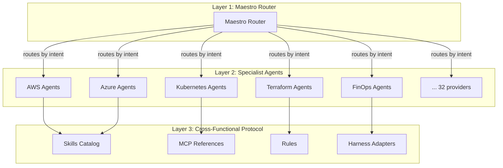
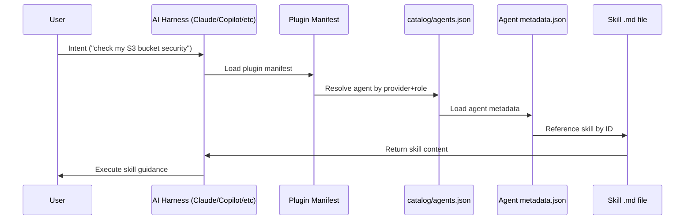

# Architecture

The Vanguard Frontier Agentic ecosystem uses a three-layer architecture designed for safety, auditability, and multi-cloud coordination.

---

## Three-Layer System



### Layer 1: Maestro Router

The Maestro router receives user intent and routes to the appropriate specialist agent. Routing is validated against 357 scenarios (`tests/validate-maestro-routing.py`). The router enforces refusal-by-default: if intent does not match a known routing path, the system refuses rather than guessing.

### Layer 2: Specialist Agents

Each provider directory under `agents/` contains specialist agents scoped to a single cloud provider or platform. Agents declare their capabilities via `metadata.json` and reference skills they can execute.

### Layer 3: Cross-Functional Protocol

Skills, MCP references, rules, and harness adapters form the execution layer. Skills are provider-scoped Markdown files with structured frontmatter. Harness adapters translate between the canonical skill format and each AI coding tool's native interface.

---

## Skill and Agent Resolution Flow



---

## Directory Structure

```
/
├── agents/              # 426 agents across 34 provider directories
│   ├── aws/             # AWS specialist agents
│   ├── azure/           # Azure specialist agents
│   ├── kubernetes/      # Kubernetes agents
│   └── ...
├── skills/              # 404 skills across 36 directories
│   ├── aws/             # AWS-scoped skills
│   ├── azure/           # Azure-scoped skills
│   └── ...
├── catalog/             # Machine-readable indexes
│   ├── agents.json      # Agent catalog index
│   ├── skills.json      # Skill catalog index
│   ├── install-roles.json
│   └── asset-integrity.json
├── schemas/             # JSON Schema contracts
│   ├── skill.schema.json
│   ├── agent.schema.json
│   ├── skill.frontmatter.schema.json
│   ├── agent.frontmatter.schema.json
│   ├── mcp-reference.schema.json
│   ├── rule.schema.json
│   ├── attestation.schema.json
│   └── skill-manifest.schema.json
├── mcp/                 # MCP reference definitions
├── rules/               # Harness rules
├── powers/              # Kiro Powers
├── scripts/             # Build and generation scripts
├── tests/               # Validation scripts
└── docs/                # Documentation (this site)
```

---

## Catalog Indexing

The `catalog/` directory contains machine-readable JSON indexes generated from the filesystem:

- `catalog/agents.json` - All 426 agents with metadata
- `catalog/skills.json` - All 404 skills with frontmatter
- `catalog/install-roles.json` - Role-to-agent mapping
- `catalog/asset-integrity.json` - SHA-256 hashes of critical files

These indexes are validated by `npm run validate:catalog` and regenerated by `npm run manifest:write:all`.

---

## Multi-Harness Adapter Pattern

Each agent can be installed into multiple AI coding harnesses. The adapter layer translates between the canonical format and each harness:

| Harness | Plugin Location | Manifest Format |
|---------|-----------------|-----------------|
| Claude Code | `.claude-plugin/plugin.json` | Claude plugin spec |
| Codex | `.agents/plugins/marketplace.json` | Codex marketplace |
| GitHub Copilot | `.github/plugin/` | Copilot extension |
| Cursor | `.cursor-plugin/plugin.json` | Cursor plugin spec |
| Gemini CLI | Export via `vfa-export-agents` | Gemini format |
| Kiro | `powers/` | Kiro Powers format |

Validation gates ensure manifests stay in sync:
- `npm run validate:plugin-manifest` (Claude)
- `npm run validate:multi-harness-marketplace` (cross-harness)
- `npm run validate:codex-marketplace` (Codex)
- `npm run validate:kiro-powers` (Kiro)

---

## Refusal-by-Default Safety Model

The system refuses to act when:

1. **Unknown intent** - Maestro cannot route to a specialist
2. **Out-of-scope request** - Agent does not have a skill for the request
3. **Missing permissions** - Skill requires elevated access not granted
4. **Validation failure** - Schema validation fails on input

This is enforced at routing time, not at execution time. The Maestro routing validation (`tests/validate-maestro-routing.py`) verifies 357 scenarios including negative cases (requests that should be refused).

---

## Schema Contracts

All assets conform to JSON Schema contracts defined in `schemas/`:

| Schema | Validates |
|--------|-----------|
| `skill.schema.json` | Full skill definition |
| `agent.schema.json` | Full agent definition |
| `skill.frontmatter.schema.json` | Skill Markdown frontmatter |
| `agent.frontmatter.schema.json` | Agent metadata.json |
| `mcp-reference.schema.json` | MCP reference definitions |
| `rule.schema.json` | Harness rule definitions |
| `attestation.schema.json` | Release attestations |
| `skill-manifest.schema.json` | Generated skill manifest |

Validation gates: `npm run validate:skill-schema`, `npm run validate:agent-schema`.

---

## Enterprise Reviewer Notes

- The three-layer architecture is documented in [ADR-0001](../adr/0001-initial-architecture/)
- Routing validation covers 357 scenarios, verifiable via `npm run validate:maestro-routing`
- Schema contracts are enforced in CI, not advisory
- The refusal-by-default model means unrecognized intents never reach execution
- Directory structure is stable: adding a new provider means adding a directory under `agents/` and `skills/`, not modifying core logic
