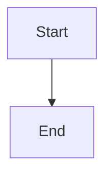

# 🤝 Contributing to Documentation

This page covers documentation-specific contribution guidance. For general contribution guidelines (code, skills, agents), see the main [CONTRIBUTING.md](https://github.com/VincentChuWaiChow/vanguard-frontier-agentic/blob/master/CONTRIBUTING.md) in the repository root.

---

## 🗂️ Documentation Structure

All documentation lives in the `docs/` directory:

```
docs/
├── index.md                 # Documentation homepage
├── getting-started.md       # Installation and first use
├── architecture.md          # System design with diagrams
├── configuration.md         # All settings and schemas
├── deployment.md            # Release pipeline
├── github-pages.md          # How the docs site works
├── security.md              # Security posture
├── testing.md               # Validation gates
├── operations-runbook.md    # Operational procedures
├── troubleshooting.md       # Common issues
├── contributing.md          # This page
├── governance.md            # Decision-making process
├── roadmap.md               # Planned work
├── faq.md                   # Frequently asked questions
└── adr/                     # Architecture Decision Records
    ├── 0001-initial-architecture.md
    └── 0002-documentation-site-with-jekyll-github-pages.md
```

---

## 📄 Adding a New Documentation Page

### 1. Create the file

Create a Markdown file in `docs/` with Jekyll front matter:

```markdown
---
layout: default
title: "Your Page Title"
permalink: /docs/your-page-slug/
---

# Your Page Title

Content here...
```

### 2. Required front matter fields

| Field | Required | Description |
|-------|----------|-------------|
| `layout` | Yes | Always `default` for docs pages |
| `title` | Yes | Page title (shown in browser tab) |
| `permalink` | Recommended | URL path for the page |

### 3. Add to the docs index

Edit `docs/index.md` and add a link to your new page in the appropriate section.

### 4. Commit and push

The Jekyll workflow triggers on any change to `docs/**` pushed to master.

---

## 📏 Jekyll Conventions

### File naming

- Use kebab-case: `operations-runbook.md`, not `operationsRunbook.md`
- Prefix ADRs with number: `0003-decision-title.md`

### Content guidelines

- Write directly. No marketing language.
- Every claim must cite evidence (file path, command, configuration)
- Use tables for structured data
- Use checklists for procedures
- Include "What can go wrong" or "How to verify this works" sections
- Mark speculative content with `[NEEDS OWNER INPUT]`

### Mermaid diagrams

Use fenced code blocks with the `mermaid` language tag:

````markdown

````

GitHub Pages renders Mermaid natively (no plugin required).

### Internal links

Use relative paths:

```markdown
See the [Architecture](../architecture/) page.
```

### Code blocks

Use triple backticks with a language specifier:

````markdown
```bash
npm run validate
```
````

---

## Local Preview

### Prerequisites

- Ruby 3.3+
- Bundler (`gem install bundler`)

### Setup

```bash
# Install gems (from repo root)
bundle install

# Serve with live reload
bundle exec jekyll serve --baseurl "" --livereload
```

The site is available at `http://localhost:4000/`.

Use `--baseurl ""` locally. The production build uses `--baseurl "/vanguard-frontier-agentic"`.

---

## Front Matter Reference

### Standard docs page

```yaml
---
layout: default
title: "Page Title"
permalink: /docs/page-slug/
---
```

### ADR

```yaml
---
layout: default
title: "ADR-NNNN: Decision Title"
permalink: /docs/adr/nnnn-decision-slug/
---
```

---

## 🔧 How Docs CI Works

Documentation quality is checked by:

1. **Jekyll build** in `.github/workflows/jekyll-gh-pages.yml` - confirms all pages render without errors
2. **markdownlint** via `npm run lint:md` - style enforcement
3. **codespell** via `npm run lint:spell` - typo detection
4. **validate:links** via `npm run validate:links` - internal link checking

### Running docs CI locally

```bash
# Markdown lint
npm run lint:md

# Spell check
npm run lint:spell

# Both together
npm run lint:docs

# Link validation
npm run validate:links
```

---

## ✍️ Writing Style Guide

| Do | Do Not |
|----|--------|
| "Run `npm run validate` to confirm" | "Simply run the validation suite" |
| "This fails because X" | "This might potentially cause issues" |
| "File: `.github/workflows/release.yml`" | "The release workflow" (without file reference) |
| "357 scenarios" | "comprehensive coverage" |
| `[NEEDS OWNER INPUT]` for unknowns | Guessing or omitting |

---

## 📐 ADR Guidelines

Architecture Decision Records follow this template:

```markdown
# ADR-NNNN: Decision Title

## Status

Accepted | Proposed | Deprecated | Superseded by ADR-XXXX

## Date

YYYY-MM-DD

## Context

What is the problem? What constraints exist?

## Decision

What did we decide? Be specific.

## Consequences

What are the trade-offs? What becomes easier? What becomes harder?
```

To propose a new ADR:

1. Create `docs/adr/NNNN-descriptive-slug.md`
2. Use the next sequential number
3. Set status to "Proposed"
4. Open a PR for discussion

---

## ✅ How to Verify This Works

```bash
# Confirm all docs render
bundle exec jekyll build --baseurl "/vanguard-frontier-agentic"

# Check for link issues
npm run validate:links

# Run docs linting
npm run lint:docs
```
