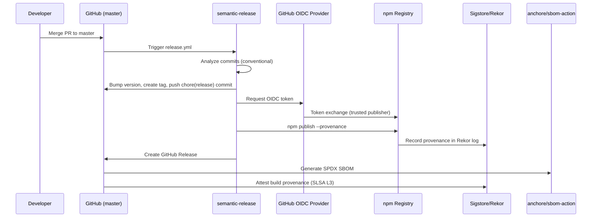

# 📦 Deployment

The release pipeline publishes `@raishin/vanguard-frontier-agentic` to npm with full supply chain integrity. No long-lived secrets are stored in this repository.

---

## 🚀 Release Flow Overview



---

## Trigger Conditions

The release workflow (`.github/workflows/release.yml`) triggers on:

1. **Push to master** - Every merge to master runs semantic-release
2. **workflow_dispatch** - Manual trigger with two options:
   - `dry_run: true` - Simulates release without publishing
   - `republish: true` - Re-publishes current version (for failed npm publishes)

---

## 🔐 OIDC Trusted Publishing

The release uses GitHub OIDC token exchange instead of a stored `NPM_TOKEN`:

- **Environment:** `npm-deployment-master`
- **Trusted publisher configuration on npmjs.com:**
  - Owner: `raishin`
  - Repository: `vanguard-frontier-agentic`
  - Workflow: `release.yml`
  - Environment: `npm-deployment-master`

The `id-token: write` permission allows the workflow to mint a short-lived OIDC token. npm validates the token's claims against the registered trusted publisher entry.

Reference: `.github/workflows/release.yml`, lines declaring `id-token: write` permission.

---

## npm Provenance

Every publish includes a Sigstore-backed provenance statement:

```bash
npm publish --provenance
```

This embeds a signed attestation in the npm registry linking the published package to:
- The exact commit SHA
- The GitHub Actions workflow run
- The OIDC identity of the publisher

Consumers verify with:

```bash
npm audit signatures
```

---

## 🛡️ SLSA Build L3

Achieved via `actions/attest-build-provenance` in the release workflow:

1. `npm pack` creates the tarball after semantic-release bumps the version
2. `actions/attest-build-provenance` signs the tarball with SLSA Build L3 attestation
3. The attestation is stored alongside the GitHub Release

This proves the tarball was produced by this repository's CI, not tampered with post-build.

---

## SPDX SBOM Generation

The `anchore/sbom-action` generates a Software Bill of Materials:

- Format: SPDX JSON
- Scope: Full repository contents
- Attached to: GitHub Release artifacts

Local generation (requires syft):

```bash
npm run release:sbom
```

---

## ⚖️ Permissions Model

The release job uses elevated permissions (least-privilege per job):

| Permission | Purpose |
|------------|---------|
| `contents: write` | Push chore(release) commit and create tag |
| `issues: write` | semantic-release/github plugin probes this scope |
| `pull-requests: write` | semantic-release/github plugin probes this scope |
| `id-token: write` | OIDC token for npm trusted publishing |
| `attestations: write` | Write SLSA attestation bundle |

All other jobs in the repository operate with `contents: read` only.

---

## semantic-release Configuration

semantic-release analyzes commit messages (Conventional Commits):

| Prefix | Release Type |
|--------|-------------|
| `fix:` | Patch bump |
| `feat:` | Minor bump |
| `BREAKING CHANGE` | Major bump |
| `chore:` | No release |
| `docs:` | No release |

The chore(release) commit pushed by semantic-release includes `[skip ci]` to prevent recursive workflow triggers.

---

## Version Detection Logic

The release workflow captures the pre-release version and compares it post-semantic-release:

```bash
PRE_VERSION="$(node -p "require('./package.json').version")"
# ... semantic-release runs ...
POST_VERSION="$(node -p "require('./package.json').version")"
```

If versions match and `republish` is not set, npm publish is skipped (no new release was produced).

---

## ⚠️ What Can Go Wrong

### OIDC token not available

**Symptom:** `ACTIONS_ID_TOKEN_REQUEST_URL` is empty.
**Cause:** `id-token: write` permission missing or environment not configured.
**Fix:** Verify the `permissions` block and that `environment: npm-deployment-master` is set.

### npm trusted publisher mismatch

**Symptom:** npm publish returns 403.
**Cause:** The OIDC claims (owner, repo, workflow, environment) do not match npmjs.com configuration.
**Fix:** Verify exact casing on npmjs.com trusted publisher settings. Owner must be lowercase.

### semantic-release no-ops

**Symptom:** "There are no relevant changes, so no new version is released."
**Cause:** All commits since last tag are `chore:` or `docs:` type.
**Fix:** This is expected behavior. Only `fix:` and `feat:` commits trigger releases.

---

## ✅ How to Verify This Works

```bash
# Confirm provenance on the published package
npm audit signatures

# Check the latest GitHub Release has SBOM attached
# (GitHub UI: Releases page, check assets)

# Verify attestation
gh attestation verify <tarball-path> --owner Raishin
```

---

## 🏛️ Enterprise Reviewer Notes

- No `NPM_TOKEN` secret exists in this repository
- The OIDC flow is documented in `docs/npm-oidc-trusted-publishing.md`
- The `persist-credentials: true` on checkout is required for semantic-release to push back the chore(release) commit; this is acceptable because the workflow only runs on push to master (trusted ref)
- The `--debug` flag on semantic-release is intentional for forensics
