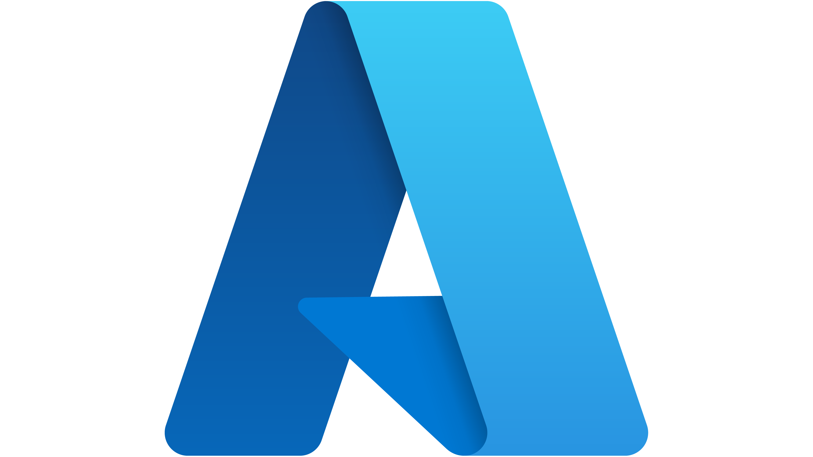

# Azure skills

  

This folder contains Azure-focused skills curated for this marketplace.

## Local marketplace portfolio

As of **2026-04-28**, this folder contains **24** local Azure skills:

- `azure-ai-foundry-ops-governor`
- `azure-aks-platform-operator`
- `azure-app-service-production-readiness`
- `azure-cost-estimation-review`
- `azure-cost-optimization-governor`
- `azure-entra-id-specialist`
- `azure-cosmosdb-application-developer`
- `azure-cosmosdb-platform-operator`
- `azure-cosmosdb-performance-investigator`
- `azure-governance-policy-guardrails`
- `azure-identity-governance-review`
- `azure-key-vault-secret-lifecycle-auditor`
- `azure-landing-zone-architect`
- `azure-migrate-landing-zone-cutover`
- `azure-network-topology-review`
- `azure-observability-investigator`
- `azure-platform-automation-devops`
- `azure-private-endpoint-adoption-planner`
- `azure-rbac-review`
- `azure-resilience-bcdr-review`
- `azure-resource-health-incident-triage`
- `azure-role-selector`
- `azure-security-posture-hardening`
- `azure-subscription-resource-organization`

## Official upstream reference

When adding or reviewing Azure skills, check the official Microsoft Azure skills repository first:

- https://github.com/microsoft/azure-skills

Use it as the primary upstream reference for Azure-specific workflow ideas, patterns, and alignment with Microsoft-maintained guidance.

## Official Azure skills snapshot

Source: `https://github.com/microsoft/azure-skills`

Snapshot date: **2026-04-27**

Based on the upstream `skills/` folder on 2026-04-27, the listed skill directories are:

- `airunway-aks-setup`
- `appinsights-instrumentation`
- `azure-ai`
- `azure-aigateway`
- `azure-cloud-migrate`
- `azure-compliance`
- `azure-compute`
- `azure-cost`
- `azure-deploy`
- `azure-diagnostics`
- `azure-enterprise-infra-planner`
- `azure-hosted-copilot-sdk`
- `azure-kubernetes`
- `azure-kusto`
- `azure-messaging`
- `azure-prepare`
- `azure-quotas`
- `azure-rbac`
- `azure-resource-lookup`
- `azure-resource-visualizer`
- `azure-storage`
- `azure-upgrade`
- `azure-validate`
- `entra-app-registration`
- `microsoft-foundry`

Note: the upstream repository README currently says it ships **20 curated Azure skills**, but the visible `skills/` directory listing on 2026-04-27 shows **25 skill directories**. Treat the directory listing as the fresher source unless Microsoft clarifies otherwise.
