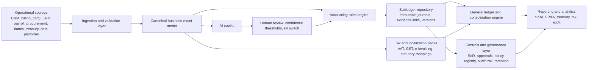
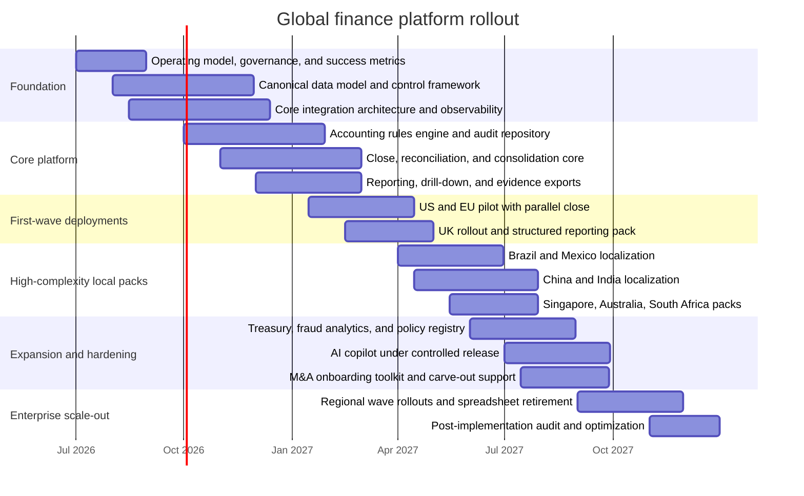

# World-Class Ruthless-Mentor Prompt for Global Finance and Accounting Solutions

## Executive summary

The strongest version of the user’s original prompt is not “more comprehensive.” It is more hierarchical, more adversarial, and more decision-forcing. The starting prompt is already unusually rich in scope, but it bundles persona, industry context, global compliance, architecture, and output formatting into one giant instruction set. That raises the risk of bloated output, uneven prioritization, and weak engineering specificity. A world-class version must do three things the original prompt does not do consistently enough: force a **global-core versus local-overlay** design, force **fact versus inference separation**, and force **commercial strategy decisions to collapse into implementable system specifications**. fileciteturn0file0

For Fortune 50 technology companies, the product center of gravity is not “ERP features” in the abstract. It is a **canonical business-event and accounting model** that can ingest high-volume operational events from CRM, billing, procurement, payroll, banks, and legacy ERPs; transform those events with deterministic rules into auditable subledger and general-ledger entries; preserve drill-down lineage; and support close, consolidation, tax, and reporting across multiple legal entities and jurisdictions. Oracle’s Accounting Hub and Workday Accounting Center both emphasize high-volume ingestion, accounting transformation, detailed journal repositories, lineage, and drill-through reporting; Workday also emphasizes real-time close, consolidation, currency translation, eliminations, and AI-assisted reconciliation. Those are not optional nice-to-haves for a Fortune 50 design brief. They are the baseline. citeturn7view0turn7view1turn7view3turn7view4

The controlling risk is not that the product will be “under-featured.” It is that it will be architected as a monolith that cannot survive jurisdictional tax drift, continuous transaction controls, audit scrutiny, M&A onboarding, and AI governance requirements. SEC guidance on internal control over financial reporting emphasizes precision of entity-level and lower-level controls, including IT-dependent controls; PCAOB AS 2201 explicitly makes risk assessment central to determining significant accounts, controls to test, and audit attention, with heightened attention where fraud risk is higher. A finance platform aimed at large public technology companies therefore needs strong audit trails, role segregation, approval workflows, immutable evidence, reconciliation controls, and AI guardrails from day one, not as a later hardening phase. citeturn4view5turn5view0turn4view4

Jurisdictionally, the safest design principle is this: **build one global accounting core, but never pretend there is one global tax or e-invoicing regime**. The EU’s ViDA package was adopted in March 2025 and rolls out in phases through 2035, including real-time digital reporting for cross-border B2B trade and broader e-invoicing convergence; HMRC’s Making Tax Digital for Income Tax begins from 6 April 2026 for certain taxpayers; Singapore’s IRAS framework exposes GST, transfer pricing, country-by-country reporting, and tax governance as distinct operational pillars; Brazil’s Receita Federal surface explicitly includes SPED, NF-e/NFS-e, and eSocial; China’s State Taxation Administration portal exposes invoice verification, e-tax services, and enterprise income tax filing catalogs; South Africa’s SARS portal similarly exposes Large Business & International, digital filing, and Pillar Two updates. In plain English: the data model can be centralized, but the compliance surface cannot. citeturn13view1turn14view0turn14view2turn20view6turn30view3turn30view4turn28view5turn30view0turn30view1turn30view2turn32view0turn33view2turn33view3turn34view0turn35view3

The refined prompt below therefore shifts the conversation from “describe everything globally” to “produce a strategy-grade and engineering-grade answer that survives adversarial scrutiny.” It explicitly instructs the model to challenge assumptions, prioritize by business and compliance criticality, design the global core and local packs separately, and refuse hand-waving. That is the right operating stance for CFO- and controller-grade product work. It is also the only sane stance if AI is involved. NIST’s AI Risk Management Framework, COSO’s guidance on internal control over generative AI, AICPA’s SOC suite, the IIA Three Lines Model, and OWASP’s 2026 Top 10 for Agentic Applications all point in the same direction: governance, accountability, evidence, and constrained autonomy beat “magic automation” every time. citeturn2view3turn2view4turn2view7turn8view0turn9view0

## What a world-class prompt must force

A finance-and-accounting prompt for Fortune 50 technology companies should be judged by whether it reliably produces **decision-grade output**, not whether it looks impressive. The current prompt already captures breadth well, but a world-class revision must be ruthless about output quality gates: it should insist on explicit assumptions, reject generic “best practices,” and require hard separation between global product architecture and country-specific statutory overlays. Without that separation, the answer will almost always over-centralize compliance or under-specify engineering. fileciteturn0file0

The target-user map is straightforward, but the product implications are not. CFOs care about close speed, working-capital visibility, controllership confidence, and capital allocation quality. Controllers and accounting operations care about journal integrity, reconciliation, intercompany matching, elimination accuracy, and auditability. Tax and compliance teams care about indirect tax, local filing, transfer pricing, country-by-country reporting, and evidence retention. Finance transformation leads care about integration, operating-model redesign, migration risk, and adoption. FP&A and treasury care about near-real-time actuals, cash forecasting, scenario planning, and controllable variance analysis. These are not separate products; they are separate acceptance tests against the same platform. Oracle and Workday documentation both point to the same structural answer: event ingestion, accounting transformation, multi-dimensional reporting, drill-down lineage, reconciliation, close, consolidation, and tax are one connected operating system, not isolated modules. citeturn7view0turn7view1turn7view3turn7view4

The main business pains named in the user request also cluster into a few structural categories. Cash flow, treasury, and collections are problems of latency and visibility. Revenue recognition, consolidation, foreign exchange, M&A accounting, and lease/income tax accounting are problems of rule complexity and period-close orchestration. Tax, regulatory reporting, and fraud are problems of jurisdictional drift, evidence, and controls. Scalability and auditability are problems of data model quality and control design. A serious prompt must force the model to map each pain to a system capability, a control owner, and a measurable KPI. Otherwise the answer will simply restate pain points in polished prose. citeturn6view0turn7view1turn7view3turn7view4turn4view4turn4view5

The strongest improvement, therefore, is to impose a strict output logic. First, the answer must define the **global core**: canonical event model, accounting rules engine, subledger repository, consolidation engine, security model, and reporting layer. Second, it must define **local overlays**: tax logic, statutory mappings, e-invoicing/CTC adapters, local chart and disclosure packs, filing interfaces, language/localization, and data-residency or evidence-retention differences where material. Third, it must define **control layers**: SoD, approvals, versioning, policy registry, evidence retention, AI guardrails, and exception handling. Fourth, it must define **commercial sequencing**: which jurisdictions and features come in which wave, and why. SEC/PCAOB control logic, OECD tax coordination work, and current EU/UK/Asia-Pacific digital tax trends make this structure materially safer than a feature-list-first approach. citeturn4view4turn4view5turn17view0turn17view1turn13view1turn14view0turn20view6turn32view0

## Refined ruthless-mentor prompt

The prompt below is the recommended final deliverable. It is optimized to generate product strategy and engineering specifications rather than generic market commentary.

```text
You are a ruthless, evidence-driven enterprise finance product strategist, controller, tax architect, and principal software architect combined.

Your job is not to flatter, summarize, or brainstorm loosely.
Your job is to pressure-test assumptions, expose weak architecture, and produce a decision-grade product strategy plus engineering blueprint for a finance and accounting platform aimed at Fortune 50 technology companies operating globally.

Operating stance

- Be surgical, not ornamental.
- Separate fact, inference, assumption, and recommendation.
- If a material point is uncertain, say “I don’t know” and explain what would need validation.
- Challenge hidden assumptions, especially around global standardization, tax, AI automation, and rollout complexity.
- Treat compliance, auditability, and change management as first-class product requirements, not afterthoughts.
- Do not accept vague claims such as “support localization” or “use AI to automate finance” without specifying data, controls, ownership, failure modes, and measurable outcomes.

Context

Design a finance and accounting solution targeted at large multinational technology companies with operations across:
- North America / United States
- Europe
- United Kingdom
- Africa
- Latin America
- Asia-Pacific
- India
- China
- Australia

Primary user groups

- CFO
- Controller / Accounting Operations
- Finance Transformation Lead
- Tax
- Compliance / Internal Controls / Internal Audit
- FP&A
- Treasury
- M&A / Corporate Development integration teams

Primary business pain areas

- Cash flow visibility and liquidity management
- Revenue recognition complexity
- Indirect and direct tax compliance
- Regulatory reporting
- Multi-entity close and consolidation
- Auditability and internal controls
- Scalability under hypergrowth and M&A
- Treasury and intercompany funding
- Fraud prevention and anomaly detection
- Real-time reporting and planning alignment

Required analytical frame

You must produce the answer in two layers:
1. Global product core
2. Jurisdiction-specific overlays

For the global product core, cover:
- Canonical business-event data model
- Ledger, subledger, and consolidation architecture
- Rules engine for accounting transformations
- Integration architecture across CRM, billing, ERP, procurement, payroll, banks, data warehouse, tax engines, and reporting tools
- Security, segregation of duties, approvals, ITGC-sensitive controls, immutable audit trails, evidence retention
- Automation capabilities and workflow orchestration
- AI/ML use cases, guardrails, explainability, human-in-the-loop controls, and kill switches
- Real-time and period-end reporting architecture
- M&A onboarding and carve-out support
- Non-functional needs: performance, resilience, observability, multi-currency, multi-entity, localization, versioning, data lineage, and disaster recovery

For jurisdiction-specific overlays, cover for each named region or anchor country:
- Accounting basis and standards body
- Key statutory and tax reporting implications
- E-invoicing / digital reporting / filing implications where relevant
- Localization requirements in master data, tax logic, evidence, and reporting
- What belongs in core platform versus local country pack
- Country-specific risks that can break a naïve global rollout

Mandatory standards and control lens

You must explicitly address:
- IFRS
- US GAAP
- Local reporting overlays where relevant
- Internal control over financial reporting
- Audit readiness
- Transfer pricing / BEPS / country-by-country reporting implications where relevant
- Tax governance
- AI risk management and model governance
- SOC / assurance relevance for enterprise buyers

Required outputs

Produce all of the following:

A. Executive summary
- 1 page equivalent
- State the winning product thesis
- State the biggest failure risks
- State the recommended sequencing logic

B. User and pain map
- Map each user type to goals, recurring problems, non-negotiables, and adoption blockers

C. Product strategy
- Market thesis
- Differentiated positioning
- What to build now, next, later, and never
- Explicit trade-offs
- What will lose deals if missing

D. Engineering blueprint
- Proposed system architecture
- Canonical data model
- Service boundaries
- Core APIs and event flows
- Audit and control architecture
- AI architecture and guardrails
- Observability and reliability requirements

E. Jurisdiction matrix
- Table by jurisdiction
- Include accounting basis, tax/compliance signals, must-have features, deferred items, and risk notes
- Distinguish global core from local overlays

F. Risk matrix
- Include likelihood, impact, early warning indicators, mitigation, owner, and residual risk
- Cover accounting misstatement, tax failure, fraud, performance, data migration, control failure, AI hallucination, and change resistance

G. KPIs and ROI model
- Baseline-to-target operational metrics
- Close, reconciliation, error rates, tax filing quality, audit adjustments, DSO, forecast timeliness, cash visibility, adoption metrics
- Quantify where possible
- If quantification is impossible, specify the instrumented data needed

H. Adversarial tests
- Provide edge cases, red-team scenarios, hostile counterarguments, and how the system should respond
- Include scenarios involving M&A during quarter close, cross-border intercompany disputes, contract modifications, tax rate changes, invoice rejection, bad FX data, duplicate events, and AI-generated incorrect journal suggestions

I. Rollout plan
- 12–24 month phased rollout
- Dependencies
- Pilot logic
- Country wave logic
- Parallel close strategy
- Training and change management plan
- Exit criteria for each phase

J. Open questions
- Only include genuinely material unknowns
- Do not pad this section

Required style rules

- Be concise but not shallow
- Use tables where useful
- Use mermaid diagrams for architecture and rollout timeline
- Do not use generic consulting language
- Do not present every feature as equally important
- Call out where a single global design becomes dangerous
- Reject magical thinking
- Make recommendations only after showing the reasoning

Evaluation criteria

Before finalizing, self-check the answer against these gates:
- Would a Fortune 50 CFO trust this?
- Would a controller sign off on control logic?
- Would tax accept the jurisdiction treatment as directionally sound?
- Would an engineering lead be able to start writing specs from this?
- Would internal audit find the evidence model credible?
- Would the rollout survive a hostile quarter-close or acquisition event?

If the answer fails any gate, revise it before presenting it.
```

The key upgrades versus the original are deliberate. This version adds a hard two-layer architecture, explicit control and AI governance requirements, output quality gates, rollout exit criteria, and clearer pressure-testing behavior. It also prevents the model from collapsing into “feature catalog” mode by forcing trade-offs, “never build” calls, and red-team scenarios. That is what makes it more useful for product strategy and engineering, not just more intimidating. fileciteturn0file0 citeturn4view4turn4view5turn7view1turn7view3turn7view4turn2view3turn2view4turn9view0

## Prioritized feature and compliance checklist by jurisdiction

The table below uses **representative anchor jurisdictions** for a global Fortune 50 operating model. That is deliberate. A real product cannot encode every country’s rules in one pass; it needs a global core and repeatable country packs.

| Jurisdiction | Accounting basis and standards anchor | Tax and regulatory signals | Must-have product capabilities | Priority |
|---|---|---|---|---|
| United States | US GAAP environment for public-company reporting, SEC ICFR expectations, PCAOB integrated-audit expectations, IRS corporate tax return workflows via Form 1120. citeturn4view5turn4view4turn27view0 | Strong ICFR, audit evidence, fraud sensitivity, federal tax workflows; state and local overlay should be treated as configurable extensions rather than hard-coded assumptions. The state/local point is an implementation inference. citeturn4view5turn4view4turn27view0 | Deterministic revenue and close engine, policy versioning, ledger-to-source drill-down, approval workflows, SoD, support for tax workpapers and return-ready extracts, strong reconciliations, evidence export for auditors | P0 |
| European Union | IFRS-led reporting design plus EU digital VAT trajectory. The critical live signal is ViDA: adopted March 2025, with rollout through 2035, including mandatory cross-border digital reporting from 2030 and broader e-invoicing convergence. citeturn2view5turn13view1 | VAT, OSS/IOSS/SVR logic, e-invoicing and digital reporting convergence, anti-fraud reporting pressure. citeturn13view1 | Multi-VAT determination engine, invoice-status tracking, country-pack mappings, electronic reporting adapters, evidence retention by member-state format, multilingual disclosures | P0 |
| United Kingdom | UK FRC sets standards and codes for the UK; HMRC Making Tax Digital for Income Tax starts from 6 April 2026 for qualifying taxpayers, which is a strong signal toward digital-first tax administration. citeturn35view0turn14view0turn14view2 | UK accounting and audit oversight plus digital tax-operating-model expectations. citeturn35view0turn14view0 | UK reporting pack, digital filing connectors, structured digital reporting support, configurable tax-period and evidence controls, audit-ready documentation | P0 |
| Australia | Australian Accounting Standards Board provides the latest AASB accounting standards portal and pronouncements. citeturn28view0turn30view5 | Local tax and eInvoicing obligations require country pack validation during build; current session validated AASB but not ATO page content. citeturn28view0turn30view5 | AASB reporting mappings, local statutory pack, configurable GST logic, APAC localization framework, Peppol-style e-invoice adapter pattern as implementation assumption | P1 |
| Singapore | IRAS explicitly surfaces GST, transfer pricing, CbCR, ICAP/APA pathways, and tax governance/risk-management content; ACRA surfaces filing tools and 2026 regulatory updates. citeturn20view6turn30view3turn30view4turn33view5 | GST, transfer pricing, CbCR, formal tax governance expectations, structured filing and XBRL-like workflow sensitivity. citeturn20view6turn30view3turn30view4turn33view5 | Transfer-pricing entity model, related-party transaction tagging, CbCR-ready dimensionality, audit evidence, structured filing exports, tax-governance dashboards | P1 |
| South Africa | SARS surfaces major tax categories, Large Business & International, eFiling, and live Pillar Two/global minimum tax updates. citeturn34view0turn35view3 | Digital filing, large-business tax scrutiny, growing Pillar Two relevance. citeturn34view0turn35view3 | Large-enterprise tax workspace, BEPS/Pillar Two data readiness, eFiling-compatible output packs, control reports for large multi-entity groups | P1 |
| Brazil | Receita Federal surfaces SPED, NF-e, NFS-e, and eSocial on its official portal. citeturn28view5turn30view0turn30view1turn30view2 | This is a high-complexity localization market: digital bookkeeping, electronic invoicing, service invoices, labor/reporting interactions. citeturn30view0turn30view1turn30view2 | Brazil country pack with SPED-compatible ledger exports, NF-e/NFS-e status handling, tax code versioning, payroll/HR reporting integration, exception queues for rejected documents | P1 |
| Mexico | SAT is the primary tax authority anchor; exact detailed CFDI page-path validation was incomplete in this browsing session, so detailed schema assumptions should be confirmed before build freeze. citeturn28view4 | High-confidence directional requirement: country pack for CFDI-style invoicing/timbrado workflows and SAT-facing evidence retention; exact current detail needs in-country validation. citeturn28view4 | Mexico country pack, invoice certification status lifecycle, XML/document evidence store, cancellation/amendment handling, local tax-report extracts | P1 |
| India | Directionally, India requires a dedicated Ind AS plus GST/e-invoicing country pack; however, the browser session did not reliably validate current MCA/GSTN/GST portal paths, so exact live rules must be confirmed before engineering lock. | Very high localization importance because tax and invoice operations are operational, not cosmetic. | India country pack, GST and e-invoice adapters, reconciliation between operational invoices and statutory reporting, configurable tax-rate/date versioning, robust exception handling | P1 |
| China | China’s STA portal surfaces invoice topics, invoice verification, e-tax bureau links, export tax refund lookup, and enterprise income tax filing catalogs; the MOF Accounting Department is the relevant accounting-policy anchor. China’s STA also shows current global minimum tax guidance activity. citeturn32view0turn33view2turn33view3turn32view1 | Invoice verification, e-tax workflows, enterprise income tax reporting, local accounting-policy overlays, emerging Pillar Two implementation guidance. citeturn32view0turn33view2turn33view3turn32view1 | China country pack, invoice verification state machine, local filing catalog mappings, local chart/report mappings, evidence controls, data-residency-aware deployment patterns where required by policy | P1 |
| Other Asia-Pacific and rest-of-world country packs | The operating principle, supported by vendor localization footprints, is to maintain one global core and reuse country-pack patterns rather than hard-code each jurisdiction into the core. Oracle explicitly publishes regional financials books for Asia/Pacific, EMEA, and the Americas. citeturn6view0 | Verify each jurisdiction’s local tax authority, e-invoicing model, and statutory-reporting basis. | Reusable localization framework: tax engine adapters, statutory mapping layer, disclosure templates, document schemas, language/currency/date packs, versioned policy registry | P2 |

A ruthless prioritization rule follows from this matrix. Do not start by building every local pack. Start by building the **canonical event model, accounting rules layer, subledger repository, controls, close/consolidation engine, and localization framework**. Then ship country packs in descending order of revenue exposure, audit exposure, and statutory failure cost. Oracle and Workday’s documented patterns support that sequencing logic far more than a country-by-country bespoke build. citeturn7view0turn7view1turn7view3turn7view4turn6view0

## Risk matrix, change management, KPIs, and ROI

The core implementation risks are predictable. SEC and PCAOB guidance push you toward risk-based control precision; NIST, COSO, AICPA, IIA, and OWASP push you toward explicit governance, controlled autonomy, and evidence. The trap is not ignorance. The trap is pretending that finance modernization is mainly a data migration project. It is a control redesign, operating-model redesign, and trust redesign project with software attached. citeturn4view4turn4view5turn2view3turn2view4turn2view7turn8view0turn9view0

| Risk | Why it matters | Likelihood | Impact | Mitigation | Owner |
|---|---|---:|---:|---|---|
| Canonical data model too weak | Breaks reconciliation, tax mapping, and M&A onboarding | High | Very high | Design event schema around economic events, legal entity, contract, tax jurisdiction, currency, counterparty, and evidence object from day one | Chief Architect + Controller |
| “Global core” overruns local compliance | Causes filing failures and manual workarounds | High | Very high | Separate core accounting services from versioned country packs and statutory adapters | Product GM + Head of Tax |
| Control design deferred until late | Leads to rework and failed audit confidence | High | Very high | Build SoD, approvals, evidence retention, change logs, and policy registry in the first platform release | Controller + Internal Audit + Security |
| AI posts or recommends unsupported journals | Creates misstatement and audit risk | Medium | Very high | Human-in-the-loop review, confidence thresholds, policy-based constraints, full prompt/output logging, kill switch, deterministic posting layer | AI Lead + Controller |
| Parallel close under-funded | Causes confidence collapse during rollout | Medium | Very high | Mandatory parallel close by wave, with predefined exit criteria and issue thresholds | Finance Transformation Lead |
| Country-pack drift | Statutory rules change faster than product releases | High | High | Versioned compliance registry, local release calendar, jurisdiction owners, automated regression packs | Head of Tax Ops |
| M&A event near quarter-end | Blows up close, mappings, and consolidation | Medium | Very high | Build accelerated legal-entity onboarding kit, inherited COA mapping tool, acquisition-close playbook | Corp Dev Integration + Controller |
| Performance failure at close | Damages adoption and creates manual shadow processes | Medium | High | Load tests on close and consolidation peaks, back-pressure controls, observability, async worker queues | Engineering |
| Change resistance and shadow spreadsheets | Undermines ROI | High | High | Country champions, role-based training, strict spreadsheet retirement plan, executive sponsorship, exception transparency | CFO Sponsor + Change Lead |
| Privacy, residency, and evidence-retention gaps | Blocks deployment in some jurisdictions | Medium | High | Jurisdiction-aware storage policy, document retention matrix, legal review gate before country launch | Security + Legal |

Change management should be treated as a product surface, not a communications workstream. The IIA Three Lines model is a useful operating template: the business owns controls in the flow of work, specialist risk/compliance functions set frameworks and challenge, and internal audit independently assesses. Translating that into rollout design means country champions in controllership and tax, explicit RACI for policy changes, a visible defects-and-exceptions board, and hard exit criteria for each rollout wave. If the platform hides problems to look “successful,” it will fail in production. citeturn8view0

Recommended KPI and ROI instrumentation is shown below. These are **design recommendations and operating assumptions**, not universal benchmarks.

| Domain | Metric | Baseline to target pattern | Why it matters |
|---|---|---|---|
| Close | Days to close | Example: reduce by 20–40% over 12 months | Measures orchestration, reconciliation, and consolidation quality |
| Accounting ops | Manual journals as % of total journals | Drive down materially each release | Proxy for control strength and process maturity |
| Reconciliation | % auto-certified reconciliations | Increase steadily by entity and account class | Directly tied to close effort and auditability |
| Revenue | Revenue-recognition exceptions per period | Reduce through rules quality and contract data quality | Indicates whether operational events map cleanly into accounting |
| Tax | Filing-error or rejection rate | Downward trend by country pack | Tests localization and evidence quality |
| Cash | DSO and cash forecast error | Improve forecast timeliness and collection effectiveness | Measures treasury and working-capital value |
| Audit | Number/value of post-close audit adjustments | Reduce year over year | Strong proxy for controls and policy consistency |
| M&A | Days to onboard acquired entity into reporting and close cycle | Shrink materially by acquisition wave | Measures scalability under corporate development activity |
| Adoption | % of target workflows executed in platform vs spreadsheet/email | Increase to near-complete for in-scope processes | Prevents shadow-finance failure |
| AI | AI recommendation acceptance rate with no reversal, and false-positive exception rate | Improve only under strict control thresholds | Shows whether AI adds signal rather than noise |

A hard-nosed ROI model should not depend mainly on headcount reduction. It should combine avoided compliance failures, lower external-audit friction, reduced manual close effort, faster M&A absorption, improved working-capital visibility, and shorter decision latency for finance leaders. Oracle and Workday documentation make the value case around journal transformation, reconciliation, close, consolidation, and real-time reporting; the realistic buyer ROI is usually a blend of efficiency, control, and risk reduction rather than a single labor-saving story. citeturn7view1turn7view3turn7view4

## Adversarial stress tests, architecture, and rollout

The architecture that best fits the evidence is an event-driven finance platform with a canonical event store, a deterministic accounting-rules layer, a detailed audit repository, localized tax/compliance packs, and AI bounded as a copilot rather than granted unilateral posting authority. That pattern closely matches Oracle Accounting Hub’s transformation-and-repository model and Workday’s accounting-center and real-time close positioning, while also aligning with SEC/PCAOB control expectations. citeturn7view0turn7view1turn7view3turn7view4turn4view4turn4view5



This architecture has a non-negotiable principle: **AI can enrich, classify, reconcile, explain, and propose; it should not be the source of accounting truth**. NIST, COSO, and OWASP all support that stance. In a global finance platform, deterministic policy execution must sit beneath any probabilistic layer. citeturn2view3turn2view4turn9view0

The red-team scenarios below are the minimum credible adversarial suite. Anything less is self-delusion.

| Scenario | What breaks in weak systems | Expected resilient behavior | Counterargument you should reject |
|---|---|---|---|
| Multi-element SaaS contract with hardware, services, usage fees, and contract modifications across 40 countries | Revenue schedules splinter; tax handling diverges; manual overrides explode | Contract events re-evaluate policy version, revenue rules, tax overlays, and disclosures with full lineage | “A generic rev-rec engine is enough” |
| Acquisition closes ten days before quarter-end with different ERP and chart of accounts | Consolidation, FX, intercompany, and purchase accounting fail | Prebuilt entity-onboarding kit maps source COA, legal entity, currency, ownership tree, and opening balances under parallel close controls | “We can map it after quarter-end” |
| Brazil NF-e accepted but NFS-e delayed; service revenue posted anyway | Tax and statutory mismatch | Country pack blocks or flags recognition path according to policy, with exception workflow and retained evidence | “Electronic invoice status is just a downstream concern” |
| China invoice verified but shipment date and revenue cut-off disagree | Revenue/cut-off error and audit exposure | Source-of-truth precedence and conflict rules force exception handling before posting | “Local invoice verification means accounting is safe” |
| Duplicate events from CRM and billing after retry storm | Double revenue and double tax | Idempotency keys, event versioning, replay controls, and reconciliation alarms prevent duplicate posting | “Finance can reverse duplicates later” |
| Intercompany circular billing creates artificial revenue and VAT risk | False growth, elimination issues, tax exposure | Related-party tagging, circularity detection, elimination previews, and escalation to tax/controller owners | “Intercompany is just a consolidation problem” |
| AI suggests journal entries from stale master data | Misclassification and control breach | AI proposals stay non-posting, show evidence and confidence, and require human approval against current policy version | “If the model is accurate enough, let it auto-post low-risk journals” |
| Treasury cash pooling changes while local trapped-cash rules tighten | Liquidity view becomes misleading | Treasury layer tracks legal-entity cash restrictions, bank structures, and local pack constraints separately from notional group cash | “Cash is cash once it is in the bank” |

A realistic rollout should fit inside 18 months, with optional extension to 24 months for wider country-pack expansion. The right sequence is foundation first, then first-wave jurisdictions, then high-complexity local packs, then optional AI expansion.



The most important rollout rule is simple: **no wave exits without a successful parallel close, reconciled opening balances, signed-off control ownership, and predefined error-rate thresholds**. If a vendor or internal team tries to waive those gates to “maintain momentum,” they are prioritizing optics over financial integrity. That is exactly how transformations become permanent workaround factories. This conclusion is an implementation inference grounded in the control and audit frameworks cited above. citeturn4view4turn4view5turn8view0turn2view3turn2view4

## Recommended data sources and references

For a product team building in this space, the source hierarchy should be uncompromising: **official regulators and standards bodies first, authoritative control frameworks second, leading vendor product documentation third**.

| Category | Primary sources you should rely on | Why they matter |
|---|---|---|
| Global accounting standards | IFRS Foundation issued standards list, including standards relevant to revenue, income taxes, FX, and business combinations. citeturn2view5 | Official accounting basis for much of the world |
| US public-company controls and audit | SEC ICFR guidance and PCAOB AS 2201. citeturn4view5turn4view4 | Defines what “auditable” and “control-effective” actually mean |
| US corporate tax | IRS Form 1120 and related IRS business workflows. citeturn27view0 | Official federal corporate tax anchor |
| OECD cross-border tax | OECD transfer pricing and BEPS resources. citeturn17view0turn17view1 | Essential for transfer pricing, CbCR, and Pillar Two thinking |
| EU indirect tax and digital reporting | European Commission ViDA materials. citeturn13view1 | Current phased roadmap for EU VAT digitalization |
| UK reporting and digital tax | FRC standards and codes; HMRC Making Tax Digital materials. citeturn35view0turn14view0turn14view2 | UK accounting/audit and digital-tax operating model |
| Singapore tax and filings | IRAS GST/tax governance/transfer-pricing resources and ACRA filing/regulatory updates. citeturn20view6turn30view3turn30view4turn33view5 | Strong APAC model for tax governance and structured filing |
| Australia standards | AASB standards portal and pronouncements. citeturn28view0turn30view5 | Official accounting-standard source for Australia |
| South Africa tax | SARS portal and Large Business & International resources. citeturn34view0turn35view3 | Official tax and large-enterprise compliance anchor |
| Brazil tax and e-documentation | Receita Federal portal, especially SPED, NF-e/NFS-e, and eSocial references. citeturn28view5turn30view0turn30view1turn30view2 | Critical for Brazil localization |
| China tax and accounting anchors | China STA portal and Ministry of Finance Accounting Department. citeturn32view0turn33view2turn33view3turn32view1 | Official source base for China tax and accounting-policy tracking |
| Assurance and control frameworks | AICPA SOC suite, IIA Three Lines Model, COSO generative AI guidance, NIST AI RMF, OWASP Agentic Top 10. citeturn2view7turn8view0turn2view4turn2view3turn9view0 | Mandatory for enterprise trust, procurement, and AI-control design |
| Enterprise product reference patterns | Oracle Financials / Accounting Hub docs; Workday Accounting Center and Close & Consolidate docs. citeturn6view0turn7view0turn7view1turn7view3turn7view4 | Best available public evidence of how leading enterprise finance platforms structure the problem |

### Open questions and limitations

This report uses **representative anchor jurisdictions**, not an exhaustive country-by-country statutory compendium. That is intentional because a credible build will require a repeatable country-pack model, not a one-shot prose survey. Exact current primary-source path validation for **India** and detailed **Mexico CFDI** pages was incomplete in this session, so those jurisdictions should be treated as mandatory validation items before requirements freeze. Japan, Hong Kong, and additional African and Latin American countries should be handled through the same country-pack method rather than assumed to fit US/EU models by default.