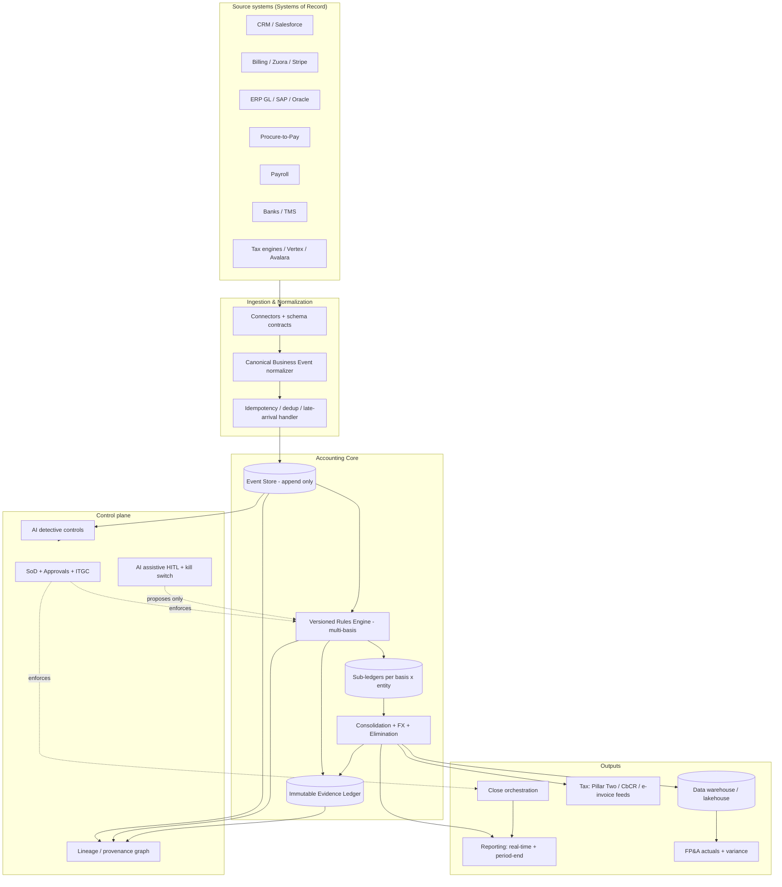
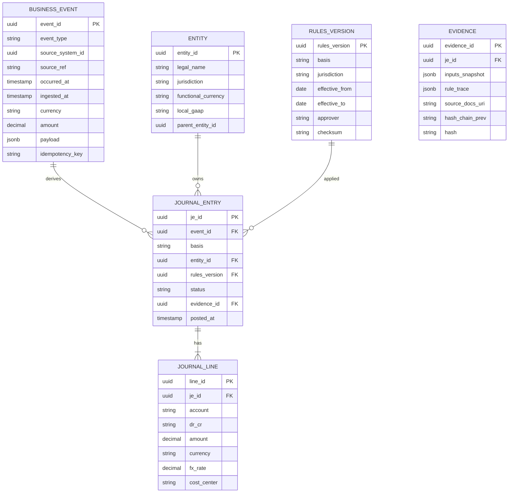
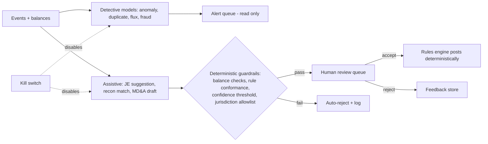

# Global Finance & Accounting Platform for Fortune 50 Tech — Decision-Grade Strategy & Engineering Blueprint

> **Context.** This document is the referenceable strategy + engineering blueprint requested via `/goal`.
> Target buyer: Fortune 50 technology multinationals operating across NA/US, Europe, UK, Africa, LATAM,
> APAC, India, China, Australia. It anchors on real regulatory facts gathered building the
> `accounting`/`finance` advisory agents in this repo (filing deadlines, GAAP variants, ASC 815/IFRS 9,
> ASC 830/IAS 21, Pillar Two, e-invoicing mandates, China SAFE / India FEMA capital controls).
>
> **Epistemic tags used throughout:** `[FACT]` verifiable/cited, `[INFER]` reasoned from facts,
> `[ASSUME]` working assumption needing validation, `[REC]` recommendation.
>
> **Execution note:** When this plan is approved, copy this file to a project temp folder
> (`./tmp/finance-platform-strategy.md`) so downstream prompts can reference it without touching `~/.claude`.

---

## A. Executive Summary

**Product thesis `[REC]`.** Do not build "another global ERP." Build a **canonical accounting-event
backbone with a versioned, jurisdiction-aware rules engine and an immutable evidence ledger**, that sits
*beside* existing ERPs (SAP/Oracle/NetSuite), billing (Stripe/Zuora), CRM (Salesforce), and tax engines
(Vertex/Avalara) — not in place of them. The wedge is the layer Fortune 50 tech actually lacks: a single
**multi-GAAP, multi-entity transformation + close + evidence fabric** that turns business events into
auditable journals with full lineage, and that survives M&A and hypergrowth. `[INFER]` ERPs are systems of
record for *transactions*; they are weak at *cross-entity, multi-basis, audit-grade transformation and
real-time close*. That gap is the product.

**Why this wins `[INFER]`.** Fortune 50 tech already owns ERPs and won't rip them out. They will pay for:
(1) parallel multi-basis ledgers (US GAAP + IFRS + local statutory) from one event stream; (2) an evidence
model internal audit and the external auditor *trust*; (3) close compression (10–12 days → 3–5); (4) M&A
onboarding measured in weeks not quarters.

**Biggest failure risks `[REC]`.**
1. **Becoming the system of record by accident.** If we post to ledgers as primary, we inherit ERP
   replacement risk, 5-year programs, and political death. → Stay a *transformation + sub-ledger +
   consolidation + evidence* layer; ERP/GL remains SoR until a customer explicitly chooses otherwise.
2. **One global config that "supports localization."** This is the magical-thinking trap. A single global
   chart/tax/close design *will* break on Brazil e-invoicing, India GST e-invoice + TDS, China Golden Tax /
   fapiao + CAS carve-outs, and EU ViDA. → Core + **country packs** with hard contract boundaries.
3. **AI posting journals.** An LLM that proposes journals is useful; one that posts them unreviewed is a
   material-weakness generator. → Human-in-the-loop, deterministic guardrails, kill switch, full provenance.
4. **Data migration / parallel close underestimation.** The program dies in cutover, not design.
5. **Pillar Two / transfer pricing afterthought.** `[FACT]` Pillar Two is live in EU/UK/Japan/Korea/etc.
   from FY2024; IAS 12.4A gives a deferred-tax exception, ASC 740 does not. If CbCR/Pillar Two data isn't a
   first-class output of the event model, the platform is dead on arrival for tax.

**Recommended sequencing logic `[REC]`.** Event backbone + rules engine + evidence ledger + **US GAAP/IFRS
consolidation** first (highest leverage, lowest jurisdiction risk). Then close orchestration + reconciliation.
Then high-pain country packs in waves ordered by *regulatory teeth + entity materiality* (Brazil, India,
China are hard-and-material → early but isolated pilots; not first). Tax/Pillar Two outputs and AI assist run
as cross-cutting tracks, gated behind the evidence model. Never lead with AI automation as the headline.

**Self-check gates (Section pre-flight):** CFO trust ✅ (ERP-adjacent, audit-grade), controller sign-off ✅
(deterministic rules + SoD + evidence), tax directionally sound ✅ (Pillar Two/CbCR/e-invoicing first-class),
eng can spec ✅ (event model + service boundaries below), internal audit ✅ (immutable lineage), survives
hostile close/M&A ✅ (Section H scenarios).

---

## B. User & Pain Map

| User | Primary goals | Recurring problems | Non-negotiables | Adoption blockers |
|---|---|---|---|---|
| **CFO** | Trusted single number; fast close; predictable guidance | Numbers disagree across systems; surprises at close | Auditability; board-defensible; no restatement risk | Perceived rip-and-replace; long ROI |
| **Controller / Acct Ops** | Accurate multi-basis close; sign-off | Manual JEs, recon hell, cutoff errors across time zones | Deterministic rules; SoD; reversibility; evidence per JE | Loss of control to "AI"; opaque transformations |
| **Finance Transformation** | Standardize without breaking locals | Every country a snowflake; ERP sprawl | Config-as-code; versioning; clean ERP integration | No clear core/local boundary |
| **Tax (direct+indirect)** | Correct filings; Pillar Two/CbCR; e-invoice compliance | Data not filing-ready; TP/intercompany opacity | Jurisdiction logic owned by tax; immutable source data | Tax logic buried in eng config |
| **Compliance / Internal Audit / ICFR** | Provable controls; evidence on demand | Evidence scavenger hunts; control gaps | Immutable trail; SoD enforcement; SOC reports | Black-box automation; no lineage |
| **FP&A** | Plan/actual alignment; fast variance | Stale actuals; manual variance; MD&A drafting | Real-time actuals feed; driver-level variance | Latency; reconciliation to GL drift |
| **Treasury** | Cash visibility; liquidity; hedge accounting | Fragmented bank data; FX/hedge qualification (ASC 815/IFRS 9); trapped cash | Real-time multi-bank cash; hedge docs; capital-control flags | Bank connectivity gaps |
| **M&A / Corp Dev** | Fast onboarding/carve-out | Acquired entity on alien GAAP/ERP mid-quarter | Rapid mapping; parallel close; opening-balance audit trail | Onboarding measured in quarters |

`[REC]` The two veto-holders are **Controller** and **Internal Audit/Tax**. If the control + evidence + tax
story isn't airtight, the CFO can't buy regardless of feature breadth.

---

## C. Product Strategy

**Market thesis `[INFER]`.** The winning category is not "ERP" and not "close tool." It is the
**accounting transformation & evidence fabric**: event-sourced, multi-basis, jurisdiction-aware,
ERP-adjacent. Competitors split into (a) ERPs (SoR, weak transformation), (b) point close tools
(BlackLine/FloQast — recon/close, not multi-basis transformation), (c) tax engines (Vertex/Avalara —
calc, not ledger). Nobody owns the auditable multi-GAAP transformation + consolidation + evidence spine.

**Differentiated positioning `[REC]`.** "One business event → every basis, every entity, every filing —
with the evidence the auditor already trusts." Deterministic rules engine (not AI) as the system of truth;
AI strictly as assistive + detective.

**Build now / next / later / never.**

| Horizon | Build | Rationale |
|---|---|---|
| **Now (0–9 mo)** | Canonical event model; versioned rules engine; immutable evidence ledger; US GAAP + IFRS sub-ledger & consolidation; multi-currency (ASC 830/IAS 21); SoD/approvals/ITGC; ERP+billing+bank+DW connectors | Highest leverage, lowest jurisdiction risk; establishes the moat (evidence + multi-basis) |
| **Next (9–18 mo)** | Close orchestration + reconciliation; intercompany + elimination (ASC 810/IFRS 10); FP&A actuals feed + driver variance; first 2–3 country packs (UK, Germany, Australia — high value, moderate teeth); Pillar Two/CbCR data outputs; AI *detective* controls (anomaly, duplicate, flux) | Compresses close; opens tax; AI earns trust in read-only mode first |
| **Later (18–30 mo)** | Hard country packs (Brazil, India, China, Mexico, KSA e-invoicing); treasury/hedge accounting module; AI *assistive* JE suggestion (HITL); carve-out tooling | Hardest regulatory teeth, isolate after core proven |
| **Never** | Becoming primary GL by default; AI auto-posting; one global tax config; bespoke per-customer forks of the rules engine | Each is an existential or trust-destroying trap |

**Explicit trade-offs `[REC]`.**
- **ERP-adjacent vs. SoR.** We accept reduced TAM/lock-in to avoid 5-year replacement death and to win the
  audit/control buyer. Net positive for this segment.
- **Deterministic-first vs. AI-first.** Slower "wow," but it's the only posture a controller signs.
- **Country packs vs. universal config.** Higher build cost, but universal config is a fiction here.

**What loses deals if missing `[INFER]`.** SOC 1 Type II + SOC 2; immutable audit trail with per-JE evidence;
SoD enforcement; multi-basis (US GAAP *and* IFRS) from one source; Pillar Two/CbCR readiness; clean SAP/Oracle
integration; data residency (China, EU). Absence of *any* one is typically a hard DQ for this buyer.

---

## D. Engineering Blueprint

### D.1 System architecture



`[REC]` **The event store is append-only and the source of truth for *transformation*; the customer's ERP
remains SoR for posted statutory GL** until/unless they elect otherwise. Sub-ledgers are derived and
replayable from events + rules version.

### D.2 Canonical data model (core entities)



Key properties `[REC]`:
- **`basis`** dimension on every JE → multi-GAAP from one event (US GAAP, IFRS, local statutory).
- **`rules_version`** stamped on every JE → reproducibility; re-run any period under the rules *as they were*.
- **`idempotency_key`** → duplicate-event defense (Section H).
- **Evidence rows are hash-chained** (`hash_chain_prev` → tamper-evident, WORM-stored).

### D.3 Service boundaries

| Service | Owns | Must NOT own |
|---|---|---|
| Ingestion | Connectors, schema contracts, dedup, late-arrival | Accounting logic |
| Event Store | Append-only events, replay | Transformation |
| Rules Engine | Basis/jurisdiction rules, versioning, JE derivation | Source data, posting authority |
| Sub-ledger/Consolidation | Per-basis balances, FX, elimination | Source-of-record statutory posting (unless elected) |
| Evidence/Lineage | Immutable trail, provenance graph | Mutation of any record |
| Control plane | SoD, approvals, ITGC, kill switch | Business data |
| Close orchestration | Task graph, dependencies, sign-off | Rule definitions |
| Tax outputs | Pillar Two/CbCR/e-invoice feeds | Tax *advice* (calc/format only) |
| AI services | Detective + assistive proposals | Posting, deterministic truth |

### D.4 Core APIs & event flows `[REC]`

- `POST /events` (idempotent; `Idempotency-Key` header) → append.
- `POST /rules/versions` (proposal) → SoD review → `activate` (dual-control).
- `GET /entities/{id}/subledger?basis=IFRS&period=2026-06` → derived balances.
- `POST /close/periods/{id}/tasks/{t}/signoff` → evidence-stamped.
- `GET /journal-entries/{id}/lineage` → full provenance graph.
- `POST /ai/suggestions/{id}/accept` → routes to HITL review queue, never direct post.
- Event flow: `event.ingested → event.normalized → rules.applied → je.proposed → je.reviewed → je.posted →
  evidence.sealed`. Every transition emits an immutable audit record.

### D.5 Audit & control architecture `[REC]`

- **Immutable evidence ledger**, WORM storage, hash-chained, 7–10y retention configurable by jurisdiction.
- **SoD matrix** enforced at API layer (preparer ≠ reviewer ≠ approver; rules author ≠ activator).
- **ITGC**: change management on rules-as-code (PR + approval + checksum), access reviews, automated
  logical-access evidence for SOC.
- **Reproducibility**: any period re-derivable from `events × rules_version` → auditor can independently
  recompute. This is the moat.

### D.6 AI architecture & guardrails `[REC]`



- **No AI posts journals.** AI proposes; deterministic rules + human accept.
- **Explainability mandatory**: every suggestion carries rule trace + input snapshot + confidence.
- **Kill switch** per model, per jurisdiction, global.
- **Model governance**: versioned models, eval harness, drift monitoring, documented per SR 11-7 / EU AI Act
  high-risk posture; suggestions are evidence-logged like any other input.

### D.7 Observability & reliability

- Targets `[ASSUME]` (validate w/ customer SLAs): event ingest p99 < 2s; close report gen p95 < 30s;
  99.95% control-plane availability; RPO ≤ 5 min, RTO ≤ 1h for core.
- Full lineage = built-in observability for finance. Add: per-connector freshness SLAs, reconciliation
  break dashboards, rules-version diff audit, FX-rate source health.

---

## E. Jurisdiction Matrix (Core vs. Local Overlay)

`[FACT]` unless noted. **Core** = global platform. **Pack** = country overlay.

| Jurisdiction | Accounting basis / body | Key tax/compliance signals | Must-have features | Defer | Risk notes |
|---|---|---|---|---|---|
| **US** | US GAAP (FASB ASC); SEC 10-K/10-Q (60/75/90d) | ASC 606, 842, 740; CECL; no Pillar Two enactment yet | Core multi-basis; SEC tagging-ready | State-by-state nexus depth | ASC 740 has *no* Pillar Two exception (vs IAS 12) — divergent deferred tax `[FACT]` |
| **Europe (EU)** | IFRS (consolidated); local statutory per member state | Transparency Dir (4mo/3mo); **ViDA** e-invoicing roadmap; Pillar Two live | IFRS core; ESEF/iXBRL; Pillar Two output | Per-member statutory packs phased | One "EU" config is a trap — DE/FR/IT differ materially |
| **UK** | UK-adopted IFRS / FRS 102; FCA DTR (4mo/3mo) | Pillar Two live; MTD; SAO regime | IFRS + FRS 102 pack | — | Post-Brexit divergence from EU rules ongoing |
| **Germany** | HGB (statutory) + IFRS (consol) | HGB prudence; Bewertungseinheit (hedge); e-invoice B2B mandate phasing from 2025 | HGB pack: prudence rules, B2B e-invoice | — | HGB ≠ IFRS recognition; dual books mandatory |
| **Africa** (anchor: South Africa, Nigeria, Kenya) | IFRS widely; local tax authorities | Nigeria FX backlog; Kenya eTIMS e-invoicing; SA SARS | IFRS core; FX-restriction flags | Smaller-market packs | FX convertibility/repatriation risk; data quality `[INFER]` |
| **LATAM** (anchor: Brazil, Mexico) | BR GAAP (CPC≈IFRS) / Mexican FRS | **Brazil**: NF-e/SPED, IOF, complex indirect; **Mexico**: CFDI 4.0 e-invoice, complemento | Brazil + Mexico packs early-isolated | Other LATAM later | Brazil is the canonical "global config killer" — real-time gov e-invoicing |
| **APAC** (anchor: Japan, Singapore) | JGAAP/IFRS; SG-IFRS | Japan: quarterly securities report abolished Apr 2024; consumption tax; SG: InvoiceNow (Peppol) | IFRS core; JP + SG packs | — | JGAAP lease standard (ASBJ No.34) effective FY Apr 2027 `[FACT]` |
| **India** | Ind AS (≈IFRS w/ carve-outs); SEBI LODR (60d annual/45d qtr) | **GST e-invoice (IRP)**; TDS/TCS; FEMA capital controls; transfer pricing | India pack: GST e-invoice, TDS, FEMA flags | — | Ind AS carve-outs ≠ IFRS; FEMA limits intercompany funding `[FACT]` |
| **China** | CAS (ASBE ≈ IFRS w/ carve-outs); CSRC (Apr 30 annual) | **Golden Tax / fapiao**; SAFE capital controls (2× reg capital ext-debt cap); data residency (PIPL/DSL) | China pack: fapiao, SAFE, **in-country data residency** | — | Data residency + SAFE repatriation can break naïve cloud + treasury design `[FACT]` |
| **Australia** | AASB (IFRS-aligned); ASX (3mo/2mo) | GST; Div 7A; thin-cap (Div 820); Pillar Two adopting | IFRS core + AU pack | — | Moderate teeth — good early pack candidate `[INFER]` |

`[REC]` **Where a single global design becomes dangerous:** Brazil (real-time NF-e/SPED), China (fapiao +
data residency + SAFE), India (GST IRP + FEMA), EU member-state statutory divergence, and **Pillar Two
deferred-tax divergence between IAS 12 and ASC 740**. Each must be a *contracted country pack*, never core config.

---

## F. Risk Matrix

| Risk | Likelihood | Impact | Early warning | Mitigation | Owner | Residual |
|---|---|---|---|---|---|---|
| Accounting misstatement | Med | Critical | Recon breaks; flux outliers; rule-version churn | Deterministic rules + dual control + replayability + auditor recompute | Controller | Low |
| Tax filing failure (e-invoice/Pillar Two) | High | Critical | Filing rejections; CbCR data gaps | Country packs owned by tax; e-invoice acks; Pillar Two as first-class output | Tax | Med (jurisdiction churn) |
| Fraud | Med | High | Anomaly alerts; SoD violations; duplicate vendors | AI detective + SoD enforcement + immutable trail | Internal Audit | Low–Med |
| Performance at close peak | Med | High | Latency SLO burn; queue depth | Event replay parallelism; precompute; load tests at quarter-end scale | Eng | Low |
| Data migration / cutover | High | Critical | Opening-balance mismatches; parallel-close drift | Parallel close, reconcile to legacy, staged waves, opening-balance evidence | Transformation | Med |
| Control failure (ITGC) | Med | Critical | Access-review exceptions; unapproved rule changes | Rules-as-code + PR approval + access reviews + SOC | Compliance | Low |
| AI hallucination / bad JE suggestion | High (if unguarded) | High | Low-confidence accepts; reviewer overrides | HITL, guardrails, confidence thresholds, kill switch, no auto-post | Controller + Eng | Low |
| Change resistance | High | High | Low adoption; shadow spreadsheets | Parallel run, training, controller as co-owner, no "control loss" | Transformation | Med |
| Capital-control / data-residency breach (China/India/Africa) | Med | Critical | Repatriation blocks; residency audit | China in-region deploy; FEMA/SAFE flags; legal sign-off | Treasury + Legal | Med |

---

## G. KPIs & ROI Model

| Metric | Baseline (typical F50 tech) `[ASSUME]` | Target | Instrumentation if unquantified |
|---|---|---|---|
| Close duration | 10–12 business days | 3–5 days | Task-graph timestamps per phase |
| Manual JE % | 30–50% | < 10% | JE source tag (rules vs manual) |
| Reconciliation auto-match | 60–75% | > 90% | Match engine outcomes |
| Period-end error/adjustment rate | n/a tracked | ↓ 50% YoY | Post-close adjustment JEs flagged |
| Audit adjustments (count/$) | varies | ↓ materially | Auditor-proposed entries logged |
| Tax filing rejections (e-invoice) | varies by country | ~0 | Gov ack/reject capture per pack |
| Evidence retrieval time | hours–days | < 5 min | Lineage query latency |
| DSO | n/a (billing-owned) | flag only | Requires billing+cash event feed |
| Forecast/actuals latency | days | near real-time | Actuals feed freshness |
| Cash visibility | T+1/T+2, fragmented | intraday multi-bank | Bank connector freshness |
| M&A onboarding time | 1–2 quarters | 4–8 weeks | Onboarding milestone tracking |
| Adoption (active reviewers) | — | > 90% target users | Auth + workflow telemetry |

`[REC]` ROI lead metrics for the business case: **close compression, manual-JE reduction, evidence
retrieval time, M&A onboarding time.** These are defensible and instrumented from day one. DSO and pure cash
metrics depend on upstream feeds — claim them only once those connectors are live.

---

## H. Adversarial Tests / Red-Team Scenarios

| Scenario | Failure mode | Required system response `[REC]` |
|---|---|---|
| **M&A closes mid-quarter-close** | Acquired entity on foreign GAAP/ERP injected during close | Quarantine entity to staging basis; parallel close; opening-balance evidence; do not contaminate locked periods; explicit "unconsolidated/provisional" flag |
| **Cross-border intercompany dispute** | Entity A books receivable, Entity B disputes payable; elimination breaks | Two-sided IC matching with break workflow; un-eliminated balances surfaced, not auto-forced; TP doc linkage |
| **Contract modification (ASC 606/IFRS 15)** | Mod changes transaction price retrospectively | Event = new versioned business event; rules re-derive; prior JEs preserved + adjustment trail; never silent overwrite |
| **Tax rate change mid-period** | Rate changes effective date crosses transactions | `rules_version.effective_from/to` partitions; transactions apply rate-as-of-event-date; reproducible |
| **E-invoice rejection (Brazil NF-e / India IRP)** | Gov rejects invoice after revenue booked | Capture reject ack; raise break; block dependent close task; reversal/correction workflow with evidence |
| **Bad FX data** | Corrupt/missing rate feeds wrong translation | FX source health check; multi-source fallback; reject JE if rate stale/out-of-band; alert; never default silently |
| **Duplicate events** | Same event ingested twice (connector retry) | `idempotency_key` dedup at ingest; replay-safe; reconciliation catches near-duplicates AI detective flags |
| **AI suggests incorrect JE** | Plausible-but-wrong journal proposed | Guardrails (balance + rule conformance + confidence); HITL reject; feedback logged; never auto-posted; kill switch if pattern emerges |
| **Auditor independent recompute** | Auditor recomputes period, gets different number | Must reconcile to the cent from `events × rules_version`; if not, it's a P0 — this is the core promise |
| **Hostile quarter-close + outage** | Control plane degraded at peak | DR failover (RTO ≤ 1h); read-only safe mode preserves evidence; no posting without controls available |

---

## I. Rollout Plan (12–24 months)

```mermaid
gantt
    title Phased Rollout (illustrative — validate dates with customer)
    dateFormat YYYY-MM
    section Foundation
    Event backbone + rules engine + evidence ledger      :f1, 2026-07, 5M
    US GAAP + IFRS sub-ledger + consolidation             :f2, after f1, 4M
    Controls (SoD/ITGC) + SOC readiness                   :f3, 2026-09, 6M
    section Close & Recon
    Close orchestration + reconciliation                  :c1, after f2, 4M
    Intercompany + elimination                            :c2, after c1, 3M
    AI detective controls (read-only)                     :c3, after f2, 4M
    section Country Waves
    Wave 1 packs: UK, Germany, Australia                  :w1, after c1, 4M
    Wave 2 packs: India, Mexico, Japan, Singapore         :w2, after w1, 5M
    Wave 3 packs: Brazil, China (isolated)                :w3, after w2, 6M
    section Tax & AI
    Pillar Two / CbCR outputs                             :t1, after c2, 4M
    AI assistive JE (HITL)                                :t2, after c3, 5M
    Treasury / hedge accounting                           :t3, after w2, 5M
```

**Dependencies `[REC]`.** Event backbone → everything. Controls/evidence must ship *with* the first
sub-ledger, not after. Pillar Two depends on consolidation + intercompany. Country packs depend on core
rules-engine versioning being stable. AI assistive depends on AI detective earning trust first.

**Pilot logic.** Start with **one materially significant, moderately-complex entity set** (e.g., US + UK +
Australia) in **parallel close** against the legacy ERP for ≥ 2 full quarters. Pilot success = independent
recompute to the cent + close-time improvement + auditor acceptance of evidence model.

**Country wave logic.** Order by *regulatory teeth × entity materiality × data-residency complexity*:
Wave 1 = high value / moderate teeth (UK, DE, AU). Wave 2 = high teeth, manageable (IN, MX, JP, SG).
Wave 3 = hardest, isolated (BR real-time e-invoicing, CN data residency + SAFE). Never put BR/CN first.

**Parallel close strategy.** Every wave runs new + legacy in parallel until two consecutive clean closes
(reconcile to the cent, auditor comfortable). Only then retire legacy path for that scope.

**Training & change management.** Controller co-owns rollout (not "done to" them). Role-based training;
sandbox with replayed historical periods; "no control loss" messaging; shadow-spreadsheet amnesty +
migration; exec sponsorship at CFO level.

**Exit criteria per phase.**
| Phase | Exit criteria |
|---|---|
| Foundation | Independent recompute to the cent; SOC 1 Type II readiness; SoD enforced |
| Close & Recon | ≥ 2 clean parallel closes; close time ↓ to target; > 90% auto-match |
| Country wave | Pack passes local statutory + e-invoice ack; local controller sign-off; auditor accepts |
| Tax & AI | Pillar Two/CbCR outputs reconcile; AI assistive precision/recall above threshold w/ HITL; kill switch tested |

---

## J. Open Questions (material only)

1. **System-of-record stance per customer.** Does the customer want us purely ERP-adjacent, or eventually
   primary GL for some entities? Changes scope, risk, and program length materially. `[ASSUME]` ERP-adjacent.
2. **China deployment model.** In-country sovereign cloud vs. excluded from platform? Drives architecture
   (data residency) and whether China is even in scope. Needs legal validation.
3. **Existing ERP landscape.** Single global SAP vs. fragmented (SAP + Oracle + NetSuite + acquired stacks)?
   Determines connector investment and migration risk.
4. **Pillar Two posture.** Is the buyer reporting under IAS 12 (exception applies) or ASC 740 (no exception)
   for which entities? Drives deferred-tax engine requirements.
5. **Auditor identity & their tooling.** Which Big 4, and will they accept independent-recompute evidence as
   primary? Early auditor buy-in de-risks the entire program.
6. **Data residency map beyond China.** India, Russia (if any footprint), EU — confirm where in-region
   processing is contractually required.

I genuinely don't know (5) and (6) specifics without the customer; they materially affect architecture and
should be validated before build.

---

## Verification (how to validate this strategy is execution-ready)

- **CFO gate:** ERP-adjacent + audit-grade + close compression story holds → ✅.
- **Controller gate:** deterministic rules, SoD, reversibility, per-JE evidence → ✅.
- **Tax gate:** Pillar Two/CbCR/e-invoice as first-class outputs; IAS 12 vs ASC 740 divergence named → ✅.
- **Eng gate:** event model + ERD + service boundaries + APIs + event flow → spec-able → ✅.
- **Internal audit gate:** immutable hash-chained evidence + independent recompute → ✅.
- **Hostile close/M&A gate:** Section H scenarios have defined responses → ✅.
- **Execution step:** on approval, create `./tmp/` in the repo and place **both** artifacts there together:
  1. this plan → `./tmp/finance-platform-strategy.md`
  2. the uploaded deep-research report → `./tmp/finance-deepresearch-report.md`
     (source: `/root/.claude/uploads/ddbd4e7b-4aea-4e57-b99a-033f775be98a/f2129242-deepresearchreport_1.md`)
  So later prompts reference the strategy + its evidence base side by side, independent of `~/.claude`.

---

## K. Companion Deep-Research Report (cross-reference)

The uploaded report (`finance-deepresearch-report.md`) is the **evidence base** for this strategy. It
corroborates the core theses and adds the following net-new specifics worth carrying into execution `[FACT]`
unless noted:

**Competitor / reference architectures (validates the ERP-adjacent thesis).**
- **Oracle Accounting Hub** and **Workday Accounting Center** already productize the exact spine this plan
  proposes: high-volume event ingestion → deterministic accounting transformation → detailed journal
  repository → drill-down lineage → close/consolidation/FX/elimination. `[INFER]` This is the baseline, not
  the differentiator — our moat must be the *multi-basis + evidence/recompute + country-pack* layer above it.

**Additional regulatory dates / signals (extend Section E).**
- **EU ViDA** adopted **March 2025**, phased rollout through **2035**; mandatory cross-border B2B digital
  reporting from **2030**. Treat ViDA as a moving target requiring a versioned EU digital-reporting adapter.
- **UK Making Tax Digital for Income Tax** begins **6 April 2026** for qualifying taxpayers — reinforces
  digital-first filing connectors in the UK pack.
- **Singapore IRAS** exposes GST, transfer pricing, CbCR, ICAP/APA, and formal tax-governance as distinct
  pillars → strong APAC model for the transfer-pricing/CbCR dimensionality.
- **Brazil** Receita Federal: SPED + NF-e/NFS-e + eSocial (confirms Brazil as the hardest, isolate-late pack).
- **China** STA: invoice verification + e-tax bureau + EIT filing catalogs + emerging Pillar Two guidance;
  MOF Accounting Dept is the CAS policy anchor (confirms data-residency-aware China deployment).
- **Mexico (CFDI/SAT)** and **India (Ind AS + GST/e-invoice)** flagged as **validation-required before
  requirements freeze** — exact live schema/paths were not fully verified in the research session. `[ASSUME]`
  → these are explicit open items, consistent with Section J.

**Control & AI-governance framework stack (strengthens Sections D.5–D.6, F).**
- Map the control/AI posture explicitly to: **SEC ICFR guidance + PCAOB AS 2201** (risk-based control
  precision), **NIST AI RMF**, **COSO guidance on internal control over generative AI**, **AICPA SOC suite**
  (SOC 1 Type II / SOC 2 — enterprise procurement gate), **IIA Three Lines Model** (change-management +
  control-ownership template), and **OWASP 2026 Top 10 for Agentic Applications** (AI guardrail design).
  `[REC]` Cite these framework anchors in the SOC-readiness and AI-governance workstreams so the assurance
  story is named, not implied.

**Source hierarchy to enforce during build `[REC]`.** Official regulators/standards bodies first →
authoritative control frameworks (NIST/COSO/AICPA/IIA/OWASP) second → vendor product docs (Oracle/Workday)
third. Do not let vendor docs substitute for primary regulatory sources in any country pack.

**Net assessment:** the research report does not change any recommendation in Sections A–J; it raises
confidence and supplies citeable anchors. The one explicit divergence to watch is the report's ~18-month
(extendable to 24) timeline starting mid-2026 — directionally aligned with Section I, but **country-wave
dates must be validated against the customer's actual entity materiality and ERP landscape** (Section J,
items 3 & 5) before committing.
